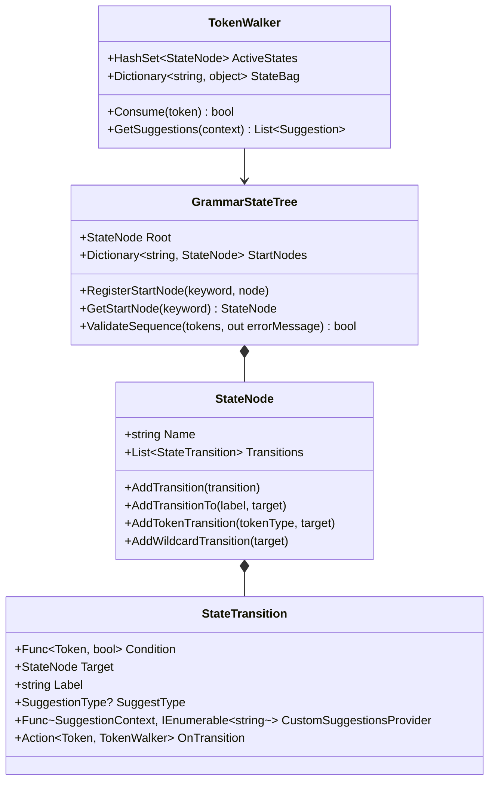

# Grammar State Engine Architecture

The **Grammar State Engine** is a lightweight, non-deterministic state machine used in ETL-SQL for context-aware autocompletion and automated documentation testing. It operates side-by-side with the main compiler front-end, allowing quick, partial syntax verification without requiring the full execution engine or complete variable binding context.

---

## 1. Design Model & Components

The engine is built around three core classes in `ETL-SQL.Analysis`:



### 1.1 `GrammarStateTree`
The root container that holds references to start keyword nodes and manages validation entries. 
- It maintains a `Root` state node where all statements are expected to start or return to.
- It stores a map of registered statement-start nodes (e.g. `CREATE`, `SELECT`, `UPDATE`) for instant branching.

### 1.2 `StateNode`
Represents an individual grammar state (e.g. `ExpectingTable`, `ExpectingOption`). Each node holds a list of outgoing `StateTransition` instances. Multiple transitions can match simultaneously (supporting non-determinism).

### 1.3 `StateTransition`
Evaluates a C# delegate `Condition` against a lexed `Token` to decide if the state machine can transition.
- **Label**: Description of what is expected (e.g., `"<table_source>"`). Used by autocomplete or linter debuggers.
- **SuggestType**: Autocomplete category (e.g., `SuggestionType.Connection`).
- **OnTransition**: An action executed when the transition is taken, allowing changes to the `TokenWalker`'s `StateBag` (such as tracking parentheses depth).

### 1.4 `TokenWalker`
A stateful walker that consumes tokens sequentially and tracks the active set of `StateNode`s. Since the grammar is non-deterministic, multiple branches (e.g. standard DML `MERGE` vs. `MERGE FILES` operation) can be traversed simultaneously. If the set of `ActiveStates` becomes empty, a syntax error is raised.

---

## 2. Partial Evaluation for Doc-Testing

Standard compiler parsers fail when processing partial code blocks, making documentation transition coverage difficult. The Grammar State Engine supports **non-deterministic partial evaluation**, while complete sequences built by `DefaultGrammar` are also checked by the production parser so the state tree cannot certify parser-invalid syntax:

1. **Self-Contained Snippets**: The engine validates single statements or blocks without demanding complete environment registration (like database connections).
2. **Wildcard Fallbacks**: Transitions like `AddWildcardTransition()` match any valid expression token. If a template script references `#temp` tables that were not previously declared, the wildcard absorbs them, permitting validation of isolated middle-of-the-road snippets.
3. **Optional Semicolons**: When `TokenType.SEMICOLON` is consumed, the `TokenWalker` resets `ActiveStates` back to `Root`, facilitating multi-statement syntax validation.
4. **Statement Split Prevention**: An automated pre-processor splits documentation code blocks into statements by checking line breaks and statement-start keywords. High-friction pairs (like `IF` followed by `BEGIN` on a new line, or `CREATE` followed by `REFRESH`) use split-prevention rules to avoid breaking unified blocks.

---

## 3. Semantic Autocomplete Bindings

To serve context-aware autocompletions in the LSP and TUI, `GrammarLanguageService` binds active grammar states directly to workspace metadata. The base language service also contributes general keyword, function, and symbol suggestions as a fallback:

1. **State Identification**: The walker evaluates the document script up to the cursor. It looks at the transition labels of all current active states.
2. **Metadata Injection**:
   - **Table Source** (`<table_source>`, `<join_table>`): Queries the active `IMetadataManager` to suggest registered connection names, tables inside active connections (filtered by connection prefix), and local `#temp` tables.
   - **Connection Alias** (`<connection_name>`): Pulls and suggests registered connection strings and connection aliases from the metadata manager.
   - **Local Variables** (`<variable_name>`): Scans the preceding script block using regex matches (`@\w+`) to suggest declared local variables.
   - **Columns** (`<column_name>`): Resolves the active table aliases in the query block and fetches columns from the active connection.

---

## 4. Extension Guidelines

When adding new syntax elements, new commands, or connection options, follow this workflow:

### 4.1 Update `DefaultGrammar.cs`
Locate the relevant configuration method (e.g., `ConfigureFileOperations` or `ConfigureCommonStatements`) and define your new node transitions:

```csharp
// Example: Adding a new OPTION key
var newOptionNode = new StateNode("CONN_NEW_OPTION");
optionNameNode.AddTransitionTo("NEW_OPTION", newOptionNode, SuggestionType.OptionName);
```

### 4.2 Update Linter Unit Tests
Ensure `DocumentationSyntaxTests.cs` is aware of any new start keywords or split-prevention rules:

```csharp
// Register new keyword as statement starter
StartKeywords.Add("MY_NEW_KEYWORD");
```

### 4.3 Rerun Validation Gates
Validate that all help documents and sample scripts conform to the updated grammar:

```powershell
dotnet test --filter DocumentationSyntaxTests
```
