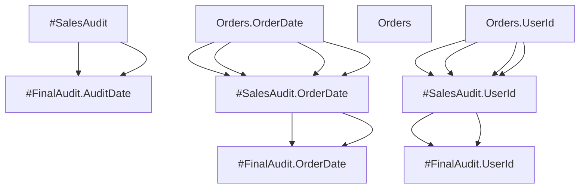

# Data Lineage Report: #FinalAudit

## Visual Graph

## Detailed Audit Log
| Timestamp | Operation | Sources | Metadata |
| :--- | :--- | :--- | :--- |
| 2026-05-01 02:03:06 | SELECT INTO | #SalesAudit | **author**: chuck **engine_version**: 0.6.0 |
| 2026-05-01 02:03:06 | SELECT INTO | #SalesAudit (OrderDate) | **owner**: SalesDept **d**: Timestamp of sale **author**: chuck **engine_version**: 0.6.0 *Derived From*: OrderDate: Timestamp of sale |
| 2026-05-01 02:03:06 | SELECT INTO | #SalesAudit (UserId) | **owner**: SalesDept **sensitive**: true **d**: Customer UID **author**: chuck **engine_version**: 0.6.0 *Derived From*: UserId: Customer UID |
| 2026-05-01 02:03:06 | SELECT | #SalesAudit | **author**: chuck **engine_version**: 0.6.0 |
| 2026-05-01 02:03:06 | SELECT | #SalesAudit (OrderDate) | **owner**: SalesDept **d**: Timestamp of sale **author**: chuck **engine_version**: 0.6.0 *Derived From*: OrderDate: Timestamp of sale |
| 2026-05-01 02:03:06 | SELECT | #SalesAudit (UserId) | **owner**: SalesDept **sensitive**: true **d**: Customer UID **author**: chuck **engine_version**: 0.6.0 *Derived From*: UserId: Customer UID |
