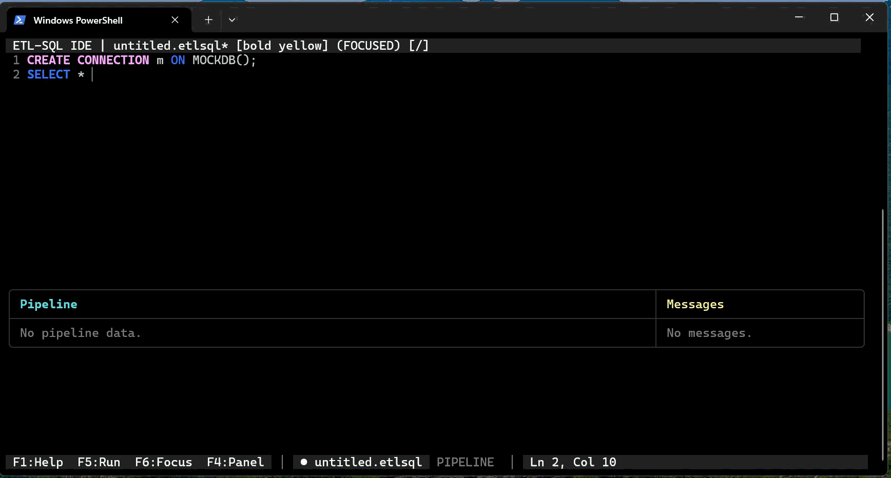

# ETL-SQL™

<p align="center">
  
</p>


[](https://github.com/etl-sql/ETL-SQL/actions/workflows/ci.yml)

> **Octocolee™** — an ETL-SQL engine. *Octocolee* is the product name; *ETL-SQL* is the engine and the name used throughout this documentation and the CLI (`etlsql`).

ETL-SQL is a SQL-first automation engine for moving, transforming, validating, scheduling, and reporting on data across mixed systems. A single script can connect to databases, APIs, files, SFTP servers, and cloud storage; stage data in engine-managed `#temp` tables; apply procedural logic; publish dashboards; and run headless, in a terminal IDE, in VS Code, or as a scheduled job.

Use ETL-SQL when you want SQL to be the orchestration language, not just the query language.

## Why ETL-SQL?

ETL-SQL is built around a simple idea: keep the **T** in the middle of ETL without giving up the portability, reviewability, and operational discipline that made ELT attractive. Data can still land in warehouses when that is the right destination, but transformation does not have to be trapped inside one warehouse engine or spread across Python scripts, schedulers, BI designer files, and undocumented handoffs.

### SQL Is the Orchestration Language

ETL-SQL uses a SQL-like language to coordinate databases, APIs, files, transfers, validation, scheduling, and reports. Data from different systems can be staged in engine-managed `#temp` tables, where portable transformations and control flow run before rows are written to a destination.

Remote SQL remains dialect-aware. Queries pushed to SQL Server, PostgreSQL, Oracle, and other databases use the target system's native rules; cross-source work runs in the ETL-SQL engine.

### One Script from Source to Dashboard

A pipeline can extract, transform, validate, load, and then declare its report in the same plain-text workflow. Report-SQL (`.rptsql`) adds visuals, filters, pages, and navigation to normal data-preparation scripts. Reports can be previewed locally, built as static outputs, or published to Portal.

### Script-First and Source-Control Native

Pipelines and dashboards are reviewable text instead of opaque designer files. The same script can run headlessly, in the terminal IDE, in VS Code or notebooks, through Orchestrator, or as part of CI/CD. Changes can be diffed, reviewed, tested, packaged, and rolled back with the same source-control workflow used for application code.

### Security and Lineage in the Execution Model

Runtime controls enforce path boundaries, protected-script immutability, encrypted credential handling, and limits on file operations. `SECRET` variables reduce credential lifetime, while `SET WHAT_IF ON` provides a dry-run path for side-effecting operations. Lineage metadata can follow data from source operations through transformations and into report assets.

### Why Not Just ELT?

ELT is attractive because it centralizes execution in a warehouse, but it often leaves hard problems outside the model: file drops, SFTP, APIs, cross-system validation, operational recovery, governance metadata, dashboards, and source-controlled review. ETL-SQL keeps those concerns in one script while still allowing database pushdown where it is correct and useful.

### Standout Capabilities

| Capability | What it adds |
| :--- | :--- |
| Cross-source staging | Join, cleanse, validate, and enrich data from unrelated systems in engine-managed `#temp` tables. |
| Transform-centered ETL | Stage data before load so validation, masking, enrichment, dedupe, lineage tagging, and quality gates happen before downstream systems are mutated. |
| Source-control native pipelines | Plain-text `.etlsql` and `.rptsql` files are diffable, reviewable, testable, and runnable unchanged in CLI, VS Code, notebooks, Orchestrator, and CI/CD. |
| Built-in lineage and tags | Attach metadata where transformations happen, then query, diagram, or export lineage instead of reconstructing it after the fact. |
| Report-SQL | Define data preparation and interactive dashboards together in a `.rptsql` file. |
| Resumable sessions | Use labels, `--session`, and `--resume` to continue checkpointed workflows after a failure. |
| Fuzzy matching | Use `FUZZY JOIN`, `SIMILARITY`, `LEVENSHTEIN`, `SOUNDEX`, `METAPHONE`, and related engine functions. |
| Relative dates | Express engine-side date parameters such as `D-7` and `M-1` without embedding a database-specific date function. |
| Docker lifecycle commands | Start disposable services for development or testing with `USE DOCKER`, then release them with `CLOSE DOCKER`. |
| Specification-driven scaffolding | Convert a reviewed JSON specification contract into a schema-validated starter script with lineage, validation, and quarantine scaffolding. This workflow is experimental and still requires developer review. |

---

## See It In Action

### VS Code Extension & Notebooks


*Inline diagnostics · schema autocomplete · REPL results panel · report preview · cell-by-cell notebook execution · Lineage*

### Report-SQL Dashboards


*Interactive charts · drill-down navigation · live parameter slicers · multi-page navigation · PDF export*

### Terminal IDE



*Syntax highlighting · autocomplete · live results grid · compare mode · profiling dashboard*

---

## Quick Start

### Prerequisites

- [.NET 10.0 SDK](https://dotnet.microsoft.com/download)

### Build From Source

```bash
git clone https://github.com/etl-sql/ETL-SQL.git
cd ETL-SQL
dotnet build
```

### Run a Script

```bash
dotnet run --project src/ETL-SQL.App -- run MyScript.etlsql
```

### Open the Terminal IDE

```bash
dotnet run --project src/ETL-SQL.App -- ui edit MyScript.etlsql
```

### Serve a Report Dashboard

```bash
etl-sql-report serve my_report.rptsql
```

### Build Static Report Outputs

```bash
etl-sql-report build my_report.rptsql --format pdf
etl-sql-report build my_report.rptsql --format md
```

---

## ETL Example

This script extracts from SQL Server, stages rows inside the ETL-SQL engine, writes a CSV archive, and sends a completion email.

```sql
CREATE CONNECTION prod_db AS MSSQL(
    SERVER = 'prod',
    DATABASE = 'Sales',
    TRUSTED_CONNECTION = TRUE
);

CREATE CONNECTION archive AS FLATFILE(
    PATH = 'C:\Exports\sales_2026.csv',
    FORMAT = 'DELIMITED',
    DELIMITER = ',',
    HEADER = ON
);

CREATE CONNECTION my_smtp AS SMTP(
    HOST = 'smtp.company.com',
    PORT = 587,
    USERNAME = 'etl-service',
    PASSWORD = 'ENC:replace-with-encrypted-value',
    USE_SSL = TRUE
);

BEGIN TRY
    SELECT OrderId, Customer, Amount
    INTO #latest
    FROM prod_db.dbo.Orders
    WHERE OrderDate >= '2026-01-01';

    INSERT INTO archive SELECT * FROM #latest;

    SEND EMAIL
        TO      'admin@company.com'
        FROM    'etl@company.com'
        SUBJECT 'ETL Success'
        BODY    ('Archived ' + CAST((SELECT COUNT(*) FROM #latest) AS STRING) + ' orders.')
        AT      my_smtp;
END TRY
BEGIN CATCH
    PRINT 'Load failed: ' + ERROR_MESSAGE();
    THROW;
END CATCH;
```

---

## Report-SQL Example

Report-SQL extends ETL-SQL with dashboard primitives. Data prep stays in SQL; visuals, filters, pages, and layouts are declared in the same `.rptsql` file.

```sql
SET REPORT TITLE       = 'Sales Dashboard';
SET REPORT DESCRIPTION = 'Regional revenue by quarter';

CREATE CONNECTION prod AS MSSQL(
    SERVER = 'prod',
    DATABASE = 'Sales',
    TRUSTED_CONNECTION = TRUE
);

SELECT Region, Quarter, SUM(Revenue) AS Revenue
INTO #revenue
FROM prod.dbo.Orders
GROUP BY Region, Quarter;

SELECT DISTINCT Region AS Value
INTO #regions
FROM #revenue
ORDER BY Value;

DECLARE @region varchar(200) = 'All';

CREATE VISUAL RegionSlicer AS SLICER (
    SOURCE   = #regions,
    MAPPINGS (VALUE = Value),
    ACTIONS  (ON_CHANGE = SET_PARAMETER(@region, Value))
);

CREATE VISUAL RevChart AS BAR (
    SOURCE   = (
        SELECT Quarter, Region, Revenue
        FROM #revenue
        WHERE (@region = 'All' OR Region = @region)
    ),
    MAPPINGS (X = Quarter, Y = Revenue, SERIES = Region),
    STYLE    (HEIGHT = '380px', THEME = dark)
);

CREATE VISUAL TotalKpi AS CARD (
    SOURCE   = (SELECT SUM(Revenue) AS Value, 'Total Revenue' AS Label FROM #revenue),
    MAPPINGS (VALUE = Value, LABEL = Label),
    OPTIONS  (FORMAT = 'C0')
);

CREATE PAGE Sales AS DASHBOARD (
    TITLE     = 'Sales',
    STRUCTURE = 'A A / B C',
    MAP ('A' = RevChart, 'B' = RegionSlicer, 'C' = TotalKpi)
);
```

Serve it live:

```bash
etl-sql-report serve sales_dashboard.rptsql
```

Or build static outputs:

```bash
etl-sql-report build sales_dashboard.rptsql --format md
etl-sql-report build sales_dashboard.rptsql --format pdf
etl-sql-report build sales_dashboard.rptsql --format json
```

---

## Core Capabilities

### Data Movement & Transformation

- Read and write across SQL databases, flat files, document formats, APIs, SFTP/FTP, Azure Blob, and SMTP.
- Stage rows in engine-managed `#temp` tables for cross-source joins, validation, filtering, enrichment, lineage, and reporting.
- Use procedural control flow: variables, `IF`, `WHILE`, `FOR`, `FOREACH`, `TRY...CATCH`, transactions, and `PARALLEL`.
- Push compatible joins and filters to database connectors while keeping cross-source operations engine-side.

### Performance & Scale

- Stream large datasets through supported execution paths with bounded display results.
- Spill sort, join, aggregate, and window workloads to disk when thresholds are exceeded.
- Cache repeated scalar subqueries within a session.
- Profile statements with `SET PROFILING ON`, `EXPLAIN`, `EXPLAIN ANALYZE`, and `--explain`.
- Inspect runtime metrics, spill totals, and memory pressure with system variables and `SHOW PROFILE`.

### Security & Governance

- Resolve file paths through the engine security boundary.
- Block script mutation of `.etlsql`, `.rptsql`, `.sql`, and other protected source files.
- Encrypt credentials with `ENC:` values.
- Use `SET WHAT_IF ON` to validate side-effecting operations before they run.
- Track data lineage with standard tags, transformation metadata, OpenLineage export, and Mermaid diagrams.

### Reporting & Portal

- Build live dashboards from `.rptsql` scripts using `CREATE VISUAL`, `CREATE PAGE`, `CREATE CONTAINER`, `CREATE NAVIGATION`, and shared datasets.
- Render charts, tables, cards, text, filters, inputs, maps, Sankey, Sunburst, Network, Matrix, Gantt, and other visual types.
- Use slicers, multi-select filters, date pickers, sliders, search boxes, drill-downs, cross-highlighting, saved views, alerts, subscriptions, and portal administration commands.
- Export report outputs as Markdown, JSON manifests, SVG/PDF assets, and paginated reports.

### Developer Experience

- Run scripts headlessly from the CLI.
- Use the terminal IDE for syntax highlighting, autocomplete, live result grids, compare mode, and profiling.
- Use the VS Code extension for LSP diagnostics, hover docs, schema autocomplete, REPL execution, report preview, and `.etlnb` notebooks.
- Use `LINT`, `EXPLAIN`, `EXPLAIN ANALYZE`, `SHOW PROFILE`, `SHOW CONNECTIONS`, and `SHOW VERSION` to inspect scripts and sessions.
- Turn LLM-reviewed vendor data specifications into validated ETL-SQL starter scripts (`gen-script`) with schema gates, review notes, lineage tags, validation summaries, and quarantine scaffolding; optionally trim large vendor PDFs to data-dictionary pages first (`extract-spec`).

---

## Tools

| Tool | Purpose |
| :--- | :--- |
| `ETL-SQL.exe` | Headless script executor for pipelines, CI/CD, cron, and server deployments. |
| `ETL-SQL-TUI.exe` | Interactive terminal IDE with editor, results, messages, autocomplete, and profiling. |
| `ETL-SQL-REPORT.exe` | Report-SQL CLI for `build`, `refresh`, and `serve`. |
| `etl-sql doctor` | Install validation: checks runtime, config, encryption, engine smoke, and asset health. Use `--profile full` for extended checks, `--strict` for CI exit codes, `--json` for machine-readable output. |
| `etl-sql gen-script` | Compiles a reviewed JSON specification contract into an ETL-SQL starter script with schema checks, casts, lineage tags, validation summaries, and optional quarantine handling. |
| `etl-sql extract-spec` | Trims administrative fluff from large vendor PDF specifications, retaining likely schema and dictionary pages for LLM review. |
| VS Code extension | Language server, REPL panel, notebook support, schema sidebar, and report preview. |
| Portal | Multi-report hosting, publishing, permissions, subscriptions, alerts, saved views, and usage metrics. |
| Orchestrator service | Job scheduling, execution history, and always-on automation. |

---

## Documentation

### Start Here

| Document | Description |
| :--- | :--- |
| [ETL-SQL Goals](GOALS.md) | Core product vision, language goals, and engineering principles. |
| [Documentation Home](docs/README.md) | Main documentation map for guides, reference, cookbooks, architecture, and releases. |
| [Getting Started](docs/guides/getting-started.md) | Pipeline mental model, connections, variables, control flow, and debugging. |
| [ETL Notebook Guide](docs/guides/notebook-guide.md) | Cell execution model, cross-cell state, and notebook IntelliSense. |
| [Report-SQL Guide](docs/guides/report-sql.md) | `.rptsql` syntax, visuals, filters, dashboards, drill-downs, and report hosting. |
| [Pattern Cookbook](docs/cookbooks/etl-recipes.md) | Self-contained ETL recipes for common production workflows. |
| [Sample Guide](docs/guides/sample-guide.md) | Inventory of sample scripts in the `samples/` folder. |

### Reference

| Document | Description |
| :--- | :--- |
| [Syntax Index](docs/syntax-index.md) | Searchable map of commands, functions, options, visual types, and syntax forms. |
| [Statement Reference](docs/reference/statements/README.md) | Focused pages for DDL, DML, query syntax, control flow, and session commands. |
| [Standard Library](docs/reference/functions/README.md) | Built-in functions: string, date, math, regex, window, JSON/XML, and more. |
| [Data Connectors](docs/reference/connectors/README.md) | Connector types, options, authentication patterns, and examples. |
| [File Operations](docs/reference/file-operations/README.md) | File operations, email, transfer, SSH/PGP keys, Docker, and advanced file ops. |
| [Performance](docs/reference/performance/performance.md) | Spill thresholds, memory model, tuning guidance, and scale certification references. |
| [Spec-Driven Development](docs/spec-import/spec-driven-development.md) | Guide for generating scripts and extracting data dictionaries from specifications. |

### Engineering

| Document | Description |
| :--- | :--- |
| [Engine Architecture](docs/architecture/Engine.md) | Parser, AST, evaluator internals, dispatch, linting, and execution model. |
| [Reporting Architecture](docs/architecture/Reporting.md) | Report runtime, manifest builder, renderer, exports, and parameter binding. |
| [Connector Architecture](docs/architecture/Connectors.md) | Connector interfaces, lifecycle, pushdown, and security boundaries. |
| [Lineage Architecture](docs/architecture/Lineage.md) | Lineage capture, history queries, export formats, and orchestration integration. |
| [VS Code Extension](docs/architecture/VSCodeExtension.md) | LSP, REPL channels, notebook controller, results panel, and report preview. |
| [Connector Certification Matrix](docs/architecture/standards/Connector_Certification_Matrix.md) | Connector test classes, certification tiers, and release gate coverage. |
| [Release Workflows](docs/architecture/roadmaps/Release_Workflows.md) | Local-first release validation and packaging workflow. |
| [Security Policy](SECURITY.md) | Zero-trust sandbox, cryptographic architecture, and audit policy. |
| [AI Agent Manual](AGENTS.md) | Mandatory instruction set for AI-assisted development in this repo. |

---

## Testing & Quality

ETL-SQL moves and transforms real data, so we have tried to test as much of it as we reasonably can. No software is bug-free — but a great deal of effort goes into validating behavior, and the suite grows with every change:

- **Over 3,500 automated unit and integration tests** (xUnit) spanning the parser, evaluator, expression and type system, connectors, security guardrails, reporting engine, language server, and Portal.
- **Over 11,500 SQL-correctness checks.** The dedicated SQLite [`sqllogictest`](https://www.sqlite.org/sqllogictest/) lane currently runs 42 active files containing 9,375 query records and 2,160 statement records. The excluded index-optimization corpus relies on indexing physical tables, while ETL-SQL currently supports indexes on in-memory `#temp` tables.
- **71 VS Code extension and UI unit tests** (Vitest), plus separate Node-based smoke checks for report designer and portal components.
- **Layered connector integration coverage** using disposable containers where practical (including MSSQL, Postgres, MySQL, Oracle, SFTP, Kafka, MongoDB, Neo4j, S3/MinIO, Azure Blob/Azurite, SMTP/MailPit, Portal, and Orchestrator), provider emulators for BigQuery and Snowflake, and local files or loopback services for connectors such as Parquet, Avro, REST, and SharePoint. See the [Connector Certification Matrix](docs/architecture/standards/Connector_Certification_Matrix.md) for provider-specific coverage and remaining external-provider gaps.
- **Performance and scale tests** exercise large-dataset and spill paths, including Standard-tier scenarios that scale to one million rows, plus a BenchmarkDotNet suite. Scale-certification scripts can compare results with checked-in baselines and fail on configured regressions.
- **A 70% line-coverage threshold in CI** when the generated coverage summary is parsed successfully. The local pre-release workflow runs asset checks, dependency audits, build, smoke, fast, sample, VS Code, and Smoke-tier scale checks by default; SLT, Docker integration, Standard-tier scale, and installer validation are opt-in phases.

We make no claim that it is perfect — if you hit a bug, please [open an issue](https://github.com/etl-sql/ETL-SQL/issues). But the breadth above reflects a genuine, ongoing commitment to making ETL-SQL something you can trust with real data.

---

## Release Build

Maintainers can run the release script to validate, package, and publish the 0.17.0 artifacts:

```powershell
.\scripts\Test-PreRelease.ps1
.\scripts\Master-Release.ps1 -Version "0.17.0"
```

---

## Contributing

See [CONTRIBUTING.md](CONTRIBUTING.md) for development setup, branching, testing, and contribution guidelines.

---

Copyright 2026 Charles Clemens and ETL-SQL contributors.

**Licensing** — ETL-SQL is open-source software licensed under the [Apache License 2.0](LICENSE.md), including commercial use, modification, and redistribution subject to the license terms. Paid support, implementation, training, and development services may be available by contacting [etlsqlsoftware@gmail.com](mailto:etlsqlsoftware@gmail.com).

**Trademarks** — ETL-SQL™ and the ETL-SQL logo are trademarks of Charles Clemens. Use of these trademarks is governed by our [Trademark Policy](TRADEMARK.md).
