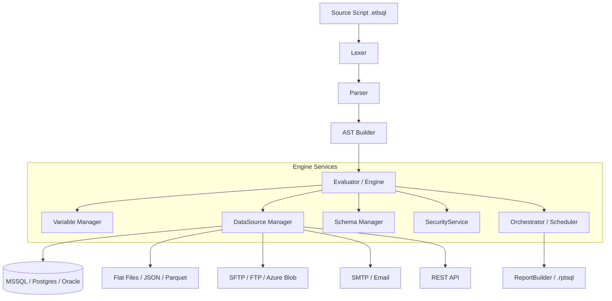

# 🚀 ETL-SQL Engine


A powerful, high-performance ETL (Extract, Transform, Load) engine that blends the simplicity of **Standard SQL** with the flexibility of **Procedural Automation**. Designed for data engineers who need to orchestrate complex data flows without leaving the comfort of a SQL-first environment.

---

## 🎨 Premium Developer Experience

### Professional Console Editor (`ui edit`)
Experience a modern, terminal-based development environment designed for productivity.

- **Vibrant Syntax Highlighting**: Context-aware coloring for DML, DDL, Control Flow, and ETL-specific keywords.
- **Intelligent Autocomplete**: Deep integration with data source schemas, variables, and file systems.
- **Live Results Grid**: Interactive paging and multi-result set navigation directly in your terminal.
- **Standardized Shortcuts**:
  - `F5` / `Shift+F5`: Execute full script or current statement.
  - `Ctrl+I`: Smart Auto-Formatter.
  - `F1`: Instant Help Overlay.
  - Standard `Undo/Redo`, `Duplicate`, and `File Management` shortcuts.

### VS Code Extension Support
Leverage the power of ETL-SQL within Visual Studio Code with our dedicated language extension — syntax highlighting, autocomplete, inline LINT, and a report preview panel for `.rptsql` files.

---

## ✨ Core Pillars

### ⚡ High-Stream Performance
- **Zero-Copy Streaming**: Process billion-row datasets with a fixed memory footprint.
- **Native Pushdown**: Automatically detects when to push operations (joins, filters) to source databases like MSSQL or Postgres.
- **Parallel Execution**: Run data transfers and transformations in concurrent streams with the `PARALLEL` keyword.

### 🛠️ Standardized Automation Syntax
A strict `VERB NOUN` / `VERB_NOUN` convention for all automation commands — predictable and intuitive.

| Category | Commands |
| :--- | :--- |
| **Data Flow** | `SEND EMAIL`, `SEND FILE`, `RECEIVE FILE` |
| **Filesystem** | `CREATE DIRECTORY`, `DELETE FILE`, `COMPRESS FILE`, `ENCRYPT FILE` |
| **Management** | `CREATE CONNECTION`, `DROP CONNECTION`, `START DOCKER`, `CLOSE DOCKER`, `CREATE JOB` |
| **Scripting** | `CREATE PROCEDURE`, `CREATE FUNCTION`, `CREATE SETS`, `USE SETS` |
| **Analysis** | `LINT`, `EXPLAIN`, `LINEAGE()`, `SET PROFILING ON` |

### 🔒 Zero-Trust Security
- **Sandbox Isolation**: Scripts cannot access OS system directories, credentials stores (`.ssh`, `.aws`, `.git`), or drive roots.
- **Script Immutability**: The engine cannot write or modify `.etlsql`, `.sql`, or `.py` files — logic is always human-authored.
- **Credential Encryption**: All connection strings can be encrypted with `ENC:` prefix + AES-256 master password.
- **Resource Caps**: Maximum 100 file operations and 5 recursive directory levels per script execution.

### 🔍 Deep Observability
- **Data Lineage**: Trace exactly where every column came from using `LINEAGE()`. Export Mermaid.js diagrams with `LINEAGE(#result) TO 'report.md'`.
- **Static Analysis**: Catch logic errors and dialect mismatches before production with `LINT 'script.etlsql'`.
- **Execution Profiling**: `SET PROFILING ON` reveals statement-by-statement timing and memory deltas.

---

## 🏗️ Technical Architecture



---

## Executables

| Binary | Purpose |
| :--- | :--- |
| `ETL-SQL.exe` | Headless script executor for pipelines, CI/CD, cron, and server deployments. Built from `src/ETL-SQL.App/`. |
| `ETL-SQL-TUI.exe` | Interactive console IDE for development, debugging, and ad-hoc queries. Built from `src/ETL-SQL.App/ --ui edit`. |

---

## 🚀 Getting Started

### Prerequisites
- [.NET 10.0 SDK](https://dotnet.microsoft.com/download)

### Installation
```bash
git clone https://github.com/AmericanSuperstar/ETL-SQL.git
cd ETL-SQL
dotnet build
```

### Launch the Editor
```bash
dotnet run --project src/ETL-SQL.App -- --ui edit MyScript.etlsql
```

### Headless Execution
```bash
dotnet run --project src/ETL-SQL.App -- --run MyScript.etlsql
```

### Full Release (Maintainers)
To build a complete cross-platform release with tests and VS Code extension:
```powershell
.\scripts\Master-Release.ps1 -Version "0.6.0"
```
This script validates the engine, builds the React UI, publishes binaries for Windows/Linux/macOS, and packages everything into ZIP archives.

### Quick-Start Example

```sql
-- Define connections
CREATE CONNECTION prod_db ON MSSQL() WITH(SERVER='prod', DATABASE='Sales', TRUSTED_CONNECTION=TRUE);
CREATE CONNECTION archive  ON FLATFILE('C:\Exports\sales_2026.csv') WITH(DELIMITER=COMMA, HEADER=ON);
CREATE CONNECTION my_smtp  ON SMTP('smtp.company.com') WITH(PORT=587, USERNAME='admin', PASSWORD='secret', USE_SSL=TRUE);

BEGIN TRY
    -- Extract from SQL Server into engine memory
    SELECT OrderId, Customer, Amount INTO #latest
    FROM prod_db.dbo.Orders
    WHERE OrderDate >= '2026-01-01';

    -- Write to CSV archive
    INSERT INTO archive SELECT * FROM #latest;

    -- Notify on success
    SEND EMAIL
        TO      'admin@company.com'
        FROM    'etl@company.com'
        SUBJECT 'ETL Success'
        BODY    ('Archived ' + CAST((SELECT COUNT(*) FROM #latest) AS STRING) + ' orders.')
        AT      my_smtp;
END TRY
BEGIN CATCH
    PRINT 'Load failed: ' + ERROR_MESSAGE();
    THROW;
END CATCH;
```

---

## 📚 Documentation Library

### 📖 Getting Started & Guides
| Document | Description |
| :--- | :--- |
| [User Manual](Docs/User_Manual.md) | Pipeline mental model, connections, variables, control flow, and debugging |
| [Pattern Cookbook](Docs/Cookbook.md) | 18 self-contained, production-ready ETL recipes |
| [Sample Guide](Docs/Sample_Guide.md) | Inventory of 55+ sample scripts in the `/samples/` folder |

### 📜 Language Reference
| Document | Description |
| :--- | :--- |
| [Grammar](Docs/Reference/Grammar.md) | Complete syntax — variables, control flow, SELECT, DML, DDL, scheduling |
| [Standard Library](Docs/Reference/Standard_Library.md) | All built-in functions: string, date, math, regex, window, JSON/XML |
| [Data Connectors](Docs/Reference/Data_Connectors.md) | Every connector type, all `WITH()` options, authentication patterns |
| [Specialized Operations](Docs/Reference/Specialized_Operations.md) | File ops, email, SFTP transfer, lineage, SSH keygen, Docker, jobs |
| [Report SQL Guide](Docs/Report_SQL_Guide.md) | `.rptsql` syntax, `CREATE VISUAL`, dashboards, and the report player |
| [Master Language Reference](Docs/ETL_SQL_Language_Reference.md) | Comprehensive single-document language specification |

### 🏛️ Architecture & Engineering
| Document | Description |
| :--- | :--- |
| [Engine Architecture](Docs/Architecture/Engine.md) | Parser, AST, Evaluator internals, statement dispatch loop |
| [Connector Architecture](Docs/Architecture/Connectors.md) | Connector interface contracts, lifecycle, pushdown logic, error propagation |
| [Presentation Architecture](Docs/Architecture/Presentation.md) | TUI IDE, ANSI rendering, SharpConsoleUI integration |

### 📏 Standards & Governance
| Document | Description |
| :--- | :--- |
| [Connector Standards](Docs/Standards/Connectors_Standards.md) | 10 inviolable rules + 25-item compliance checklist for new connectors |
| [Presentation Standards](Docs/Standards/Presentation_Standards.md) | UI consistency, color system, error sanitization rules |
| [Security Policy](SECURITY.md) | Zero-Trust sandbox, cryptographic architecture, audit trail |
| [AI Agent Manual](AGENTS.md) | Mandatory instruction set for AI-assisted development in this repo |

---

## 🤝 Contributing

See [CONTRIBUTING.md](CONTRIBUTING.md) for how to set up a development environment, the branching model, and contribution guidelines.

---

© 2026 ETL-SQL Team. Built for speed, designed for clarity.

**Commercial Use & Licensing** — This software is free for personal, non-commercial use only. For commercial licensing or service agreements, contact [etlsqlsoftware@gmail.com](mailto:etlsqlsoftware@gmail.com).
