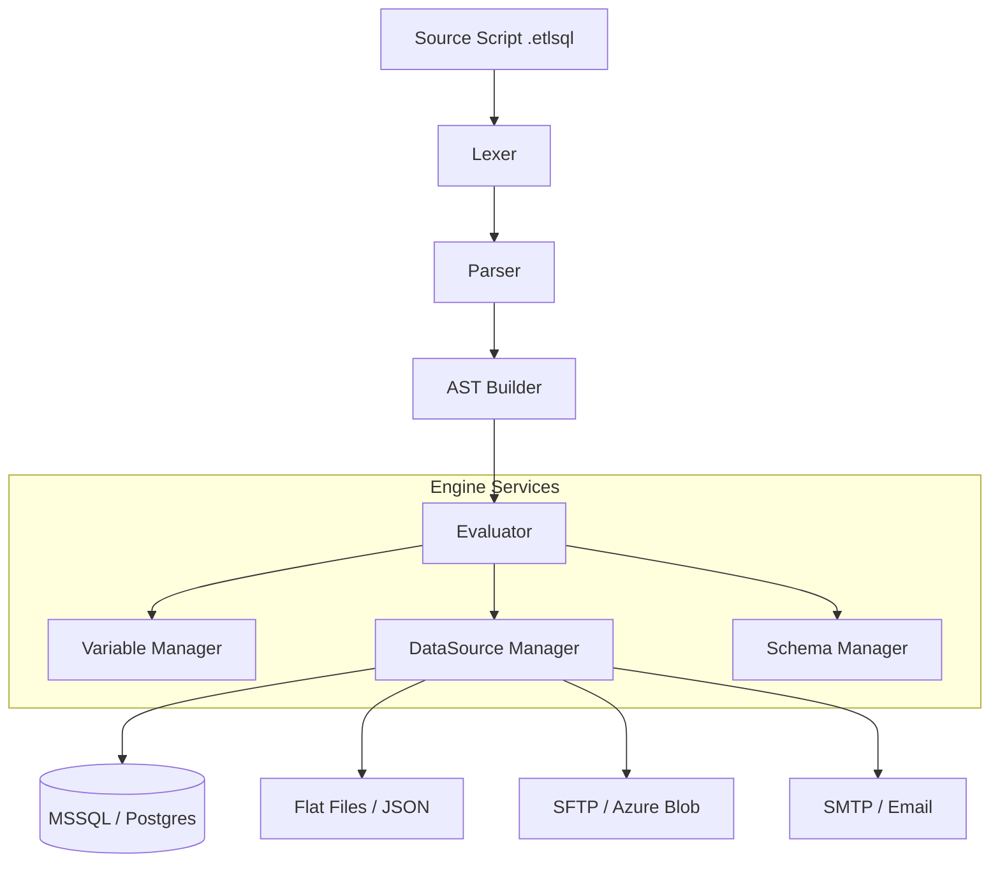

# 🚀 ETL-SQL Engine


A powerful, high-performance ETL (Extract, Transform, Load) engine that blends the simplicity of **Standard SQL** with the flexibility of **Procedural Automation**. Designed for data engineers who need to orchestrate complex data flows without leaving the comfort of a SQL-first environment.

---

## 🎨 Premium Developer Experience

### Professional Console Editor (`ui edit`)
Experience a modern, terminal-based development environment designed for productivity.


- **Vibrant Syntax Highlighting**: Context-aware coloring for DML, DDL, Control Flow, and specific ETL keywords.
- **Intelligent Autocomplete**: Deep integration with data source schemas, variables, and file systems.
- **Live Results Grid**: Interactive paging and multi-result set navigation directly in your terminal.
- **Standardized Shortcuts**:
  - `F5` / `Shift+F5`: Execute full script or current statement.
  - `Ctrl+I`: Smart Auto-Formatter.
  - `F1`: Instant Help Overlay.
  - Standard `Undo/Redo`, `Duplicate`, and `File Management` shortcuts.

### VS Code Extension Support
Leverage the power of ETL-SQL within Visual Studio Code with our dedicated language server.


---

## ✨ Core Pillars

### ⚡ High-Stream Performance
- **Zero-Copy Streaming**: Process billion-row datasets with a fixed memory footprint.
- **Native Pushdown**: Automatically detects when to push operations (Joins, Filters) to source databases like MSSQL or Postgres.
- **Parallel Execution**: Run data transfers and transformations in concurrent streams with the `PARALLEL` keyword.

### 🛠️ Standardized Automation Syntax
We adhere to a strict `VERB_NOUN` convention for all automation commands, ensuring a predictable and intuitive API.

| Category | Commands |
| :--- | :--- |
| **Data Flow** | `SEND_EMAIL`, `SEND_FILE`, `RECEIVE_FILE` |
| **Filesystem** | `CREATE_DIRECTORY`, `DELETE_FILE`, `COMPRESS_FILE`, `ENCRYPT_FILE` |
| **Management** | `CREATE CONNECTION`, `DROP CONNECTION`, `START_DOCKER`, `CREATE JOB` |

### 🔍 Deep Observability
- **Data Lineage**: Visualize exactly where your data comes from and how it transforms using `LINEAGE()`.
- **Static Analysis (LINT)**: Catch logic errors, missing indices, or unoptimized joins before they hit production.
- **Execution Profiling**: Enable `SET PROFILING ON` to see exactly where your bottlenecks are.

---

## 🏗️ Technical Architecture



---

## 🚀 Getting Started

### Installation
Clone the repository and ensure you have the **.NET 10.0 SDK** installed.

```bash
git clone https://github.com/user/ETL-SQL.git
cd ETL-SQL
dotnet build
```

### Launch the Editor
```bash
# Open a script in the interactive editor
dotnet run --project src/ETL-SQL.App -- --ui edit MyScript.etlsql
```

### Fast-Track Example
```sql
-- Define your environment
CREATE CONNECTION prod_db ON MSSQL('Server=prod;Database=Sales;');
CREATE CONNECTION archive ON FLATFILE('C:\Exports\') WITH (DELIMITER=PIPE);
CREATE CONNECTION my_smtp ON SMTP('smtp.company.com') WITH (USER='admin', PASS='secret');

-- Perform the ETL
INSERT INTO archive.Sales_2026
SELECT * FROM prod_db.Orders
WHERE OrderDate >= '2026-01-01';

-- Send a notification
SEND_EMAIL TO 'admin@company.com' 
SUBJECT 'ETL Success' 
BODY 'Sales archived successfully.'
AT my_smtp;
```

---

## 📄 Documentation
For a complete list of commands, functions, and connector options, refer to the [Language Reference](docs/ETL_SQL_Language_Reference.md).

---
© 2026 ETL-SQL Team. Built for speed, designed for clarity.

Commercial Use & LicensingThis software is free for personal, non-commercial use only. If you wish to use this software for commercial purposes (including use by a business or for-profit entity), or if you are interested in a service agreement, please contact me at etlsqlsoftware@gmail.com for a commercial license.
