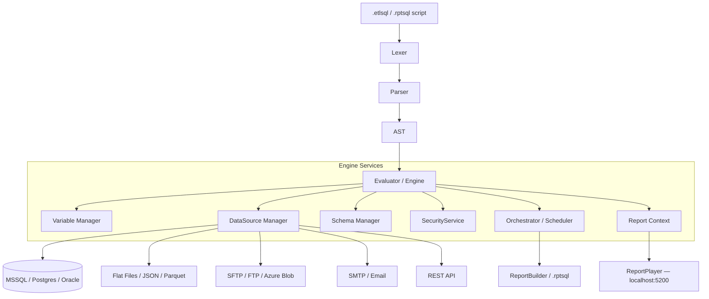

# ETL-SQL Engine


A high-performance ETL engine and scripting language that blends **Standard SQL** with **procedural automation**. Write data pipelines, interactive reports, and scheduled jobs in a single SQL-first language — and run them headless, in a terminal IDE, or as live web dashboards.

---

## See It In Action

### Terminal IDE (`--ui edit`)

<!-- Record with ScreenToGif or VHS → save to docs/assets/tui-demo.gif -->


*Syntax highlighting · autocomplete · live results grid · compare mode · profiling dashboard*

### VS Code Extension

<!-- Record with ScreenToGif → save to docs/assets/vscode-demo.gif -->


*Inline diagnostics · schema autocomplete · REPL results panel · report preview*

### Report-SQL Dashboards

<!-- Record with ScreenToGif → save to docs/assets/report-demo.gif -->


*Interactive charts · live parameter slicers · multi-page navigation · PDF export*

---

## Core Pillars

### High-Stream Performance
- **Zero-Copy Streaming**: Process billion-row datasets with a fixed memory footprint.
- **Native Pushdown**: Automatically pushes joins and filters to MSSQL or Postgres when possible.
- **Disk-Spilling Engines**: Four configurable engines (`ExternalSortEngine`, `ExternalJoinEngine`, `ExternalAggregateEngine`, `ExternalWindowEngine`) kick in automatically above row-count thresholds.
- **Parallel Execution**: Concurrent data transfers and transformations with the `PARALLEL` keyword.

### Standardized Automation Syntax
A strict `VERB NOUN` / `VERB_NOUN` convention for all automation commands.

| Category | Commands |
| :--- | :--- |
| **Data Flow** | `SEND EMAIL`, `SEND FILE`, `RECEIVE FILE` |
| **Filesystem** | `CREATE DIRECTORY`, `DELETE FILE`, `COMPRESS FILE`, `ENCRYPT FILE` |
| **Management** | `CREATE CONNECTION`, `DROP CONNECTION`, `START DOCKER`, `CLOSE DOCKER`, `CREATE JOB` |
| **Scripting** | `CREATE PROCEDURE`, `CREATE FUNCTION`, `CREATE SETS`, `USE SETS` |
| **Analysis** | `LINT`, `EXPLAIN`, `LINEAGE()`, `SET PROFILING ON` |

### Zero-Trust Security
- **Sandbox Isolation**: Scripts cannot access OS system directories, credential stores (`.ssh`, `.aws`, `.git`), or drive roots.
- **Script Immutability**: The engine cannot write or modify `.etlsql`, `.sql`, or `.py` files — logic is always human-authored.
- **Credential Encryption**: All connection strings can be encrypted with `ENC:` prefix + AES-256 master password.
- **Resource Caps**: Maximum 100 file operations and 5 recursive directory levels per script execution.

### Deep Observability
- **Data Lineage**: Trace column origins with `LINEAGE()`. Export Mermaid.js diagrams via `LINEAGE(#result) TO 'report.md'`.
- **Static Analysis**: Catch logic errors and dialect mismatches before production with `LINT 'script.etlsql'`.
- **Execution Profiling**: `SET PROFILING ON` reveals statement-by-statement timing and memory deltas.

---

## Premium Developer Experience

### Terminal IDE (`ui edit`)
A full-featured, terminal-based development environment.

- **Vibrant Syntax Highlighting**: Context-aware coloring for DML, DDL, Control Flow, and ETL-specific keywords.
- **Intelligent Autocomplete**: Deep integration with data source schemas, variables, and file systems.
- **Split Lower Panel**: Execution tree (left) and message log (right) side-by-side.
- **Live Results Grid**: Interactive paging, column scrolling, multi-result set navigation, and inline row filtering (`Ctrl+F`).
- **Compare Mode** (`F7`): Stack all result sets simultaneously — each pane independently scrollable and filterable.
- **Export to CSV** (`Ctrl+P`): RFC 4180-compliant export of the active result set.
- **Performance Dashboard**: Per-statement timing, row counts, memory, and disk-spill metrics when `SET PROFILING ON`.
- **Standard Shortcuts** — full reference via `F1`:

| Key | Action |
| :--- | :--- |
| `F5` / `Shift+F5` | Run full script / current statement |
| `F6` | Toggle focus between Editor and Results |
| `F7` | Compare mode (all result sets) |
| `Ctrl+/` | Toggle SQL line comment on selection |
| `Tab` / `Shift+Tab` | Indent / dedent selected block |
| `Ctrl+Left/Right` | Word jump |
| `Alt+Up/Down` | Add cursor above / below (multi-cursor) |
| `Ctrl+I` / `Alt+F` | Smart SQL formatter |
| `Ctrl+Q` | Exit |

### VS Code Extension
Brings ETL-SQL into Visual Studio Code with two independent backend channels:

- **Language Server (LSP)**: Syntax highlighting, inline diagnostics, hover docs, go-to-definition, schema autocomplete for `.etlsql` and `.rptsql` files.
- **REPL Panel**: Run scripts or selections, see live results and variable snapshots inside VS Code.
- **Connections Sidebar**: Browse data source schemas without leaving the editor.
- **Report Preview**: Render `.rptsql` dashboards directly in a VS Code WebView panel — no browser required.

---

## Report-SQL: Interactive Dashboards

Report-SQL extends the ETL-SQL language with dashboard primitives. Write a `.rptsql` file, run one command, and get a live, filterable web dashboard backed by your real data.

### How It Works

```
your_report.rptsql
        │
        ▼  etl-sql-report build / serve
┌─────────────────────────┐
│  ETL-SQL Engine         │   ← same evaluator as .etlsql scripts
│  CREATE VISUAL          │
│  CREATE PAGE            │
│  CREATE DATASET         │
│  CREATE CONTAINER       │
│  CREATE NAVIGATION      │
└────────────┬────────────┘
             │ builds ReportManifest
             ▼
┌─────────────────────────┐
│  ManifestBuilder        │
│  EChartsRenderer        │   → Apache ECharts v5 option JSON
│  SvgChartRenderer       │   → server-side SVG for PDF
│  PdfExporter (QuestPDF) │   → .pdf
│  MarkdownRenderer       │   → .md
└────────────┬────────────┘
             │
    ┌────────┴─────────┐
    ▼                  ▼
.snapshot.json    ReportPlayer
                  localhost:5200
```

### Visual Types

| Category | Types |
| :--- | :--- |
| **Charts** | `BAR`, `LINE`, `SCATTER`, `PIE`, `DONUT`, `HORIZONTAL_BAR`, `COMBO`, `BOX_PLOT`, `TREEMAP`, `HEATMAP`, `GAUGE`, `FUNNEL`, `WATERFALL` |
| **Data** | `TABLE` (with conditional formatting), `CARD` (scalar KPI) |
| **Text** | `TEXT` (free HTML/markdown block) |
| **Filters** | `SLICER`, `MULTISELECT`, `DATEPICKER`, `SLIDER`, `SEARCH` |

### Quick-Start Report

```sql
-- sales_dashboard.rptsql

SET REPORT TITLE   = 'Sales Dashboard';
SET REPORT DESCRIPTION = 'Regional revenue by quarter';

CREATE CONNECTION prod ON MSSQL() WITH(SERVER='prod', DATABASE='Sales', TRUSTED_CONNECTION=TRUE);

-- Populate datasets
SELECT Region, Quarter, SUM(Revenue) AS Revenue
INTO   #revenue
FROM   prod.dbo.Orders
GROUP BY Region, Quarter;

SELECT DISTINCT Region AS Value INTO #regions FROM #revenue ORDER BY Value;

-- Filter control
CREATE VISUAL RegionSlicer AS SLICER (
    SOURCE   = #regions,
    MAPPINGS ( VALUE = Value )
) WITH ACTIONS ( ON_CHANGE = SET_PARAMETER(@region) );

-- Main chart
CREATE VISUAL RevChart AS BAR (
    SOURCE   = #revenue WHERE Region = @region OR @region = 'All',
    MAPPINGS ( X = Quarter, Y = Revenue, SERIES = Region )
) WITH STYLES ( HEIGHT = '380px', THEME = 'dark' );

-- KPI card
CREATE VISUAL TotalKpi AS CARD (
    SOURCE   = (SELECT SUM(Revenue) AS Value, 'Total Revenue' AS Label FROM #revenue),
    MAPPINGS ( VALUE = Value, LABEL = Label )
) WITH OPTIONS ( FORMAT = 'C0' );

-- Page layout
CREATE PAGE Sales AS LAYOUT (
    STRUCTURE = 'A A / B C',
    MAP ( 'A' = RevChart, 'B' = RegionSlicer, 'C' = TotalKpi )
) WITH PARAMETERS ( @region = 'All' );
```

Serve it live:

```bash
etl-sql-report serve sales_dashboard.rptsql
# Opens http://localhost:5200
```

Or build static outputs:

```bash
etl-sql-report build sales_dashboard.rptsql --format md    # Markdown
etl-sql-report build sales_dashboard.rptsql --format pdf   # PDF via QuestPDF
etl-sql-report build sales_dashboard.rptsql --format json  # Raw manifest JSON
```

### Multi-Report Hosting

Host a catalog of reports from a single server with a `reports.json` manifest:

```json
{
  "reports": [
    { "name": "sales",     "script": "reports/sales_dashboard.rptsql" },
    { "name": "inventory", "script": "reports/inventory.rptsql" }
  ]
}
```

```bash
etl-sql-report serve --manifest reports.json
# Catalog at http://localhost:5200
# Reports at  http://localhost:5200/reports/sales
#             http://localhost:5200/reports/inventory
```

### Live Parameter Binding

Filter controls automatically post parameter changes to the server. Only affected visuals re-query — unaffected visuals serve from cache.

```
Browser filter interaction
        │
        ▼  POST /api/parameters
DashboardService
        │ dependency analysis
        ├─ affected visuals → ManifestBuilder.RefreshVisualAsync()
        └─ unaffected visuals → serve from cache
        │
        ▼  updated ReportManifest JSON
Browser re-renders changed panels only
```

---

## Architecture

Six dependency tiers, strictly layered:

| Tier | Project(s) | Role |
| :--- | :--- | :--- |
| 0 — Foundation | `ETL-SQL.Core` | Parser, AST, interfaces, linting rules |
| 1 — Execution | `ETL-SQL.Engine` | Evaluator, 30+ statement handlers, external sort/join/aggregate/window engines |
| 2 — Integration | `ETL-SQL.Connectors`, `ETL-SQL.Orchestrator` | 14 connector types, job scheduler, execution history (SQLite) |
| 3 — Language Server | `ETL-SQL.LanguageServer` | LSP — completions, diagnostics, hover, schema autocomplete |
| 4 — Shells | `ETL-SQL.App`, `ETL-SQL.TUI` | CLI entry point (System.CommandLine), Spectre.Console terminal IDE |
| 5 — Reports | `ETL-SQL.ReportBuilder`, `ETL-SQL.ReportPlayer` | Report-SQL compilation and live dashboard HTTP server |



---

## Executables & CLIs

| Binary | Purpose |
| :--- | :--- |
| `ETL-SQL.exe` | Headless script executor for pipelines, CI/CD, cron, and server deployments. |
| `ETL-SQL --ui edit` | Interactive terminal IDE — syntax highlighting, autocomplete, live results. |
| `etl-sql-report` | Report-SQL CLI — `build`, `refresh`, `serve` sub-commands. |

---

## Getting Started

### Prerequisites
- [.NET 10.0 SDK](https://dotnet.microsoft.com/download)

### Install

```bash
git clone https://github.com/AmericanSuperstar/ETL-SQL.git
cd ETL-SQL
dotnet build
```

### Run the Terminal IDE

```bash
dotnet run --project src/ETL-SQL.App -- --ui edit MyScript.etlsql
```

### Run a Script Headlessly

```bash
dotnet run --project src/ETL-SQL.App -- --run MyScript.etlsql
```

### Serve a Report Dashboard

```bash
# Single report
etl-sql-report serve my_report.rptsql

# Multi-report catalog
etl-sql-report serve --manifest reports.json
```

### Build Static Report Outputs

```bash
etl-sql-report build my_report.rptsql --format pdf
etl-sql-report build my_report.rptsql --format md
```

### Full Release Build (Maintainers)

```powershell
.\scripts\Master-Release.ps1 -Version "0.6.0"
```

This validates the engine, builds the VS Code extension, publishes binaries for Windows/Linux/macOS, and packages everything into ZIP archives.

---

## ETL Pipeline Example

```sql
-- Define connections
CREATE CONNECTION prod_db ON MSSQL() WITH(SERVER='prod', DATABASE='Sales', TRUSTED_CONNECTION=TRUE);
CREATE CONNECTION archive  ON FLATFILE('C:\Exports\sales_2026.csv') WITH(DELIMITER=COMMA, HEADER=ON);
CREATE CONNECTION my_smtp  ON SMTP('smtp.company.com') WITH(PORT=587, USERNAME='admin', PASSWORD='secret', USE_SSL=TRUE);

BEGIN TRY
    -- Extract from SQL Server into engine memory
    SELECT OrderId, Customer, Amount INTO #latest
    FROM prod_db.dbo.Orders
    WHERE OrderDate >= '2026-01-01';

    -- Write to CSV archive
    INSERT INTO archive SELECT * FROM #latest;

    -- Notify on success
    SEND EMAIL
        TO      'admin@company.com'
        FROM    'etl@company.com'
        SUBJECT 'ETL Success'
        BODY    ('Archived ' + CAST((SELECT COUNT(*) FROM #latest) AS STRING) + ' orders.')
        AT      my_smtp;
END TRY
BEGIN CATCH
    PRINT 'Load failed: ' + ERROR_MESSAGE();
    THROW;
END CATCH;
```

---

## Documentation Library

### Getting Started & Guides
| Document | Description |
| :--- | :--- |
| [User Manual](Docs/User_Manual.md) | Pipeline mental model, connections, variables, control flow, and debugging |
| [Report-SQL Guide](Docs/Report_SQL_Guide.md) | `.rptsql` syntax, `CREATE VISUAL`, dashboards, and the report player |
| [Pattern Cookbook](Docs/Cookbook.md) | 18 self-contained, production-ready ETL recipes |
| [Sample Guide](Docs/Sample_Guide.md) | Inventory of 55+ sample scripts in the `/samples/` folder |

### Language Reference
| Document | Description |
| :--- | :--- |
| [Grammar](Docs/Reference/Grammar.md) | Complete syntax — variables, control flow, SELECT, DML, DDL, scheduling |
| [Standard Library](Docs/Reference/Standard_Library.md) | All built-in functions: string, date, math, regex, window, JSON/XML |
| [Data Connectors](Docs/Reference/Data_Connectors.md) | Every connector type, all `WITH()` options, authentication patterns |
| [Specialized Operations](Docs/Reference/Specialized_Operations.md) | File ops, email, SFTP transfer, lineage, SSH keygen, Docker, jobs |
| [Master Language Reference](Docs/ETL_SQL_Language_Reference.md) | Comprehensive single-document language specification |

### Architecture & Engineering
| Document | Description |
| :--- | :--- |
| [Engine Architecture](Docs/Architecture/Engine.md) | Parser, AST, Evaluator internals, statement dispatch loop |
| [Reporting Architecture](Docs/Architecture/Reporting.md) | Report-SQL runtime — manifest builder, ECharts renderer, PDF export, parameter binding |
| [Connector Architecture](Docs/Architecture/Connectors.md) | Connector interface contracts, lifecycle, pushdown logic |
| [TUI Editor](Docs/Architecture/TuiEditor.md) | Terminal IDE internals — buffer, highlighting, autocomplete |
| [VS Code Extension](Docs/Architecture/VSCodeExtension.md) | LSP + REPL channels, results panel, report preview |
| [Orchestrator](Docs/Architecture/Orchestrator.md) | Job scheduling, execution sessions, history |

### Standards & Governance
| Document | Description |
| :--- | :--- |
| [Connector Standards](Docs/Standards/Connectors_Standards.md) | 10 inviolable rules + 25-item compliance checklist for new connectors |
| [Presentation Standards](Docs/Standards/Presentation_Standards.md) | UI consistency, color system, error sanitization rules |
| [Security Policy](SECURITY.md) | Zero-Trust sandbox, cryptographic architecture, audit trail |
| [AI Agent Manual](AGENTS.md) | Mandatory instruction set for AI-assisted development in this repo |

---

## Contributing

See [CONTRIBUTING.md](CONTRIBUTING.md) for how to set up a development environment, the branching model, and contribution guidelines.

---

© 2026 ETL-SQL Team. Built for speed, designed for clarity.

**Commercial Use & Licensing** — This software is free for personal, non-commercial use only. For commercial licensing or service agreements, contact [etlsqlsoftware@gmail.com](mailto:etlsqlsoftware@gmail.com).
