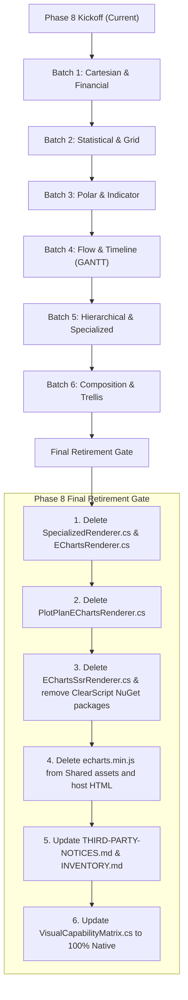

# Architecture Decision & Inventory: ECharts and ClearScript Retirement

## Status
Implemented / Historical Pre-Retirement Inventory

## Executive Summary
ETL-SQL is migrating from third-party JavaScript charting (Apache ECharts 5.x) and server-side V8 script execution (Microsoft.ClearScript.V8) to a native C# Grammar of Graphics pipeline (`ChartSpec` -> `PlotPlan` -> `PlotPlanSvgRenderer`).

This document provides the exhaustive, authoritative inventory of every consumer of ECharts and ClearScript across the entire codebase, classifies each component by retirement timing and prerequisites, and defines the phased deletion sequence.

The inventory below is retained as the pre-retirement audit record. Phase 8 removed every listed
production consumer, package, generated asset, transient compiler, and server-side script engine.
Theme construction now emits renderer-neutral tokens, the browser imports native SVG from the
manifest, and static/PDF output uses the same managed rendering pipeline. The legal inventory and
SBOM generators no longer enumerate either dependency.

---

## 1. Authoritative Component Inventory & Classification

| Component / File Path | Role & Description | Classification | Target Milestone / Batch |
| :--- | :--- | :---: | :---: |
| **Packages & Native Binaries** | | | |
| `Directory.Packages.props` | Central version management for `Microsoft.ClearScript.V8` and 5 native runtime packages. | Required Until Final Retirement | Phase 8 Final Gate |
| `src/ETL-SQL.Reporting/ETL-SQL.Reporting.csproj` | Package references to ClearScript managed and native multi-platform packages. | Required Until Final Retirement | Phase 8 Final Gate |
| **Server SSR Pipeline** | | | |
| `src/ETL-SQL.Reporting/EChartsSsrRenderer.cs` | Pooled V8 script engine instances executing `echarts.min.js` server-side for static chart export. | Required Until Final Retirement | Phase 8 Final Gate |
| `src/ETL-SQL.Reporting/SvgChartRenderer.cs` | Dispatches unmigrated visual types to `EChartsSsrRenderer.Shared.RenderSvgAsync`. | Required Until Final Retirement | Phase 8 Final Gate |
| `src/ETL-SQL.Portal/Program.cs` | Wires SSR error logging delegate (`EChartsSsrRenderer.OnError`). | Required Until Final Retirement | Phase 8 Final Gate |
| `src/ETL-SQL.Portal/Controllers/ExportController.cs` | Server-side export documentation and fallback dispatch referencing SSR. | Required Until Final Retirement | Phase 8 Final Gate |
| **Transient Renderers & Option Compilers** | | | |
| `src/ETL-SQL.Reporting/EChartsRenderer.cs` | Top-level dispatcher translating `VisualManifest` to ECharts JSON options. | Required Until Final Retirement | Phase 8 Final Gate |
| `src/ETL-SQL.Reporting/Renderers/PlotPlanEChartsRenderer.cs` | Transient compiler translating native `PlotPlan` to ECharts options for browser runtime during migration. | Required Until Final Retirement | Phase 8 Final Gate |
| `src/ETL-SQL.Reporting/Renderers/SpecializedRenderer.cs` | Legacy ECharts option generators for all 24 standard visual types. | Removable After Named Batch | Batch 1 to 6 (per visual) |
| **Theming & AST** | | | |
| `src/ETL-SQL.Core/ReportingThemeBuilder.cs` | `BuildEChartsTheme` method translating Report-SQL themes to ECharts JSON palette objects. | Required Until Final Retirement | Phase 8 Final Gate |
| `src/ETL-SQL.Engine/Handlers/CreateThemeStatementHandler.cs` | Handler writing `.json` theme files in ECharts theme format. | Required Until Final Retirement | Phase 8 Final Gate |
| `src/ETL-SQL.Core/ReportAst.cs` | AST theme node comments referencing ECharts theme JSON structure. | Required Until Final Retirement | Phase 8 Final Gate |
| `src/ETL-SQL.App/App/EngineRunner.cs` | Command-line banner mentioning Apache ECharts. | Required Until Final Retirement | Phase 8 Final Gate |
| **Browser Runtime Assets & Host HTML** | | | |
| `src/ETL-SQL.ReportRuntime/Resources/Shared/echarts.min.js` | Canonical 1.07 MB ECharts 5.x bundle. | Required Until Final Retirement | Phase 8 Final Gate |
| `src/ETL-SQL.ReportPlayer/wwwroot/echarts.min.js` | Generated copy synced from ReportRuntime. | Required Until Final Retirement | Phase 8 Final Gate |
| `src/ETL-SQL.WorkstationEditor/wwwroot/echarts.min.js` | Generated copy synced from ReportRuntime. | Required Until Final Retirement | Phase 8 Final Gate |
| `src/ETL-SQL.Portal/wwwroot/js/echarts.min.js` | Generated copy synced from ReportRuntime. | Required Until Final Retirement | Phase 8 Final Gate |
| `src/etl-sql-vscode/media/echarts.min.js` | Generated copy synced from ReportRuntime. | Required Until Final Retirement | Phase 8 Final Gate |
| `scripts/sync-assets.js` | Script synchronizing `echarts.min.js` across host projects. | Required Until Final Retirement | Phase 8 Final Gate |
| `src/ETL-SQL.ReportRuntime/Resources/Shared/report-runtime.js` | Browser runtime script initializing ECharts instances, renderItem custom series, and brush handlers. | Required Until Final Retirement | Phase 8 Final Gate |
| `src/ETL-SQL.ReportRuntime/Resources/Shared/designer/designer.js` | Report Builder live preview rendering via `window.echarts`. | Required Until Final Retirement | Phase 8 Final Gate |
| `src/ETL-SQL.Portal/wwwroot/index.html` | HTML script tag loading `echarts.min.js`. | Required Until Final Retirement | Phase 8 Final Gate |
| `src/ETL-SQL.Portal/wwwroot/designer.html` | HTML script tag loading `echarts.min.js`. | Required Until Final Retirement | Phase 8 Final Gate |
| `src/ETL-SQL.Portal/wwwroot/designer-preview.html` | Dynamic script tag loader for `echarts.min.js`. | Required Until Final Retirement | Phase 8 Final Gate |
| `src/ETL-SQL.Portal/wwwroot/admin.html` | HTML script tag loading `echarts.min.js`. | Required Until Final Retirement | Phase 8 Final Gate |
| `src/ETL-SQL.Portal/wwwroot/orchestrator.html` | Orchestrator internal timeline chart using `echarts.init`. | Removable Now | Immediate (Independent) |
| **Test Suites & Harnesses** | | | |
| `tests/ETL-SQL.Tests/Reporting/EChartsSsrSpikeTests.cs` | Initial V8 engine spike tests; non-contract. | Removable Now | Immediate |
| `tests/ETL-SQL.Tests/Reporting/EChartsSsrTests.cs` | Unit tests for server-side rendering with ClearScript. | Required Until Final Retirement | Phase 8 Final Gate |
| `tests/ETL-SQL.Tests/Reporting/EChartsRendererCoverageTests.cs` | Unit tests covering legacy ECharts option generation. | Removable After Named Batch | Batch 1 to 6 (per visual) |
| `tests/ETL-SQL.Tests/Reporting/Conformance/RepresentativeVisualConformanceTests.cs` | Conformance tests verifying transient ECharts output. | Required Until Final Retirement | Phase 8 Final Gate |
| `tests/ETL-SQL.Tests/Reporting/Conformance/RepresentativeVisualConformanceHarness.cs` | Test harness compiling ECharts options for conformance tests. | Required Until Final Retirement | Phase 8 Final Gate |
| `tests/ETL-SQL.Tests/Reporting/AdvancedAuthoring/AdvancedAuthoringSemanticReadinessTests.cs` | Tests verifying ECharts lowering of advanced authoring specs. | Required Until Final Retirement | Phase 8 Final Gate |
| `tests/ETL-SQL.Tests/Reporting/AdvancedAuthoring/AdvancedAuthoringSemanticReadinessHarness.cs` | Harness helper for advanced authoring tests. | Required Until Final Retirement | Phase 8 Final Gate |
| `tests/ETL-SQL.Tests/Reporting/AdvancedAuthoring/AdvancedChartProductionTests.cs` | Tests asserting ECharts output for custom charts. | Required Until Final Retirement | Phase 8 Final Gate |
| `tests/ETL-SQL.Tests/Reporting/Gantt/GanttCharacterizationTests.cs` | Characterization tests asserting Gantt behavior. | Removable After Named Batch | Batch 4 (Flow & Timeline) |
| **Legal Notices & SBOM** | | | |
| `THIRD-PARTY-NOTICES.md` | Legal license text for Apache ECharts and ClearScript V8. | Required Until Final Retirement | Phase 8 Final Gate |
| `THIRD-PARTY-INVENTORY.md` | Inventory entries for `echarts.min.js` and `Microsoft.ClearScript.V8.*`. | Required Until Final Retirement | Phase 8 Final Gate |

---

## 2. Classification Definitions

### 2.1 Removable Now (Safe Immediate Pruning)
These components are isolated spikes or auxiliary internal UI charts that do not gate standard Report-SQL execution:
1. `tests/ETL-SQL.Tests/Reporting/EChartsSsrSpikeTests.cs`: Exploratory test spike for V8 initialization.
2. `src/ETL-SQL.Portal/wwwroot/orchestrator.html`: Standalone dashboard timeline; can be switched to a lightweight SVG/HTML table timeline.

### 2.2 Removable After Named Migration Batch
These components implement specific visual types inside `SpecializedRenderer.cs` and their corresponding unit test assertions in `EChartsRendererCoverageTests.cs`. As each batch migrates to `PlotPlan` with native SVG rendering, its legacy option builder methods are deleted:
- **Batch 1 (Cartesian & Financial)**: `RenderBubble`, `RenderWaterfall`, `RenderCandlestick`.
- **Batch 2 (Statistical & Grid)**: `RenderBoxPlot`, `RenderHeatMap`.
- **Batch 3 (Polar & Indicator)**: `RenderRadar`, `RenderGauge`.
- **Batch 4 (Flow & Timeline)**: `RenderFunnel`, `RenderGantt`.
- **Batch 5 (Hierarchical & Specialized)**: `RenderTreeMap`, `RenderSunburst`, `RenderSankey`, `RenderNetwork`, `RenderMap`.
- **Batch 6 (Composition & Faceting)**: `RenderTrellis`, `SpecializedRenderer.cs` (entire class deleted).

### 2.3 Required Until Final Retirement (Phase 8 Final Gate)
These components form the core ECharts/V8 runtime infrastructure and must remain operational until **all 24 standard visual types** are fully migrated to native PlotPlan lowering and pure SVG rendering:
- V8 engine runtime (`EChartsSsrRenderer.cs`, `SvgChartRenderer.cs`, ClearScript NuGet packages).
- Browser bundle asset (`echarts.min.js`) and host HTML `<script>` tags.
- Client-side bridge (`report-runtime.js` ECharts init block, `PlotPlanEChartsRenderer.cs`).
- Theme translation (`ReportingThemeBuilder.BuildEChartsTheme`).
- Third-party notices and software inventory tables.

---

## 3. Deletion Sequence & Cutover Checklist

---

## 4. Automated Inventory Guard Test
To prevent accidental re-introduction of unclassified ECharts or ClearScript consumers, the automated test `EChartsClearScriptRetirementInventoryTests.cs` runs as part of standard test lanes. It asserts that:
- Every consumer in the repository is explicitly registered in the authoritative inventory.
- Every registered file exists on disk with a valid classification and prerequisite rationale.
- Any new unclassified dependency or reference fails CI immediately.
