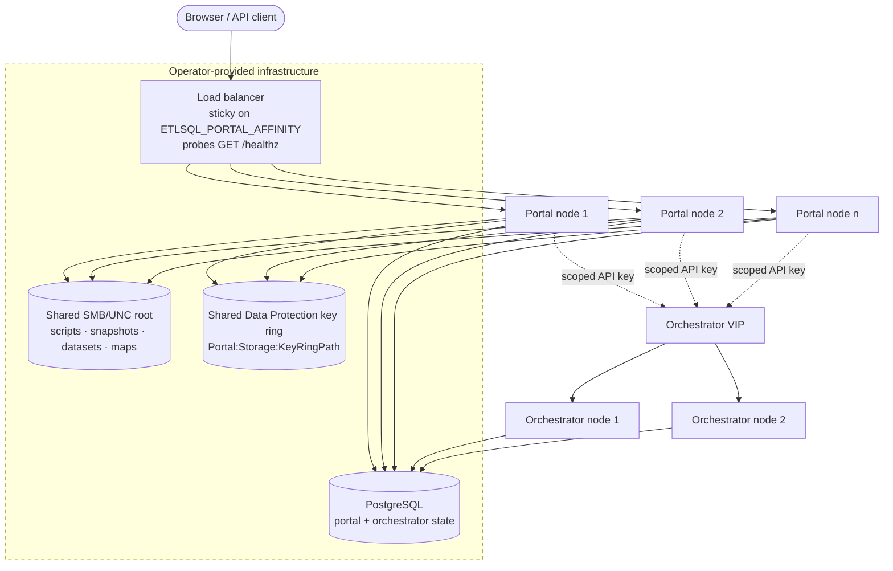

# HA Topology and Failure Certification

This guide defines the supported Portal and Orchestrator deployment topologies, the readiness
contract exposed to load balancers, and the failure scenarios that must be certified before an HA
environment is treated as production-ready.

## Supported Topologies

| Topology | State | Artifact storage | Traffic | Intended use |
| :--- | :--- | :--- | :--- | :--- |
| Standalone | SQLite on one host | Local directories on one host | Direct or single reverse proxy | Developer, single-user, small team installs |
| Departmental | SQLite on one managed host, or PostgreSQL for easier operations | Local or managed shared directory | One Portal endpoint, optional external Orchestrator | Team/shared service where maintenance windows are acceptable |
| High Availability | Shared PostgreSQL for Portal and Orchestrator | Shared SMB/UNC or equivalent mounted roots plus shared Data Protection key ring | Load-balanced Portal with sticky affinity; one or more Orchestrator nodes | Production operations that require node loss and rolling maintenance tolerance |

### High-Availability Topology

Everything in the dashed box is infrastructure the operator provides and ETL-SQL only depends on;
everything outside it is ETL-SQL's own coordination. The split matters during an incident: a node
returning 503 is usually reporting a dashed-box failure, not its own.



Two properties of this picture are the whole reason the readiness contract is strict:

- **Interactive sessions are node-local.** They live in the process that created them, which is why
  affinity is a requirement rather than an optimisation, and why a node that stops emitting the
  affinity cookie is refused readiness.
- **The key ring is shared state, not a local file.** A cookie, protected credential, dataset key, or
  Portal secret written by one node must decrypt on every other. Nodes with separate key rings will
  serve traffic and fail unpredictably per request, which is worse than failing closed.

Scheduled work, artifact writes, and migrations are fenced through PostgreSQL — leases, fencing
tokens, and leader election. Those are ETL-SQL's responsibility and are listed under
[Responsibility Boundaries](#responsibility-boundaries) below.

## Exact HA Requirements

Every HA Portal node must use:

- `Portal:Database:Provider=Postgres` with the same PostgreSQL Portal database.
- `Orchestrator:Database:Provider=Postgres` with the same PostgreSQL Orchestrator database used by
  Orchestrator nodes.
- Shared `Portal:ScriptRootPath`, `Portal:SnapshotDirectory`, `Portal:DatasetRootPath`, and
  `Portal:MapRootPath`.
- Shared `Portal:Storage:KeyRingPath` so cookies, protected credentials, dataset keys, and Portal
  secret-store values decrypt on every Portal node.
- Identical `Portal:Jwt:Secret`, accepted previous JWT secrets during rotation, dataset at-rest key,
  Orchestrator API key, and policy-authority signing certificate identity.
- `Portal:LoadBalancer:SessionAffinityEnabled=true`; load balancers must route on
  `Portal:LoadBalancer:SessionAffinityCookieName` because interactive report sessions are node-local.
- Service identities with explicit PostgreSQL, share, and filesystem permissions. Do not run Portal or
  Orchestrator as a broad local administrator account to compensate for missing ACLs.
- DNS names and certificates that match the public Portal VIP, Orchestrator API VIP, PostgreSQL
  endpoint, artifact storage endpoint, and policy-authority enrollment endpoint.
- Process supervision through Windows Services, systemd, Kubernetes, Docker Compose/Swarm, or an
  equivalent supervisor that restarts failed Portal and Orchestrator processes.

Recommended HA readiness configuration:

```json
{
  "Portal": {
    "Topology": {
      "ExpectedMode": "HighAvailability",
      "MinLivePortalNodes": 2,
      "MinLiveOrchestratorNodes": 1,
      "RequirePostgresForHa": true,
      "RequireSharedKeyRingForHa": true
    }
  }
}
```

Keep `MinLivePortalNodes` at `1` during bootstrap if the first node must become ready before the
remaining nodes are started. Raise it after the cluster is fully provisioned.

## Readiness and Health

Use `GET /healthz` as the load-balancer readiness probe. It returns HTTP 200 only when this node can
safely accept traffic for the configured topology. The response includes:

- `status` — `Healthy` or `Unhealthy`.
- `mode` — resolved topology mode: `Standalone`, `Departmental`, or `HighAvailability`.
- `checks.database` — Portal state database reachability.
- `checks.storage` — snapshot artifact root enumeration.
- `checks.lease` — node-registry/lease-store reachability.
- `checks.topology` — topology contract validation.
- `checks.portalNodes` and `checks.orchestratorNodes` — present for HA mode when minimum live-node
  thresholds are configured.
- `findings` — stable operator-facing finding codes. These are the complete set; every one is
  emitted only in `HighAvailability` mode.

| Finding code | Emitted when | Remedy |
| :--- | :--- | :--- |
| `ha-requires-portal-postgres` | `Topology:RequirePostgresForHa` is on and `Portal:Database:Provider` is not `Postgres`. | Point the node at the shared Portal PostgreSQL database, or set the expected mode to the topology this node is actually in. |
| `ha-requires-orchestrator-postgres` | `Topology:RequirePostgresForHa` is on and the Orchestrator store is not PostgreSQL. | Set `Orchestrator:Database:Provider=Postgres` with the shared Orchestrator database. |
| `ha-requires-shared-key-ring` | `Topology:RequireSharedKeyRingForHa` is on and `Portal:Storage:KeyRingPath` is unset. | Point every node at the same shared key-ring path. Leaving it unset means each node protects data with its own key ring. |
| `ha-requires-session-affinity` | `Portal:LoadBalancer:SessionAffinityEnabled` is off. | Re-enable it. Interactive report sessions are node-local, so an HA node that emits no affinity cookie cannot be routed to safely. |
| `ha-live-portal-node-threshold-not-met` | Live Portal heartbeats are below `Topology:MinLivePortalNodes`. | Start the remaining nodes, or lower the threshold during bootstrap. `checks.portalNodes` reports `live=<n>;min=<n>`. |
| `ha-live-orchestrator-node-threshold-not-met` | Live Orchestrator heartbeats are below `Topology:MinLiveOrchestratorNodes`. | Start an Orchestrator node, or lower the threshold. Defaults to `0`, which never trips. |

Use `GET /health` for richer operator diagnostics. It may show degraded non-routing conditions such as
policy-authority or Orchestrator issues; `/healthz` remains the traffic gate and fails closed for the
dependencies that make this node unsafe to route to.

### How `ExpectedMode: Auto` resolves — and why it can take a healthy node out of rotation

`Auto` is the default. It resolves to `HighAvailability` when **any** of PostgreSQL for the Portal
store, PostgreSQL for the Orchestrator store, or a configured `Portal:Storage:KeyRingPath` is
present, and to `Standalone` otherwise. It never resolves to `Departmental`; that mode must be set
explicitly.

The consequence is worth stating plainly, because it is not what an operator expects:

> A single-node SQLite Portal that merely moves its Data Protection key ring off the default path is
> classified as `HighAvailability`. `RequirePostgresForHa` then applies, `/healthz` returns **503**
> with `ha-requires-portal-postgres`, and the load balancer stops routing to a node that is
> otherwise working.

The inference itself is right — a shared key ring is a multi-node signal — but the readiness contract
it turns on is strict, so **set `Portal:Topology:ExpectedMode` explicitly on anything that is not a
plain single-node install**. A departmental deployment on PostgreSQL is the common case: it will be
inferred as HA and held out of rotation until it is told what it is.

`HaAndSecurityDocReconciliationTests.AutoMode_TreatsAConfiguredKeyRingAsHighAvailability_AndFailsClosedWithoutPostgres`
drives the real `/healthz` endpoint through this case, so the paragraph above is asserted rather
than described.

## Responsibility Boundaries

ETL-SQL coordinates:

- Portal and Orchestrator schema migration serialization.
- Database-backed node heartbeats, leader leases, scheduled-work fencing, artifact write fencing, and
  duplicate-delivery suppression.
- Node-local readiness decisions through `/healthz`.
- Fleet status aggregation through the scoped read-only FleetReader endpoint.
- Operational alerts and Prometheus signals for queue, storage, policy, audit/security, database, and
  fleet-node health.

Operators and infrastructure must provide:

- PostgreSQL high availability, backups, WAL archiving, point-in-time recovery, monitoring, and
  connection-pool sizing.
- Load-balancer routing, sticky affinity, TLS termination or pass-through, and external dead-man
  probing of each node.
- Shared storage availability, snapshots, restore procedures, SMB/object-storage access control, and
  capacity monitoring.
- Process supervision, container scheduling, node draining, restart policy, and host patching.
- DNS, PKI, certificate renewal, firewall rules, private routing, and network segmentation.
- Backup coordination across PostgreSQL, artifacts, key rings, policy material, certificates, and
  external dependencies.

## Failure Certification Matrix

| Scenario | Certification action | Expected result |
| :--- | :--- | :--- |
| Portal node loss | Stop one Portal process while traffic continues through the load balancer. | `/healthz` fails on the stopped node; surviving nodes continue serving non-sticky-new sessions; no duplicate report mutations occur. |
| Portal process crash | Kill the Portal process during queued or running refresh activity. | Process supervisor restarts it; stale node heartbeat expires; durable jobs remain recoverable or terminally failed with audit evidence. |
| Orchestrator node loss | Stop one Orchestrator process during scheduled workload. | Leases expire or transfer; due jobs run at most once; no duplicate scheduled mutations are emitted. |
| Network partition | Block a node from PostgreSQL or shared storage. | Partitioned node returns HTTP 503 from `/healthz`; load balancer removes it; whole-environment alerts still expose the underlying database/storage failure. |
| PostgreSQL failover | Promote/fail over PostgreSQL using the operator's database tooling. | Nodes return 503 while connections are unavailable and recover to 200 after the new primary is reachable; failed mutations are retried or reported once. |
| Shared-storage outage | Deny or unmount snapshot/dataset storage. | `/healthz` returns 503; snapshot/dataset writes fail closed; no catalog row points at a missing durable artifact. |
| Duplicate scheduler leadership | Start multiple schedulers against the same due job. | Database-backed leases allow one winner; losers observe the lease and suppress execution. |
| Orphaned work | Crash a worker after claim but before completion. | Reconciliation marks stale work failed/retryable according to the owning workflow; delivery ledgers and write fences prevent duplicate downstream mutation. |
| Recovery after outage | Restore PostgreSQL/storage/network, then restart nodes. | `/healthz` returns 200 only after database, storage, lease store, and topology checks pass; fleet preflight shows no pending migrations or drift. |

## Certification Evidence

For release or production go-live evidence, capture:

- `/healthz`, `/health`, `/metrics`, and `/api/fleet/status` samples before, during, and after each
  fault.
- PostgreSQL failover logs, load-balancer probe logs, and service-supervisor restart logs.
- Portal and Orchestrator application logs with correlation IDs.
- Job history, audit outbox state, security-event delivery state, and subscription delivery ledgers.
- Artifact root listings or storage snapshots that prove no missing durable artifacts were referenced.
- `etl-sql admin ha-soak` sequence (`fault-plan` → `fault-run` → `evidence` → `validate`) outputs when using the native
  HA soak harness.

The certification pass condition is not "no failures observed." The pass condition is that each
failure is detected, unsafe nodes are removed from traffic, mutation ownership is fenced, recovery is
observable, and the final catalog contains no duplicate or lost committed mutations.

## Automated Coverage Map

The repository carries fast and integration coverage for the HA contract:

| Scenario | Automated coverage |
| :--- | :--- |
| Readiness contract, mode inference, and finding codes | `HaAndSecurityDocReconciliationTests.AutoMode_TreatsAConfiguredKeyRingAsHighAvailability_AndFailsClosedWithoutPostgres`, plus reconciliation tests that fail the build when an emitted finding code or check key is undocumented |
| Shared PostgreSQL and shared roots | `PortalMultiProcessPostgresTests.TwoPortalProcesses_StartAgainstSamePostgresAndSharedStorage` |
| Database outage and network partition | `PortalMultiProcessPostgresTests.DatabaseOutage_HealthzFailsClosed` and `DatabaseNetworkPartition_HealthzFailsClosedAndRecovers` |
| Cross-process state convergence and restart recovery | `CatalogWrites_AreVisibleAcrossProcesses_AndSurviveRestart`, `ProcessRestart_ReclaimsInterruptedRefreshJobAcrossProcesses`, and `ExecutionJobServiceTests.StartAsync_MarksAbandonedJobsAndReportRefreshAsInterrupted` |
| Duplicate refresh and scheduler ownership | `PortalMultiProcessPostgresTests.SimultaneousRefreshClaims_ConvergeAcrossProcesses`, `JobExecutionLeaseTests.TwoSchedulerInstances_SameDueJob_ExecuteExactlyOnce`, and `ClusterLockTests.IntervalGatedSend_ExactlyOneWinnerPerInterval_AndRestartSafe` |
| Shared-storage outage | `FaultInjectionRecoveryTests.Healthz_ReturnsUnavailableWhenSharedStorageFails` and snapshot write-failure tests |
| Lease loss and partition recovery | `ExecutionJobServiceTests.NodeLeaseLoss_CancelsLocalRunningJobs` and `PartitionRecovery_CancelsLocalWork_AndFencesStaleArtifactWriter` |
| Orphaned worker cleanup | `ProcessJobExecutorChaosTests.CleanupOrphans_KillsPersistedChildProcess_FromPreviousRun` |
| Subscription/job reconciliation | `SubscriptionLifecycleRecoveryTests.Reconcile_ConvergesScriptsAndOrchestratorJobsToRowState` |

Docker-backed `PortalMultiProcessPostgresTests` and long-running `etl-sql admin ha-soak` evidence are
the release gate for PostgreSQL/container-specific behavior. Fast-lane tests prove the fencing,
readiness, and recovery contracts without requiring Docker.
