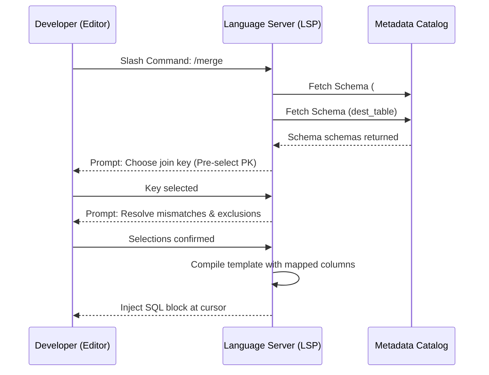

# Design Spec: Smart Snippets and Schema-Aware Code Generation

This document outlines the design and workflow for **Smart Snippets** in ETL-SQL. It details how slash commands (like `/merge` and `/upsert`) can interactively generate complex SQL boilerplate directly inside the IDE (VS Code or the TUI).

---

## 1. The Developer Experience: Interactive Slash Commands

To make this script-friendly, the interaction should live directly inside the code editor.

### Step 1: Triggering the Snippet
The developer types a slash command in the editor:
```sql
/merge #staging prod_db.dbo.Customers
```
When they press `Enter` or `Tab`, instead of treating it as text, the editor intercepts the command and launches a lightweight, inline **Schema-Mapping Wizard** (leveraging the VS Code QuickPick API or TUI prompt overlays).

### Step 2: The Interactive Prompts (The "Conversation")

The wizard asks three quick questions:

#### Question A: "Select the Matching Key(s)"
The Language Server retrieves the column definitions for `#staging` and `prod_db.dbo.Customers`.
* If `prod_db.dbo.Customers` has a Primary Key defined in the database catalog (e.g., `CustomerId`), the wizard **auto-selects it** and shows a confirmation:
  ```text
  [Key] CustomerId (Auto-detected from database schema)
  Select to change or add keys:
  [x] CustomerId
  [ ] Email
  [ ] Username
  ```

#### Question B: "Resolve Column Mismatches"
The engine automatically maps columns that have identical names (case-insensitive). For columns that don't match, it uses a **fuzzy-matching algorithm** (Levenshtein distance / Jaro-Winkler) to suggest mappings:
```text
The following columns could not be mapped automatically:
- src.FullName   -->  dest.Name?         [Approve / Change / Ignore]
- src.EmailAddress ->  dest.Email?        [Approve / Change / Ignore]
- src.CreatedDate  -->  (No match found)   [Map manually / Ignore]
```
The developer can quickly arrow-key through these and approve or override them.

#### Question C: "Conflict / Excluded Columns"
Often, you don't want to update certain columns on a match (e.g., `CreatedAt`, `CreatedBy`).
```text
Exclude columns from UPDATE on match?
[x] CreatedAt
[x] CreatedBy
[ ] LastModifiedAt
```

---

## 2. Under the Hood: The Language Server Flow

This feature is driven entirely by the **Language Server Protocol (LSP)** working in tandem with the editor.



### The Code-Generation Templates

Depending on the command, the engine generates clean, formatted SQL:

#### 1. The `/merge` Command
Generates a standard `MERGE` statement, comparing all mapped non-key columns to detect changes before performing an `UPDATE` (to avoid writing unnecessary transaction logs):

```sql
-- Generated /merge #staging prod_db.dbo.Customers
MERGE INTO prod_db.dbo.Customers AS T
USING #staging AS S ON T.CustomerId = S.CustomerId
WHEN MATCHED AND (
    T.Name <> S.FullName OR
    T.Email <> S.EmailAddress OR
    T.Phone <> S.Phone
) THEN
    UPDATE SET 
        T.Name = S.FullName,
        T.Email = S.EmailAddress,
        T.Phone = S.Phone,
        T.LastModifiedAt = GETDATE()
WHEN NOT MATCHED THEN
    INSERT (CustomerId, Name, Email, Phone, CreatedAt)
    VALUES (S.CustomerId, S.FullName, S.EmailAddress, S.Phone, GETDATE());
```

#### 2. The `/upsert` Command
For database systems that don't support `MERGE` or where performance dictates separate operations, `/upsert` generates separate `UPDATE` and `INSERT` blocks:

```sql
-- Generated /upsert #staging prod_db.dbo.Customers
-- Step 1: Update existing records
UPDATE T
SET 
    T.Name = S.FullName,
    T.Email = S.EmailAddress,
    T.Phone = S.Phone
FROM prod_db.dbo.Customers AS T
JOIN #staging AS S ON T.CustomerId = S.CustomerId
WHERE T.Name <> S.FullName 
   OR T.Email <> S.EmailAddress 
   OR T.Phone <> S.Phone;

-- Step 2: Insert new records
INSERT INTO prod_db.dbo.Customers (CustomerId, Name, Email, Phone)
SELECT S.CustomerId, S.FullName, S.EmailAddress, S.Phone
FROM #staging AS S
LEFT JOIN prod_db.dbo.Customers AS T ON S.CustomerId = T.CustomerId
WHERE T.CustomerId IS NULL;
```

---

## 3. Smarter Auto-Mapping Rules

To make the auto-mapping feel truly "smart," we should use these rules:
1. **Fuzzy String Alignment**: Map `created_by` to `CreatedBy`, `phone_num` to `Phone`, `first_name` + `last_name` to `Name` (suggesting concatenation).
2. **Data Type Coercion**: If the source column is `VARCHAR` but the destination is `INT`, the generated SQL should automatically wrap the source in a cast: `CAST(S.ZipCode AS INT)`.
3. **Audit Field Presets**: If columns named `UpdatedAt`, `LastModified`, or `ModifiedDate` exist in the target, the script should automatically map them to `GETDATE()` in the `UPDATE SET` clause without prompting.

---

### References
- [Language Server Autocomplete Protocol](../LanguageServer.md)
- [Merge Statement Grammar](../../guides/getting-started.md#9-merge)
- [Standards - Language Casing and Layout](../standards/Script_Composition_Standards.md)
