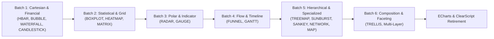

# Architecture Decision & Migration Ledger: Standard Visual Catalog Migration

## Status
Approved / Active Specification for Phase 8

## Executive Summary
This document provides the standard visual catalog migration ledger for ETL-SQL Phase 8. It groups all 24 remaining standard visual types into 6 semantic migration batches, specifies exact grammar contracts, required Grammar of Graphics primitives (`ChartSpec` / `PlotPlan`), cross-channel rendering requirements, and acceptance test criteria.

---

## 1. Migration Batch Overview & Dependency Ordering

---

## 2. Detailed Batch Specifications

### Batch 1: Cartesian & Financial
*Semantic Theme: Direct extension of existing 2D Cartesian plane with interval, multi-variable point, and stepped marks.*

#### 1.1 `HORIZONTALBAR` (or `HBAR`)
- **Accepted Mappings**: `Y` / `CATEGORY` (Nominal), `X` / `VALUE` (Quantitative), `COLOR` / `SERIES` (Nominal).
- **Options**: `TITLE`, `X_AXIS_TITLE`, `Y_AXIS_TITLE`, `STACKED`, `COLOR:PRIMARY`.
- **PlotPlan Representation**:
  - `Coordinate`: `CoordinateKind.TransposedCartesian`.
  - `Scales`: `ScaleKind.Band` on `FieldChannel.Y`, `ScaleKind.Linear` on `FieldChannel.X`.
  - `Marks`: `MarkKind.Rect` with bounds `[0, X]`.
- **Interaction & Export**:
  - Browser: Hover tooltip, category brush, bar click.
  - Static SVG & PDF: Native `<rect>` elements in `PlotPlanSvgRenderer`.
  - Terminal: Unicode horizontal bars `█` via `TerminalRenderer.RenderHorizontalBarChart`.
- **Acceptance Tests**: Conformance fixture `hbar_native_plot_plan.rptsql`, golden SVG geometry test.

#### 1.2 `BUBBLE`
- **Accepted Mappings**: `X` (Quantitative), `Y` (Quantitative), `SIZE` (Quantitative), `COLOR` / `SERIES` (Nominal), `LABEL` (Nominal).
- **Options**: `TITLE`, `MIN_SIZE`, `MAX_SIZE`, `COLOR:PRIMARY`.
- **PlotPlan Representation**:
  - `Coordinate`: `CoordinateKind.Cartesian`.
  - `Scales`: `ScaleKind.Linear` on `FieldChannel.X` and `FieldChannel.Y`, `ScaleKind.Sqrt` on `FieldChannel.Size`.
  - `Marks`: `MarkKind.Point` with dynamic `r` radius and `fill-opacity = 0.7`.
- **Interaction & Export**:
  - Browser: Hover tooltip showing X, Y, and Size metrics.
  - Static SVG & PDF: Native `<circle>` elements.
  - Terminal: Scatter plot with size indicator or ranked table fallback.
- **Acceptance Tests**: Conformance fixture `bubble_native_plot_plan.rptsql`, radius normalization golden test.

#### 1.3 `WATERFALL`
- **Accepted Mappings**: `X` / `LABEL` (Nominal), `Y` / `VALUE` (Quantitative), `IS_TOTAL` (Boolean).
- **Options**: `TITLE`, `COLOR:POSITIVE`, `COLOR:NEGATIVE`, `COLOR:TOTAL`.
- **PlotPlan Representation**:
  - `Coordinate`: `CoordinateKind.Cartesian`.
  - `Scales`: `ScaleKind.Band` on `FieldChannel.X`, `ScaleKind.Linear` on `FieldChannel.Y`.
  - `Marks`: `MarkKind.Rect` with floating interval `[prevRunningTotal, currentRunningTotal]`, connector `MarkKind.Rule` lines between consecutive bars.
- **Interaction & Export**:
  - Browser: Step-by-step delta tooltips.
  - Static SVG & PDF: Floating `<rect>` and connecting `<line>` elements.
  - Terminal: ASCII waterfall step chart.
- **Acceptance Tests**: Waterfall step balance fixture, negative delta coloring tests.

#### 1.4 `CANDLESTICK`
- **Accepted Mappings**: `X` / `DATE` (Temporal/Nominal), `OPEN` (Quantitative), `HIGH` (Quantitative), `LOW` (Quantitative), `CLOSE` (Quantitative).
- **Options**: `TITLE`, `COLOR:BULL` (default green `#26a69a`), `COLOR:BEAR` (default red `#ef5350`).
- **PlotPlan Representation**:
  - `Coordinate`: `CoordinateKind.Cartesian`.
  - `Scales`: `ScaleKind.Band` / `ScaleKind.Time` on `FieldChannel.X`, `ScaleKind.Linear` on `FieldChannel.Y`.
  - `Marks`: Multi-mark composite — `MarkKind.Rule` for High-Low wick, `MarkKind.Rect` for Open-Close real body.
- **Interaction & Export**:
  - Browser: OHLC tooltip card, crosshair cursor.
  - Static SVG & PDF: Pure `<line>` wicks + `<rect>` bodies.
  - Terminal: Unicode candlestick symbols.
- **Acceptance Tests**: Bullish/bearish body fill tests, extreme wick boundary assertions.

---

### Batch 2: Statistical & Grid
*Semantic Theme: Summary statistics distributions, multi-dimensional matrix tiles, and cell heatmaps.*

#### 2.1 `BOXPLOT`
- **Accepted Mappings**: `X` / `CATEGORY` (Nominal), `MIN`, `Q1`, `MEDIAN`, `Q3`, `MAX` (Quantitative) or raw values with engine computation.
- **Options**: `TITLE`, `SHOW_OUTLIERS`, `ORIENTATION` (`VERTICAL` / `HORIZONTAL`).
- **PlotPlan Representation**:
  - `Coordinate`: `CoordinateKind.Cartesian` (or `TransposedCartesian`).
  - `Scales`: `ScaleKind.Band` on X, `ScaleKind.Linear` on Y.
  - `Marks`: Composite layer — `MarkKind.Rect` for IQR box `[Q1, Q3]`, `MarkKind.Rule` for median line and whiskers `[Min, Q1]` & `[Q3, Max]`, `MarkKind.Point` for outlier dots.
- **Acceptance Tests**: 5-number summary alignment, outlier threshold rendering.

#### 2.2 `HEATMAP`
- **Accepted Mappings**: `X` (Nominal/Ordinal), `Y` (Nominal/Ordinal), `VALUE` (Quantitative).
- **Options**: `TITLE`, `COLOR_MAP` (e.g. `BLUES`, `VIRIDIS`), `MIN`, `MAX`, `CELL_RADIUS`.
- **PlotPlan Representation**:
  - `Coordinate`: `CoordinateKind.Cartesian`.
  - `Scales`: `ScaleKind.Band` on X and Y, `ScaleKind.Sequential` on `FieldChannel.Size` / `FieldChannel.Color`.
  - `Marks`: `MarkKind.Rect` grid cells with normalized `fill-opacity` or interpolated color scale, `MarkKind.Text` for cell value labels.
- **Acceptance Tests**: 2D discrete grid mapping, sequential palette interpolation.

#### 2.3 `MATRIX`
- **Accepted Mappings**: `ROW` (Nominal), `COLUMN` (Nominal), `VALUE` (Quantitative), `VALUE2..VALUE5` (Quantitative).
- **Options**: `AGGREGATE`, `GRAND_TOTAL`, `SUBTOTALS`, `AXIS_SORT`.
- **PlotPlan Representation**:
  - Tabular pivot grid layout rendered directly as semantic HTML table / SVG matrix without ECharts.
- **Acceptance Tests**: Multi-level dimension grouping, subtotal calculations.

---

### Batch 3: Polar & Indicator
*Semantic Theme: Radial axes, angular coordinate projections, and metric needles.*

#### 3.1 `RADAR`
- **Accepted Mappings**: `CATEGORY` / `AXIS` (Nominal), `VALUE` (Quantitative), `SERIES` / `COLOR` (Nominal).
- **Options**: `TITLE`, `MAX`, `SHAPE` (`POLYGON` / `CIRCLE`), `FILL_OPACITY`.
- **PlotPlan Representation**:
  - `Coordinate`: `CoordinateKind.Polar`.
  - `Scales`: `ScaleKind.Band` on `Theta` (angular slots), `ScaleKind.Linear` on `Radius`.
  - `Marks`: `MarkKind.Path` (closed polygon) + `MarkKind.Point` vertices + `MarkKind.Rule` web radial lines.
- **Acceptance Tests**: Multi-series polygon intersection, radial tick label alignment.

#### 3.2 `GAUGE`
- **Accepted Mappings**: `VALUE` (Quantitative), `LABEL` (Nominal).
- **Options**: `TITLE`, `MIN` (default 0), `MAX` (default 100), `TARGET`, `ZONES` (`GREEN`, `YELLOW`, `RED`).
- **PlotPlan Representation**:
  - `Coordinate`: `CoordinateKind.Polar`.
  - `Scales`: `ScaleKind.Linear` on `Radius` / `Theta` interval $[-\pi, 0]$.
  - `Marks`: Background arc `MarkKind.Arc` + Value arc `MarkKind.Arc` + Needle `MarkKind.Line` + Center `MarkKind.Point`.
- **Acceptance Tests**: Angle clamping, needle pivot center, zone color thresholds.

---

### Batch 4: Flow, Timeline & Annotation
*Semantic Theme: Ordered stages, interval schedules, and milestone roadmaps.*

#### 4.1 `FUNNEL`
- **Accepted Mappings**: `LABEL` / `STAGE` (Nominal), `VALUE` (Quantitative), `COLOR` (Nominal).
- **Options**: `TITLE`, `SORT` (`DESC` / `ASC` / `NONE`), `ALIGN` (`CENTER` / `LEFT` / `RIGHT`).
- **PlotPlan Representation**:
  - `Coordinate`: `CoordinateKind.Cartesian`.
  - `Scales`: `ScaleKind.Band` on Y, `ScaleKind.Linear` on X (centered width).
  - `Marks`: `MarkKind.Path` (trapezoid polygons connecting stage widths) + `MarkKind.Text` stage & conversion rate labels.
- **Acceptance Tests**: Trapezoid stage connectivity, conversion percentage annotations.

#### 4.2 `GANTT`
- **Accepted Mappings**: `Y` / `LABEL` (Nominal), `START` / `X` (Temporal/Quantitative), `END` / `X2` (Temporal/Quantitative), `COLOR` (Nominal).
- **Options**: `TITLE`, `X_AXIS_TITLE`, `Y_AXIS_TITLE`, `GRID_LINES`.
- **PlotPlan Representation**:
  - `Coordinate`: `CoordinateKind.TransposedCartesian`.
  - `Scales`: `ScaleKind.Band` on Y, `ScaleKind.Time` / `ScaleKind.Linear` on X.
  - `Marks`: `MarkKind.Rect` intervals `[Start, End]`, `MarkKind.Rule` for deadlines/milestones, `MarkKind.Line` for dependency links.
- **Acceptance Tests**: Characterization parity with `GanttCharacterizationTests.cs`, date interval resolution.

---

### Batch 5: Hierarchical & Specialized
*Semantic Theme: Tree structures, network graphs, flow node-links, and geographic coordinates.*

#### 5.1 `TREEMAP`
- **Accepted Mappings**: `ID`, `PARENT` (Hierarchical Nominal), `VALUE` (Quantitative), `COLOR` (Nominal/Quantitative).
- **Layout**: Squarified Treemap partition layout algorithm (native C# module in `ETL-SQL.Reporting/Layouts/TreemapLayout.cs`).
- **PlotPlan Representation**: Pre-resolved hierarchical `MarkKind.Rect` marks with nested bounding boxes.
- **Third-Party Evaluation**: Pure C# algorithm (~150 lines); zero external dependency.

#### 5.2 `SUNBURST`
- **Accepted Mappings**: `ID`, `PARENT`, `VALUE`, `COLOR`.
- **Layout**: Radial partition layout (nested concentric angle/radius slices).
- **PlotPlan Representation**: Polar `MarkKind.Arc` layers with `InnerRadius` and `OuterRadius` determined by tree depth.

#### 5.3 `SANKEY`
- **Accepted Mappings**: `SOURCE` (Nominal), `TARGET` (Nominal), `VALUE` (Quantitative).
- **Layout**: Layered node-link flow solver (computes node column ranks, vertical positions, and bezier link ribbons).
- **PlotPlan Representation**: Node `MarkKind.Rect` marks + Link `MarkKind.Path` cubic bezier curves.

#### 5.4 `NETWORK`
- **Accepted Mappings**: `SOURCE`, `TARGET`, `WEIGHT` (Optional), `COLOR` (Optional).
- **Layout**: Force-directed or circular network layout solver.
- **PlotPlan Representation**: Link `MarkKind.Line` marks + Node `MarkKind.Point` circles + `MarkKind.Text` labels.

#### 5.5 `MAP`
- **Accepted Mappings**: `GEO_ID` / `NAME` (Nominal), `VALUE` (Quantitative), `COLOR` (Quantitative/Nominal).
- **Layout**: GeoJSON projection (Mercator / Equirectangular SVG path generator).
- **PlotPlan Representation**: Region `MarkKind.Path` marks bound to GeoJSON geometry + sequential choropleth color scale.

---

### Batch 6: Composition & Grid Faceting
*Semantic Theme: Multi-panel grid faceting and multi-layer chart composition.*

#### 6.1 `TRELLIS`
- **Accepted Mappings**: Child visual specification + `ROW_BY` (Nominal) + `COL_BY` (Nominal).
- **PlotPlan Representation**: `FacetSpec` with grid rows and columns, sub-panel coordinate spaces sharing synchronized scale domains.
- **Acceptance Tests**: Small multiple synchronized axes, independent facet rendering.

---

## 3. Final Gate & Deletion Checklist

Once Batches 1 through 6 pass all conformance and golden rendering tests:
1. **Delete Legacy Option Generators**: Remove `SpecializedRenderer.cs` and `EChartsRenderer.cs`.
2. **Delete Transient PlotPlan Compiler**: Remove `PlotPlanEChartsRenderer.cs`.
3. **Remove V8 Server Engine**: Remove `EChartsSsrRenderer.cs` and purge `Microsoft.ClearScript.V8.*` NuGet references from `ETL-SQL.Reporting.csproj` and `Directory.Packages.props`.
4. **Remove Browser ECharts Bundle**: Delete `echarts.min.js` from `src/ETL-SQL.ReportRuntime/Resources/Shared/`, run `sync-assets.js`, and remove `<script>` tags from all host HTML pages.
5. **Update SBOM & Legal Notices**: Remove ECharts and ClearScript entries from `THIRD-PARTY-NOTICES.md` and `THIRD-PARTY-INVENTORY.md`.
6. **Update VisualCapabilityMatrix**: Promote all 36 visual types to 100% `Native` across Browser, StaticExport, and PdfEmailExport.
