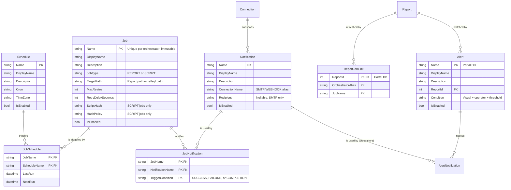

# Design Spec: Job, Schedule, and Alerting Refactor

This document outlines the architectural changes for establishing a unified, many-to-many scheduling
and notification model in ETL-SQL. It details how the engine, portal, and orchestrator align to
replace fragmented scheduler mechanisms with a robust, enterprise-grade scheduler similar to SQL
Agent.

**Status:** design final as of 2026-07-27. §12 records every decision taken and the deferrals accepted
with them; there are no open questions blocking implementation.

---

## 1. Problem Statement & Goals

### The Legacy State This Refactor Replaces

1. **1:1 Schedule Coupling:** Schedules were coupled directly to report refresh entities
   (`DatasetJob`). Registering a second schedule on the same report silently overwrites the existing
   one, because `SubscriptionsController` keys the job as `portal-refresh:{alias}:{report.Id}` and
   `DatasetRegistryService.RegisterRefreshJobAsync` looks the job up by that key.
2. **Two report-refresh paths, one of which never schedules anything.**
   * `POST api/subscriptions/refresh-jobs` → `RegisterRefreshJobAsync` wrote a `DatasetJobs` row and
     **nothing else**. It never calls `SaveJobAsync`, so no Orchestrator job exists, and
     `OrchestratorPollerService` waits forever on a completion nothing produces. This path has never
     worked.
   * `CREATE DATASET … REFRESH EVERY '30m'` **does** schedule: `CreateDatasetStatementHandler`
     synthesises a `CreateJobStatement` whose body is a `PRINT` statement — a no-op whose only
     purpose is to produce a completion for the poller to see — and then registers the link. It is
     the only working end-to-end refresh today, and it is built out of the two things this refactor
     removes: the inline `AS <statement>` job body and a 1:1 dataset↔schedule coupling.
3. **Naming and vocabulary fragmentation.** Five schedule vocabularies exist today:
   * engine `CREATE JOB … ON SCHEDULE EVERY 5 MINUTES [AT '02:00']` → `JobDefinition{Interval, Unit, AtTime}`;
   * portal refresh jobs → a **cron** string in `DatasetJob.RefreshInterval` that nothing consumed;
   * subscriptions → `Daily`/`Weekly`/`Monthly`/`Hourly`, mapped to an interval by
     `SubscriptionOrchestration.ParseSchedule`;
   * report datasets → `REFRESH EVERY '30m'` duration strings;
   * alerts → no schedule at all; evaluation timing is implicit.
4. **Implicit Alerting:** Email/webhook configurations are inline properties of the job/report rather
   than reusable destinations, leading to configuration duplication across hundreds of jobs.
5. **Timezone Gaps:** `SchedulerService.CalculateNextRun` computes from `DateTime.Now` with no
   timezone concept at all.
6. **No human-facing label.** A job has exactly one string, and it is both the script identifier and
   what an operator reads in a list. A generated name such as `portal-refresh:orch_a:17` is therefore
   unreadable in the UI, and there is nowhere to record what a job is *for*.

### Architectural Goals

* **Modular Peer Entities:** `JOB`, `SCHEDULE`, and `NOTIFICATION` as three independent, first-class
  peer entities, with `ALERT` composing them on the Portal side.
* **Many-to-Many Mappings:** One `SCHEDULE` triggers many `JOB`s; one `JOB` drives many
  `NOTIFICATION`s.
* **One Grammar:** A single `CREATE/ALTER/DROP/ENABLE/DISABLE` lifecycle, targeted with
  `EXECUTE <server> BEGIN … END`. The engine's existing `CREATE JOB` form is **replaced**.
* **Cron everywhere.** Cron plus an explicit timezone is the one schedule representation.
* **The script is the source of truth.** Identity is the name, and the name does not drift.

---

## 2. Identity: the name is the key

**Decision (2026-07-27).** `Name` remains the primary key. It is **not** renameable. Presentation
moves to separate, freely mutable attributes:

| Attribute | Purpose |
| :--- | :--- |
| `Name` | Primary key. Script-facing identity. Immutable. |
| `DisplayName` | Human label shown in the Portal and CLI. Defaults to `Name`. Freely editable. |
| `Description` | What the object is for. Freely editable. |
| `Options` | Property bag for classification and presentation metadata only. |

### Why not a surrogate key with a renameable name

The SQL Agent model — surrogate id, renameable label — is the wrong fit here, for a reason specific
to this product: **ETL-SQL's configuration is code.** `ConfigurationExportService` emits the catalog
as a replayable script, and scripts reference objects by name:

```sql
ALTER JOB FinanceNightly ADD SCHEDULE NightlyTrigger;
```

If a name can change out from under that script, the script silently stops matching what exists. A
re-import then creates a duplicate instead of reconciling, and the config-as-code round trip — the
property the export exists to provide — is broken by a UI action nobody thought was destructive.

It is also the identity model every other object in the language already uses. `CONNECTION`,
`PROCEDURE`, `FUNCTION`, `VIEW`, `INDEX`, `TABLE` are all named, none has a surrogate key, and none
can be renamed. Giving three new objects a different identity model would make them the exception.

**What this buys us**, beyond consistency: the plan no longer re-keys `JobHistory`,
`JobState (JobName, StateKey)` or `HostMetricsDaily (Day, JobName)`. Those all key on the name string
today, and the surrogate-key version required rebuilding four tables — which would have been the
first non-additive change ever made to the orchestrator store, and SQLite cannot alter a primary key
in place. That entire migration disappears. The name stays stable, so history stays correct without a
`JobNameAtRunTime` column to preserve it.

**What it costs:** correcting a badly chosen name means `DROP` + `CREATE`, which loses that job's
history — the same trade every other object in the language makes. `DisplayName` removes most of the
motive for renaming, since what an operator reads is editable. If a true in-place rename is ever
needed it can be added later as a cascading key update; do not build a surrogate-key model
speculatively for it.

`Options` is deliberately narrow: **anything the scheduler reads gets a real column.** A property bag
that influences behaviour becomes an unvalidated, unqueryable second schema.

---

## 3. Ownership

| Entity | Owner | Why |
| :--- | :--- | :--- |
| `JOB`, `SCHEDULE`, `NOTIFICATION` | **Orchestrator** | It runs the jobs, so it holds the trigger, computes the next run, and dispatches the outcome. |
| `ALERT` | **Portal** | An alert says *a visualization changed*. Evaluating `WHEN VISUAL …` means querying a report — Report-SQL work the Orchestrator knows nothing about. |
| Connection catalog | **Portal** | ACLs, ownership, usage ledger, per-user audit need an identity model the Orchestrator does not have. |

Names are unique per orchestrator — each Orchestrator has its own store, so `Nightly` may exist once
on `orch_a` and once on `orch_b` with no extra scoping needed.

For jobs, the Portal is a **client**, not a second catalog. It keeps exactly one thing the
Orchestrator cannot know: which of its reports a job refreshes. Everything else it displays is read
through `OrchestratorProxyService` (`api/scheduled-jobs`), not mirrored. There is therefore no
Portal→Orchestrator catalog reconciler; §9 covers the smaller problem that remains.

**There is exactly one `NOTIFICATION` catalog, and it is the Orchestrator's.** An earlier draft split
it — the Orchestrator's for job outcomes, the Portal's for alerts — which meant an operator
configuring the same mail destination twice. Instead the Portal *evaluates* an alert condition and
then asks the Orchestrator to dispatch through a named notification.

That dependency is free: an alert fires on a refresh completion which came from the Orchestrator, so
the Orchestrator is reachable by construction at exactly the moment an alert needs it. It also
preserves the property that makes §10 worth having — a job's failure notification does not depend on
the Portal being up. An `ALERT` therefore names the orchestrator connection whose notification it
uses, in the same way a job does.



`TriggerCondition` lives on `JobNotification` only. A `NOTIFICATION` is a destination; *when* it
fires is a property of the link, which is what lets one channel serve `ON SUCCESS` for one job and
`ON FAILURE` for another.

---

## 4. SQL Grammar & Statement Lifecycle

Targeting uses `EXECUTE <connection> BEGIN … END`, consistent with the managed-connection decision
in `TODO.md`. There is no `AT <server>` clause. A statement outside a block targets the locally
configured orchestrator store — the same target the engine's `CREATE JOB` uses today.

### 4.1 Object Creation

```sql
EXECUTE orch_admin BEGIN
    -- 1. A shared trigger
    CREATE SCHEDULE NightlyTrigger
    ON '0 2 * * *'
    AT TIME ZONE 'America/New_York'
    WITH (DISPLAY_NAME = 'Overnight (2am ET)', DESCRIPTION = 'Standard batch window');

    -- 2. A reusable destination
    CREATE NOTIFICATION OpsAlert
    USING local_mail TO 'ops-alerts@example.com';

    -- 3. The executable job
    CREATE JOB FinanceNightly
    FOR REPORT 'folders/Finance Dashboard'
    WITH (MAX_RETRIES = 3, RETRY_DELAY = 60, DISPLAY_NAME = 'Finance — nightly refresh');
END;
```

* **`FOR REPORT` vs `FOR SCRIPT`** are mutually exclusive and enforced by the parser.
* **`WITH (MAX_RETRIES, RETRY_DELAY)`** carries over verbatim from the retired `CREATE JOB … WITH (…)`
  form. Retry is a property of the *attempt*, not the trigger, so it belongs on the job.
  `JobDefinition` already stores both, so this costs no storage change.
* **`DISPLAY_NAME` and `DESCRIPTION`** are optional in `WITH (…)` on every kind. `DISPLAY_NAME`
  defaults to `Name`.
* **Script integrity is preserved.** `JobDefinition.ScriptHash` / `HashPolicy` (driven by
  `SET SCRIPT_HASH_POLICY`) continue to apply to `FOR SCRIPT` jobs. `FOR REPORT` jobs have no
  external script and carry neither.

### 4.2 Linking (`ALTER … ADD / REMOVE`)

```sql
EXECUTE orch_admin BEGIN
    ALTER JOB FinanceNightly ADD SCHEDULE NightlyTrigger;

    ALTER JOB FinanceNightly ADD NOTIFICATION SlackChannel ON SUCCESS;
    ALTER JOB FinanceNightly ADD NOTIFICATION OpsAlert    ON FAILURE;

    ALTER JOB FinanceNightly REMOVE SCHEDULE NightlyTrigger;
    ALTER JOB FinanceNightly REMOVE NOTIFICATION OpsAlert ON FAILURE;
END;
```

Attaching `ON COMPLETION` alongside `ON SUCCESS`/`ON FAILURE` for the same job and notification is
**rejected at link time**, not silently double-fired: `COMPLETION` is the union of the other two, so
the pair is always a mistake.

### 4.3 Alerts (Portal)

An `ALERT` is a **condition** plus destinations. That is what distinguishes it from a
`NOTIFICATION`, which is only a destination whose trigger is a job outcome. It tells a user that a
visualization has changed, so it lives with the Portal, which is the only component that can
evaluate the condition:

```sql
-- The destination lives in the orchestrator's single notification catalog.
EXECUTE orch_admin BEGIN
    CREATE NOTIFICATION FinanceOps
    USING local_mail TO 'finance-ops@example.com';
END;

EXECUTE portal_admin BEGIN
    CREATE ALERT RevenueDrop
    FOR REPORT 'folders/Finance Dashboard'
    WHEN VISUAL RevenueChart < 100000
    WITH (DESCRIPTION = 'Revenue below the quarterly floor');

    ALTER ALERT RevenueDrop ADD NOTIFICATION orch_admin.FinanceOps;
END;
```

The qualified `orch_admin.FinanceOps` is deliberate: the alert lives in the Portal and the
notification in an orchestrator, so the reference has to name which one. An unqualified name is
rejected rather than assumed, since a Portal may talk to several orchestrators.

* **The visual is an identifier, not a string literal** (`RevenueChart`, not `'RevenueChart'`),
  matching how visuals are named everywhere else in Report-SQL. Today's
  `CREATE ALERT 'x' FOR REPORT 'r' WHEN VISUAL 'v' > 100` quotes all three; name and visual become
  identifiers, and the report path stays a literal because it is a path.
* **`ADD NOTIFICATION` takes no `ON <condition>`** — the alert *is* the condition. Only jobs need a
  trigger qualifier.
* **`FOR SCRIPT` is not offered in this pass.** `WHEN VISUAL` has no meaning for a script, and the
  scalar-query predicate that would replace it is a larger grammar. Recorded in §12.
* **Evaluation is on scheduled report refresh completion.** The Portal already learns of every
  refresh through `OrchestratorPollerService`, so an alert needs no schedule of its own and cannot go
  stale relative to the data it watches. Interactive refreshes do not evaluate alerts — a user
  opening a report should not be able to trigger mail to a distribution list.
* **Alerting is transition-based**, reusing the policy v0.17.0 established for data-quality
  assertions: a pass→fail transition notifies, and repeated fail→fail evaluations are suppressed
  until the condition recovers. Without this, a condition that stays true for ten refreshes sends ten
  identical messages. This is stateful, so `Alerts` carries the previous evaluation result
  (`LastState`, plus `LastEvaluatedAt` and `LastNotifiedAt` for operator diagnosis).
* `ASSERT JOB … ON FAILURE ALERT <connection>` (v0.17.0) sends to a bare connection. It becomes
  `ON FAILURE NOTIFY <notification>` so there is one destination concept, not two.

### 4.4 Administrative Lifecycle

Existence modifiers precede the object name for every kind, matching the canonicalization already
applied to all sixteen `DROP` kinds:

```sql
DROP JOB IF EXISTS FinanceNightly;
DROP SCHEDULE IF EXISTS NightlyTrigger;
DROP NOTIFICATION IF EXISTS OpsAlert;
DROP ALERT IF EXISTS RevenueDrop;

DISABLE JOB FinanceNightly;       -- pauses this job
DISABLE SCHEDULE NightlyTrigger;  -- pauses every job on this trigger
DISABLE NOTIFICATION OpsAlert;    -- suppresses this destination everywhere
ENABLE JOB FinanceNightly;

ALTER JOB FinanceNightly SET (DISPLAY_NAME = 'Finance — overnight', DESCRIPTION = '…');
ALTER JOB FinanceNightly SET TARGET = 'folders/Finance Dashboard v2';
ALTER JOB FinanceNightly SET (MAX_RETRIES = 5);
ALTER SCHEDULE NightlyTrigger SET CRON = '0 3 * * *';
ALTER SCHEDULE NightlyTrigger SET TIME ZONE 'UTC';
ALTER NOTIFICATION OpsAlert SET TO 'infra-alerts@example.com';
```

There is no `RENAME TO`. Changing a name is `DROP` + `CREATE`, and the parser says so when a name is
not found: the diagnostic names the closest existing object rather than only reporting absence, since
a typo'd name is otherwise indistinguishable from a missing object.

### 4.5 Replay must converge — `CREATE OR ALTER`, `CREATE OR REPLACE`, idempotent links

Keeping `Name` as the key is what makes an exported script reconcile with what exists (§2). That only
pays off if re-running the script **converges** instead of failing, so both creation modes are
supported for all four kinds, with distinct meanings:

| Mode | Meaning |
| :--- | :--- |
| `CREATE` | Fails if the name exists. |
| `CREATE OR ALTER` | Patches the named object. **Links are left alone.** |
| `CREATE OR REPLACE` | Full redefinition. **Links are dropped** and must be restated. |

The link distinction is the one that matters. If a script stops saying
`ALTER JOB X ADD SCHEDULE S2`, only a `REPLACE` that resets links converges to what the script now
says; under `OR ALTER` the orphaned link survives forever and the export drifts from reality.
The Orchestrator catalog export therefore emits `CREATE OR REPLACE` followed by the full set of
job/schedule/notification links. The Portal configuration export cannot reconstruct those
Orchestrator-owned objects from `ReportJobLinks`; the Portal deliberately stores only
`ReportId`/`OrchestratorAlias`/`JobName`, so normalized-only report links are listed as explicit
manual follow-up unless an Orchestrator catalog export is replayed alongside the Portal bootstrap.

**`ADD` and `REMOVE` must be idempotent.** Fixing `CREATE` alone is not enough — a replayed
`ALTER JOB X ADD SCHEDULE S` would otherwise fail on a duplicate primary key and break the import at
the third statement. `ADD` on an existing link and `REMOVE` on an absent one are both no-ops, not
errors.

This also dissolves the atomicity problem: an `EXECUTE … BEGIN … END` block forwards statements one
at a time, so a failure partway through leaves an orphan. With convergent replay, re-running the
block heals it.

**The hazard to accept:** with `CREATE OR ALTER`, a second script importing a name that already
exists does not error — it silently takes the object over. Two teams' scripts then overwrite each
other on every import, each looking correct in isolation. This is the SQL Agent problem and it has
the same social answer: naming conventions plus a category in `OPTIONS`. The `CreatedBy`/`ModifiedBy`
attribution columns (§10) at least make the takeover visible after the fact. Enforcing it needs
per-object ownership on the Orchestrator, which is a roadmap item.

**Referential rules, enforced and tested:**

| Action | Behaviour |
| :--- | :--- |
| `DROP SCHEDULE` still linked | **Restrict.** Fails, naming the jobs that use it. |
| `DROP NOTIFICATION` still linked | **Restrict.** Fails, naming the jobs or alerts that use it. |
| `DROP JOB` / `DROP ALERT` with links | **Cascade** the links; schedules and notifications survive. |
| Portal report deleted | **Restrict** while refresh jobs or alerts are attached. |

Restrict is the default because these objects are shared: cascading a `DROP SCHEDULE` would silently
unschedule unrelated jobs.

### 4.6 Retired forms

Each is rejected by the parser with a diagnostic naming its replacement — they all parse cleanly
today, so a generic syntax error would leave the reader guessing:

| Retired | Replacement |
| :--- | :--- |
| `CREATE JOB n ON SCHEDULE EVERY 5 MINUTES AS <stmt>` | `CREATE SCHEDULE` + `CREATE JOB … FOR SCRIPT` + `ALTER JOB … ADD SCHEDULE` |
| `ALTER JOB n ON SCHEDULE EVERY …` | `ALTER SCHEDULE s SET CRON = …` |
| `CREATE REFRESH JOB FOR REPORT '…' SCHEDULE '…'` | `CREATE JOB n FOR REPORT '…'` + link |
| `DROP REFRESH JOB FOR REPORT '…'` | `DROP JOB IF EXISTS n` |
| `CREATE DATASET &d … REFRESH EVERY '30m'` | `CREATE JOB n FOR REPORT '…'` + link (see §5) |
| `CREATE ALERT 'n' FOR REPORT 'r' WHEN VISUAL 'v' > 100 DELIVER TO '…' AT smtp` | `CREATE ALERT n …` + `ALTER ALERT n ADD NOTIFICATION …` |
| `ASSERT JOB … ON FAILURE ALERT <connection>` | `ASSERT JOB … ON FAILURE NOTIFY <notification>` |

The inline `AS <statement>` job body disappears with the first row: a job names a script path, so its
body is versioned, hashable, and lintable like any other script. **Every sample, doc snippet, and
test using the inline form must be migrated in the same change.**

---

## 5. Retiring `CREATE DATASET … REFRESH EVERY`

**Decision (2026-07-27): remove it.** A dataset with its own private schedule is a 1:1 coupling of
exactly the kind this refactor exists to eliminate, and it cannot express two refresh cadences, a
timezone, retries, or notifications. Separating it now, before the product is in use, is far cheaper
than adding a second scheduler surface and migrating later.

It is also the only engine-side consumer of the two mechanisms being retired: it builds a
`CreateJobStatement` with an inline `PRINT` body and calls `RegisterRefreshJobAsync`. Removing it
deletes `CreateDatasetStatementHandler.CreateRefreshJob`, `ParseRefreshInterval`, the
`__dataset_refresh_*__` synthetic job names, and the `DatasetRefreshIntervalRule` lint rule.

Replacement is an ordinary named job against the owning report:

```sql
EXECUTE orch_admin BEGIN
    CREATE SCHEDULE HalfHourly ON '*/30 * * * *' AT TIME ZONE 'UTC';
    CREATE JOB SalesRefresh FOR REPORT 'folders/Sales';
    ALTER JOB SalesRefresh ADD SCHEDULE HalfHourly;
END;
```

`TTL` stays on `CREATE DATASET` — it is cache expiry, not a schedule, and has no trigger.
Consumers to update: `docs/reference/visuals-reporting/report/dataset.md`, `report-cli.md`,
`docs/guides/report-sql.md`, `docs/cookbooks/report-recipes.md`, `docs/syntax-index.md`,
`snippets/dataset.md`, and the sample reports under `samples/08_Reporting`,
`samples/10_Kitchen_Sinks`, `samples/integration`, and `Reports/`.

---

## 6. Orchestrator Store Changes

The Orchestrator store is raw DDL with a dialect abstraction (`SqliteOrchestratorDialect`,
`NpgsqlOrchestratorDialect`) and idempotent `ALTER TABLE … ADD COLUMN` upgrades — **not** EF
migrations. Because `Name` stays the primary key, **every change here is additive**, in keeping with
how this store has always been modified. `JobHistory`, `JobState` and `HostMetricsDaily` are not
touched at all.

### `Jobs` (altered)

* Add `DisplayName`, `Description`, `Options`, `JobType` (`TEXT NOT NULL DEFAULT 'SCRIPT'`),
  `TargetPath` (`TEXT`), `CreatedBy`, `ModifiedBy` (§10).
* **Drop `Interval`, `Unit`, `AtTime`.** No installation exists, so there is no reason to carry dead
  `NOT NULL` columns and explain them later. Developers with a local orchestrator database from
  earlier testing should delete it: an existing `Jobs` row has no schedule link after this change and
  will silently never fire, which is exactly the sort of thing that costs an afternoon to diagnose.

### `Schedules`, `Notifications` (new, Orchestrator)

`Name` (PK, `COLLATE NOCASE`), `DisplayName`, `Description`, `Options`, `IsEnabled`, `CreatedBy`,
`ModifiedBy`, plus: `Schedules` → `Cron`, `TimeZone`. `Notifications` → `ConnectionName`,
`Recipient` (nullable).

### Name collation

Names are **case-insensitive**: `FinanceNightly` and `financenightly` are the same object, and the
second `CREATE` reports the name as taken. `Jobs.Name` is `TEXT PRIMARY KEY` with no collation today,
so this is a change — and a necessary one, because the name is now the identity and identifiers
elsewhere in ETL-SQL are case-insensitive. The store already has the mechanism: `COLLATE NOCASE` with
`IOrchestratorStoreDialect.CollationDdl` providing the Postgres ICU equivalent. Apply it to every
name column and to the link tables' foreign keys.

A compound key was considered for cross-script collisions and rejected: it reintroduces exactly the
identity complexity §2 removes. One name per orchestrator, first writer wins, pick another — the SQL
Agent model. See §4.5 for the sharper edge, which is takeover under `CREATE OR ALTER`.

A credential is **never** stored on a `Notification`; the connection alias resolves through normal
connection/secret resolution at dispatch time, keeping the `SECRET:`-reference rule intact.

### `JobSchedules`, `JobNotifications` (new, Orchestrator)

Composite PKs on the names. `JobSchedules` carries per-link `LastRun`/`NextRun` — that is what makes
two schedules on one job distinguishable in operations. `JobNotifications` carries `TriggerCondition`
in the PK.

### Portal side

* `Alerts` and `AlertNotifications` (new, EF migrations on both providers). `Alerts.ReportId` is a
  real FK; the condition is stored as visual name + operator + threshold, replacing the columns on
  the existing alert entity. `LastState`, `LastEvaluatedAt` and `LastNotifiedAt` carry the
  transition-based alerting state (§4.3).
  `AlertNotifications` stores the orchestrator alias alongside the notification name, because the
  destination lives in that orchestrator's catalog and cannot be a foreign key across the boundary.
  A dangling reference is therefore possible and must be surfaced by the sweep in §9, not discovered
  at dispatch time.
* `DatasetJobs` is replaced by `ReportJobLinks` (`ReportId` FK, `OrchestratorAlias`, `JobName`).
  `ReportId` stays a **real foreign key** so report deletion is enforced by the database; the job's
  `TargetPath` is a mutable property that `ALTER JOB … SET TARGET` changes, and the Portal keeps the
  two consistent when a report is renamed or moved.
  API-created portal refresh jobs write only `ReportJobLinks`; opaque refresh job names are rejected
  because there is no legacy table left to persist them.

Dropping `DatasetJobs` is implemented by the Portal EF migration `DropDatasetJobs`, and a
`DropTable` in `Up` violates
`MigrationConvergenceTests.PortalMigrations_UpOperationsFollowRollingExpandContract`. The mechanism
is that test's `PreDeploymentBreakingMigrations` allow-list with a written justification —
precedent: `_DropSmtpConnections`. Name the migration there rather than rediscovering the failure
during the release gate.

---

## 7. Scheduler Changes: Cron and Timezone

`SchedulerService.CalculateNextRun` currently does `DateTime.Now.AddMinutes(interval)` and cannot
express `'*/15 8-18 * * 1-5'`. Cron was the intended representation from the start, so the interval
model is corrected rather than bridged:

```csharp
var tz   = RelDateResolver.FindTimeZone(schedule.TimeZone);
var next = CronExpression.Parse(schedule.Cron).GetNextOccurrence(DateTimeOffset.UtcNow, tz);
```

* `Cronos` is currently referenced only by `ETL-SQL.Portal`; the Orchestrator project needs the
  reference. It is an existing, already-inventoried dependency.
* A job with several schedules computes `NextRun` per link.
* Two links of the same job falling due simultaneously coalesce into **one** run, not two — the due
  query returns each job once however many of its links are due.
* One run then marks **every** link that was due as fired, not just the earliest. Advancing only one
  would leave the others due and the job would re-fire on the next tick, undoing the coalescing a
  step later.
* A link that was *not* due keeps its own arming: it belongs to a different occurrence, and a run it
  did not cause must not be recorded against it.
* `Jobs.NextRun` remains for display, derived as the earliest across the job's **enabled** links. A
  disabled schedule is still advanced — so re-enabling takes effect at once — but cannot be what an
  operator reads as the next run, because it cannot make the job due.
* `DateTime.Now` must not survive anywhere in the path: comparisons move to `DateTimeOffset` in UTC,
  with the timezone applied only inside the cron calculation.

### Granularity: minutes, deliberately

Standard five-field cron is minute-granularity, and that is the whole of what is supported. The
retired `EVERY 5 SECONDS` form has no replacement, by decision rather than by omission.

Cronos can parse six-field cron with seconds (`CronFormat.IncludeSeconds`), so this is recoverable if
a need appears. It is left out because sub-minute scheduling would also be capped by
`Scheduler:SleepIntervalSeconds`, which defaults to **30** — a `*/5 * * * * *` schedule would fire
every 30 seconds, not every 5, and the discrepancy would depend on an unrelated configuration knob.
Supporting seconds means dispatching on field count (5 → standard, 6 → seconds, anything else → a
parse error) *and* documenting the tick-interval coupling. Neither is hard; both are unnecessary
today.

Non-divisor intervals also have no cron equivalent — `EVERY 90 MINUTES` cannot be expressed. Use two
schedules on one job, or the nearest divisor.

### Daylight saving

A cron expression is evaluated in the schedule's named timezone, so local times can be skipped or
repeated. `0 2 * * *` in `America/New_York`:

* **Spring forward** — 02:00 never happens; the clock jumps 02:00 → 03:00. The occurrence fires at
  the instant the gap **ends**, so a nightly job still runs that night.
* **Fall back** — 02:00 occurs twice. The job runs **once**, on the first occurrence.

Both are Cronos's behaviour, adopted after checking what it actually does rather than assuming. An
earlier draft of this section asserted that a skipped local time means the job does not run that day;
the test written against fixed dates disproved it. Firing at the end of the gap is also the better
behaviour — the alternative silently drops one run a year from a nightly batch — so the library is
followed rather than overridden. `CronScheduleTests` pins both transitions against fixed dates.

### Overlapping runs

**Not addressed in this pass, matching today's behaviour.** `GetDueJobsAsync` selects on
`IsEnabled = 1 AND (NextRun IS NULL OR NextRun <= @now)` and does not exclude a job that is still
running, so a run that overruns its schedule can overlap with the next. Multiple schedules on one job
do not change this — they still point at one job — but they do make it easier to reach.

The intended behaviour when it is addressed: **refuse the new run and record it**, the SQL Agent
model. Recording matters as much as refusing — a silent skip makes a job that always overruns look
healthy while quietly running at half cadence, so the skip should write a history row rather than
being dropped. The existing per-job lease already makes the decision cluster-wide.

### `NextRun` on a new link

`NextRun IS NULL` means *due immediately* on the legacy interval path, which is how a newly created
job starts running. Carried onto a link that would be surprising: linking a `0 2 * * *` schedule at
3pm would fire the job at 3pm and again at 02:00. **A link computes its `NextRun` from the cron
expression at creation time** — an explicit cron time means what it says. `CREATE JOB` followed by a
link therefore does not run the job immediately; trigger it by hand if that is wanted.
`JobScheduleAttachment.AttachAsync` is the one place that composes the catalog with the cron
calculation, so no caller can create an unarmed link by forgetting.

On the link side, null therefore means the opposite: **not due**. A cron expression can legitimately
have no further occurrence (`0 0 30 2 *`), and treating "never again" as "run now" would spin that
job on every tick. A link left dormant that way is logged, not silently ignored.

### Timezone resolution

**Reuse `RelDateResolver.FindTimeZone`.** It already implements the product's documented rule
(`docs/reference/dates-times/dates-times.md` §3) and is what the `AT TIME ZONE` *expression* already
calls. It accepts IANA IDs (`America/New_York`), Windows IDs (`Eastern Standard Time`), and the
abbreviation aliases in its `TzMapping` (`EST`, `CST`, `PST`, `UTC`, `GMT`, `JST`, `AEST`, …), and
falls back across the IANA↔Windows boundary when the platform lacks one form. A scheduler that
accepted a different set of spellings than `AT TIME ZONE` and `RELDATE` would be a defect, so there
is nothing to decide beyond calling the existing function. `ETL-SQL.Orchestrator` already references
`ETL-SQL.Engine`, so no code moves.

Two rules the scheduler adds on top:

* **Validate at `CREATE`/`ALTER` time**, not at first fire. `FindTimeZone` already throws
  `TimeZoneNotFoundException`; the statement handler surfaces it.
* **Resolve the default once, at creation.** With no `AT TIME ZONE`, store the resolved
  `Scheduler:DefaultTimeZone` (falling back to `UTC`). Resolving lazily at each fire would mean
  editing `appsettings.json` silently moves every existing schedule.

`AT TIME ZONE` at statement level does not collide with any `AT <connection>` clause:
`ExpressionParser` already disambiguates with a two-token lookahead (`Peek == TIME && Peek2 == ZONE`).

---

## 8. Portal Integration

1. `CREATE JOB … FOR REPORT` inside `EXECUTE <portal> BEGIN … END` resolves the report, writes a
   `ReportJobLinks` row, and forwards the job to the orchestrator named by the block.
2. On completion, `OrchestratorPollerService` matches the completion's `JobName` against
   `ReportJobLinks`, resolves the `Report`, calls `jobs.EnqueueRefreshAsync`, and then evaluates any
   `Alerts` attached to that report.
3. `JobType == 'SCRIPT'` completions are not the Portal's business and are ignored.

**Generated names** for subscription- and sugar-created objects derive from `NEWID()` (UUID v7,
`StandardFunctions.System`), e.g. `sub_0198f3a1c4d27e5b`. UUID v7 is time-ordered, so generated names
sort by creation. Because the name is now only the machine identity, readability is handled by
`DisplayName` — a generated job shows as *"Weekly Sales Digest"* in the UI while keeping a stable,
export-safe name. The prefix is reserved: `CREATE JOB` rejects a user-supplied name matching it, and
`DROP JOB` refuses a generated job whose owning subscription still exists.

---

## 9. Operational Resilience

With the Orchestrator as the system of record there is no catalog to reconcile — a mutation either
commits on the Orchestrator or fails and is reported. Two narrower problems remain:

1. **Orphaned report links.** A `ReportJobLinks` row whose job no longer exists on the Orchestrator.
   A periodic sweep marks these broken and surfaces them in the Portal; it **must not** delete
   Orchestrator jobs it does not recognise. A shared Orchestrator can legitimately carry another
   Portal's jobs, and a prefix-scoped delete would silently destroy them.
2. **HA.** Any such sweep runs on every Portal node, so it must be gated by `IClusterLockStore`,
   matching `OperationalMetricsDigestService` and `AdminDigestServiceBase`. `OrchestratorPollerService`
   should be audited for the same property in this change.

---

## 10. Notification Dispatch and Security

**Job notifications are dispatched by the Orchestrator.** It owns the job, knows the outcome first,
and does not depend on the Portal being up — which matters most for a failure alert, since a Portal
outage is exactly when one is needed. Dispatch resolves the connection alias through the engine's
normal connection and `SECRET:` resolution **on the orchestrator host**, the same path any script
already uses to send mail. No new trust boundary, and no credential crosses a process boundary.

**Alert notifications are dispatched by the Orchestrator too.** The Portal evaluates the condition —
that is Report-SQL work only it can do — and then calls the Orchestrator to deliver through the named
notification. One catalog, one dispatch path, and the operator configures a mail destination once.

The consequence to accept: a notification's connection alias must exist where the job runs. The
governed `PortalSharedConnection` catalog stays in the Portal because it is a *governance* artifact —
ACLs, ownership, usage ledger, per-user audit — and the Orchestrator has no user or group model at
all (its API authenticates with a single `X-Orchestrator-Key`). Moving the catalog there would mean
inventing an identity model in the Orchestrator, a far larger change than this one. The alias is
therefore a **contract between the two**, not a shared row; recorded as a deferral in §12.

### Delivery failure

A notification that fails to send **never fails the job**. The run's status reflects the work it did,
not whether an email left the building — otherwise an SMTP outage turns every successful job red and
buries the real failures. Delivery failures are logged and recorded against the job run, and retried
under the notification's own policy, independently of the job's `MAX_RETRIES`.

### Attribution

The Orchestrator's API authenticates with a single `X-Orchestrator-Key` and has no user model, so it
cannot authorize per object — anyone who can reach the connection can mutate anyone's job. That is a
deliberate deferral, recorded in `ROADMAP.md` under *Orchestrator — Per-Object Authorization*, with
the trigger to build it being a second client or a shared multi-team orchestrator.

What ships here is the cheap half: the Portal passes the acting user's identity through on every
mutation, and `Jobs`, `Schedules` and `Notifications` record `CreatedBy` / `ModifiedBy`. One column
each, purely additive, no identity model. It answers "who scheduled this?" and it makes the
`CREATE OR ALTER` takeover in §4.5 visible after the fact. It is **attribution, not authorization** —
a trusted header, not a verifiable token — and the spec should not be read as claiming otherwise.

### Audit

All mutations (`CREATE`, `ALTER`, `DROP`, `ENABLE`, `DISABLE`, `ADD`, `REMOVE`) log to the persistent
audit outbox: `Action = CREATE_JOB | DROP_SCHEDULE | ATTACH_SCHEDULE | …`, `Target = <name>`,
`Payload = cron / timezone / connection alias / trigger condition`, `Actor = <attributed identity>`.

New statements support `WHAT_IF`, matching the precedent set by the managed-connection work: a
governed mutation that cannot be dry-run is one an operator has to test in production.

---

## 11. Consumers to Migrate

* `SubscriptionsController` — `api/subscriptions/refresh-jobs`, subscription create/update/enable.
* `DatasetRegistryService` / `IDatasetRegistry` — remove the default interface method bodies. A
  default body means deleting an override still compiles and silently binds to a no-op; the compiler
  will not find the call sites for you.
* `CreateDatasetStatementHandler` — delete `CreateRefreshJob` and `ParseRefreshInterval` (§5).
* `DatasetRefreshIntervalRule` — delete.
* `OrchestratorPollerService` — match on `ReportJobLinks`; evaluate attached alerts on completion.
* `SchedulerService`, `SQLiteJobHistoryStore`, `NpgsqlOrchestratorDialect`, `IJobHistoryStore`,
  `JobDefinition`.
* `ReportDependencyService`, `ConfigurationExportService`, `LineageImpactService`,
  `ReferenceImpactService`, `SubscriptionScriptMaintenance`, `OrchestratorProxyService`.
  `ConfigurationExportService` owns Portal state only: it must surface `ReportJobLinks`, alerts,
  and alert notification attachments, but Orchestrator-owned job/schedule/notification definitions
  round-trip through the Orchestrator catalog export.
* Parser/AST/formatter/linter, LSP completion, `eng.*` virtual tables (`eng.jobs`, `eng.schedules`,
  `eng.notifications`, `eng.alerts`, `eng.job_schedules`, `eng.job_notifications`).
* Samples, snippets, hover help, `docs/syntax-index.md`, and every doc snippet using the retired
  inline-`AS` job form or `REFRESH EVERY`.

---

## 12. Decisions Log and Known Deferrals

Every question raised during design is settled. What remains is recorded here as deliberate, so it is
not rediscovered as a surprise.

### Settled

| Question | Decision |
| :--- | :--- |
| Notification catalog: one or two? | **One, on the Orchestrator.** The Portal evaluates an alert condition and asks the Orchestrator to dispatch. Keeps job notifications working during a Portal outage, and the Orchestrator is up by construction when an alert fires, because the refresh completion came from it. One place an operator configures SMTP. |
| Alert scope | `FOR REPORT` only. `WHEN VISUAL` has no meaning for a script, and the scalar-query predicate that would replace it is a larger grammar than this pass needs. |
| Alert cadence | Evaluated on scheduled refresh completion; no schedule of its own. |
| Alert repetition | Transition-based, reusing the v0.17.0 data-quality policy. |
| Sub-minute schedules | Not supported. Recoverable via `CronFormat.IncludeSeconds`, deliberately unbuilt (§7). |
| Overlapping runs | Left as today's behaviour — overlap is possible. Intended fix recorded in §7. |
| Name collation | Case-insensitive, `COLLATE NOCASE`, first writer wins. |
| Rename | Not supported. `DISPLAY_NAME` covers the motive; identity stays stable for config-as-code. |
| Idempotent replay | `CREATE OR ALTER` / `CREATE OR REPLACE` for all kinds, idempotent `ADD`/`REMOVE` (§4.5). |
| Existing job data | None exists; `Interval`/`Unit`/`AtTime` are dropped outright. |
| Orchestrator authorization | Attribution now, authorization on the roadmap (§10). |

### Known deferrals

1. **No per-object authorization on the Orchestrator.** Anyone who can reach the orchestrator
   connection can mutate anyone's job; the connection use-ACL is the only boundary and it is
   connection-level. `ROADMAP.md` → *Orchestrator — Per-Object Authorization*.
2. **Silent takeover under `CREATE OR ALTER`.** A second script importing an existing name adopts the
   object rather than erroring. Mitigated by naming conventions, a category in `OPTIONS`, and the
   attribution columns; enforceable only once ownership exists.
3. **Overlapping runs are possible.** Refuse-and-record is the intended behaviour; §7 has the design.
4. **Connection aliases are provisioned per host.** A job notification's alias must exist where the
   job runs, so an operator configures it on the orchestrator rather than the Portal pushing it. A
   provisioning path would have to carry the `SECRET:` reference without the value and define what
   happens when it does not resolve on the target.
5. **Subscription-generated jobs are visible** in `eng.jobs` and the Portal job list, with a readable
   `DISPLAY_NAME`. No `IsSystemGenerated` filter is built; add one if the list becomes noisy.
6. **`ASSERT JOB … ON FAILURE NOTIFY`** needs a defined behaviour when a script runs outside an
   orchestrator context and no notification catalog exists — a clear error, not a silent no-op.
7. **`KILL JOB`** is unaffected by the `SHOW`-retirement pass and keeps its current form.
8. **`TargetPath` is informational for `REPORT` jobs.** `ReportJobLinks.ReportId` is authoritative;
   the path is a label kept in step by the Portal, not a second source of truth to reconcile.
