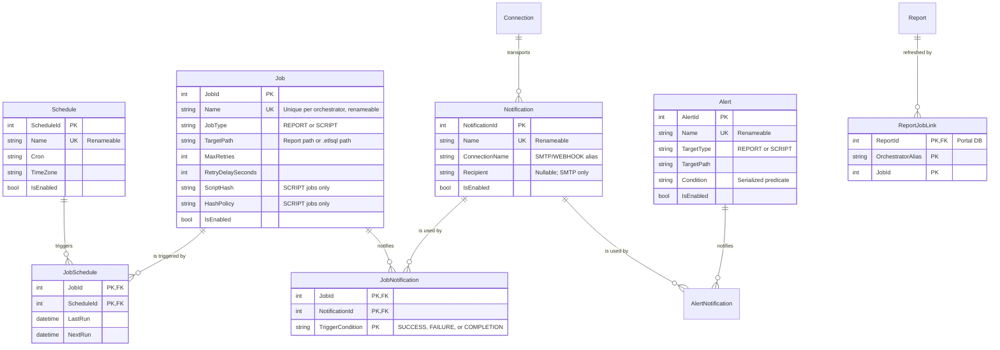

# Design Spec: Job, Schedule, and Alerting Refactor

This document outlines the architectural changes for establishing a unified, many-to-many scheduling
and notification model in ETL-SQL. It details how the engine, portal, and orchestrator align to
replace fragmented scheduler mechanisms with a robust, enterprise-grade scheduler similar to SQL
Agent.

**Status:** design agreed 2026-07-27. Remaining open points are in §12.

---

## 1. Problem Statement & Goals

### The Current State

1. **1:1 Schedule Coupling:** Schedules are coupled directly to report refresh entities
   (`DatasetJob`). Registering a second schedule on the same report silently overwrites the existing
   one, because `SubscriptionsController` keys the job as `portal-refresh:{alias}:{report.Id}` and
   `DatasetRegistryService.RegisterRefreshJobAsync` looks the job up by that key.
2. **Two report-refresh paths, one of which never schedules anything.**
   * `POST api/subscriptions/refresh-jobs` → `RegisterRefreshJobAsync` writes a `DatasetJobs` row and
     **nothing else**. It never calls `SaveJobAsync`, so no Orchestrator job exists, and
     `OrchestratorPollerService` waits forever on a completion nothing produces. This path has never
     worked.
   * `CREATE DATASET … REFRESH EVERY '30m'` **does** schedule: `CreateDatasetStatementHandler`
     synthesises a `CreateJobStatement` whose body is a `PRINT` statement — a no-op whose only
     purpose is to produce a completion for the poller to see — and then registers the link. It is
     the only working end-to-end refresh today, and it is built out of the two things this refactor
     removes: the inline `AS <statement>` job body and a 1:1 dataset↔schedule coupling.
3. **Naming and vocabulary fragmentation.** Five schedule vocabularies exist today:
   * engine `CREATE JOB … ON SCHEDULE EVERY 5 MINUTES [AT '02:00']` → `JobDefinition{Interval, Unit, AtTime}`;
   * portal refresh jobs → a **cron** string in `DatasetJob.RefreshInterval` that nothing consumes;
   * subscriptions → `Daily`/`Weekly`/`Monthly`/`Hourly`, mapped to an interval by
     `SubscriptionOrchestration.ParseSchedule`;
   * report datasets → `REFRESH EVERY '30m'` duration strings;
   * alerts → no schedule at all; evaluation timing is implicit.
4. **Implicit Alerting:** Email/webhook configurations are inline properties of the job/report rather
   than reusable destinations, leading to configuration duplication across hundreds of jobs.
5. **Timezone Gaps:** `SchedulerService.CalculateNextRun` computes from `DateTime.Now` with no
   timezone concept at all.
6. **Jobs cannot be renamed.** `Jobs.Name` is the primary key, and `JobHistory.JobName`,
   `JobState (JobName, StateKey)`, and `HostMetricsDaily (Day, JobName)` all key on that string.
   Renaming a job would silently orphan its entire history, state, and daily metrics.

### Architectural Goals

* **Modular Peer Entities:** `JOB`, `SCHEDULE`, and `NOTIFICATION` as three independent, first-class
  peer entities, with `ALERT` as a fourth that composes them.
* **Many-to-Many Mappings:** One `SCHEDULE` triggers many `JOB`s; one `JOB` drives many
  `NOTIFICATION`s.
* **One Grammar:** A single `CREATE/ALTER/DROP/ENABLE/DISABLE` lifecycle, targeted with
  `EXECUTE <server> BEGIN … END`. The engine's existing `CREATE JOB` form is **replaced**.
* **Cron everywhere.** Cron plus an explicit timezone is the one schedule representation.
* **Stable identity.** Surrogate keys, so names are user-facing labels that can be changed.

---

## 2. Ownership: the Orchestrator is the System of Record

**Decision (2026-07-27).** The Orchestrator owns `JOB`, `SCHEDULE`, `NOTIFICATION`, `ALERT` and the
links between them. It runs the jobs, so it holds the schedule, computes the next run, and dispatches
the notification. Names are **unique per orchestrator** — `Nightly` may exist once on `orch_a` and
once on `orch_b`.

The Portal is a **client**, not a second catalog. It keeps exactly one thing the Orchestrator cannot
know: which of its reports a job refreshes. Everything else it displays is read through
`OrchestratorProxyService` (`api/scheduled-jobs`), not mirrored.

Consequences, which are the substance of this decision:

* The new tables land in the **Orchestrator store** (`SQLiteJobHistoryStore` +
  `NpgsqlOrchestratorDialect`), not in Portal EF migrations.
* There is no Portal→Orchestrator catalog reconciler. §9 covers the smaller problem that remains.
* `DatasetJobs` is replaced by a link table, not by a job catalog.

### 2.1 Identity: surrogate key, renameable name

`JobId` is the primary key; `Name` is a unique, **mutable** attribute — the SQL Agent model, where a
job can be renamed at any time. The same applies to `ScheduleId`, `NotificationId`, `AlertId`.

This is not cosmetic. Every child table currently keys on the name string, so the surrogate key has
to reach them or a rename still destroys history:

| Table | Today | After |
| :--- | :--- | :--- |
| `JobHistory` | `JobName TEXT` + `idx_jh_job_start(JobName, StartTime)` | `JobId` + index on `(JobId, StartTime)` |
| `JobState` | PK `(JobName, StateKey)` | PK `(JobId, StateKey)` |
| `HostMetricsDaily` | PK `(Day, JobName)` | PK `(Day, JobId)` |
| `Jobs` | PK `Name` | PK `JobId`, unique index on `Name` |

`JobHistory` keeps a denormalised `JobNameAtRunTime` column so a historical run still reports the
name it ran under; the live name comes from the join. Without that, renaming a job silently rewrites
what the audit trail appears to say about the past.



`TriggerCondition` lives on `JobNotification` only. A `NOTIFICATION` is a destination; *when* it
fires is a property of the link, which is what lets one channel serve `ON SUCCESS` for one job and
`ON FAILURE` for another.

---

## 3. SQL Grammar & Statement Lifecycle

Targeting uses `EXECUTE <connection> BEGIN … END`, consistent with the managed-connection decision
in `TODO.md`. There is no `AT <server>` clause on these statements. A statement outside a block
targets the locally configured orchestrator store — the same target the engine's `CREATE JOB` uses
today.

### 3.1 Object Creation

```sql
EXECUTE orch_admin BEGIN
    -- 1. A shared trigger
    CREATE SCHEDULE NightlyTrigger
    ON '0 2 * * *'
    AT TIME ZONE 'America/New_York';

    -- 2. A reusable destination
    CREATE NOTIFICATION OpsAlert
    USING local_mail TO 'ops-alerts@example.com';

    -- 3. The executable job
    CREATE JOB FinanceNightly
    FOR REPORT 'folders/Finance Dashboard'
    WITH (MAX_RETRIES = 3, RETRY_DELAY = 60);
END;
```

* **`FOR REPORT` vs `FOR SCRIPT`** are mutually exclusive and enforced by the parser.
* **`WITH (MAX_RETRIES, RETRY_DELAY)`** carries over verbatim from the retired `CREATE JOB … WITH (…)`
  form. Retry is a property of the *attempt*, not the trigger, so it belongs on the job.
  `JobDefinition` already stores both, so this costs no storage change.
* **Script integrity is preserved.** `JobDefinition.ScriptHash` / `HashPolicy` (driven by
  `SET SCRIPT_HASH_POLICY`) continue to apply to `FOR SCRIPT` jobs. `FOR REPORT` jobs have no
  external script and carry neither.

### 3.2 Linking (`ALTER … ADD / REMOVE`)

```sql
EXECUTE orch_admin BEGIN
    ALTER JOB FinanceNightly ADD SCHEDULE NightlyTrigger;

    ALTER JOB FinanceNightly ADD NOTIFICATION SlackChannel ON SUCCESS;
    ALTER JOB FinanceNightly ADD NOTIFICATION OpsAlert    ON FAILURE;

    ALTER JOB FinanceNightly REMOVE SCHEDULE NightlyTrigger;
    ALTER JOB FinanceNightly REMOVE NOTIFICATION OpsAlert ON FAILURE;
END;
```

Attaching `ON COMPLETION` alongside `ON SUCCESS`/`ON FAILURE` for the same job and notification is
**rejected at link time**, not silently double-fired: `COMPLETION` is the union of the other two, so
the pair is always a mistake.

### 3.3 Alerts

An `ALERT` is a **condition** plus destinations. That is what distinguishes it from a
`NOTIFICATION`, which is only a destination whose trigger is a job outcome. The alert owns the
predicate; delivery is delegated to notifications, so a channel is configured once and reused:

```sql
EXECUTE orch_admin BEGIN
    CREATE ALERT RevenueDrop
    FOR REPORT 'folders/Finance Dashboard'
    WHEN VISUAL RevenueChart < 100000;

    ALTER ALERT RevenueDrop ADD NOTIFICATION OpsAlert;
    ALTER ALERT RevenueDrop ADD NOTIFICATION SlackChannel;
END;
```

Notes on the shape, which differ slightly from the first sketch:

* **`FOR REPORT` / `FOR SCRIPT` mirror `CREATE JOB`**, but `WHEN VISUAL` is only meaningful for a
  report — a script has no visuals. The parser must therefore pair the target kind with the
  condition kind rather than accepting any `WHEN` after any target. For `FOR SCRIPT`, the natural
  condition is a scalar query result; see §12 Q1.
* **The visual is an identifier, not a string literal** (`RevenueChart`, not `'RevenueChart'`),
  matching how visuals are named everywhere else in Report-SQL. The existing
  `CREATE ALERT 'x' FOR REPORT 'r' WHEN VISUAL 'v' > 100` uses string literals for all three; the
  name and visual become identifiers, and paths stay literals because they are paths.
* **`ALTER ALERT … ADD NOTIFICATION`** takes no `ON <condition>`: the alert *is* the condition. Only
  jobs need a trigger qualifier.
* **An alert needs an evaluation schedule.** A condition on a report is not evaluated by magic. Two
  options: attach a `SCHEDULE` to the alert exactly as a job does
  (`ALTER ALERT RevenueDrop ADD SCHEDULE NightlyTrigger`), or evaluate on the refresh completion of
  the report it targets. The former is more consistent and is the recommendation; see §12 Q1.
* `ASSERT JOB … ON FAILURE ALERT <connection>` (v0.17.0) sends to a bare connection. It becomes
  `ON FAILURE NOTIFY <notification>` so there is one destination concept, not two.

### 3.4 Administrative Lifecycle

Existence modifiers precede the object name for every kind, matching the canonicalization already
applied to all sixteen `DROP` kinds:

```sql
DROP JOB IF EXISTS FinanceNightly;
DROP SCHEDULE IF EXISTS NightlyTrigger;
DROP NOTIFICATION IF EXISTS OpsAlert;
DROP ALERT IF EXISTS RevenueDrop;

DISABLE JOB FinanceNightly;       -- pauses this job
DISABLE SCHEDULE NightlyTrigger;  -- pauses every job on this trigger
DISABLE NOTIFICATION OpsAlert;    -- suppresses this destination everywhere
ENABLE JOB FinanceNightly;

ALTER JOB FinanceNightly RENAME TO FinanceOvernight;
ALTER SCHEDULE NightlyTrigger RENAME TO OvernightTrigger;

ALTER JOB FinanceNightly SET TARGET = 'folders/Finance Dashboard v2';
ALTER JOB FinanceNightly SET (MAX_RETRIES = 5);
ALTER SCHEDULE NightlyTrigger SET CRON = '0 3 * * *';
ALTER SCHEDULE NightlyTrigger SET TIME ZONE 'UTC';
ALTER NOTIFICATION OpsAlert SET TO 'infra-alerts@example.com';
```

`RENAME TO` is a plain attribute update against the surrogate key: links, history, state, and daily
metrics all follow the id and are untouched. A rename that collides with an existing name fails on
the unique index.

`CREATE OR ALTER` and `CREATE OR REPLACE` are **not** supported for these kinds in this pass; the
parser must reject them by name rather than silently discarding the mode.

**Referential rules, enforced and tested:**

| Action | Behaviour |
| :--- | :--- |
| `DROP SCHEDULE` still linked | **Restrict.** Fails, naming the jobs that use it. |
| `DROP NOTIFICATION` still linked | **Restrict.** Fails, naming the jobs and alerts that use it. |
| `DROP JOB` / `DROP ALERT` with links | **Cascade** the links; schedules and notifications survive. |
| Portal report deleted | **Restrict** while refresh jobs are attached. |

Restrict is the default because these objects are shared: cascading a `DROP SCHEDULE` would silently
unschedule unrelated jobs.

### 3.5 Retired forms

Each is rejected by the parser with a diagnostic naming its replacement — they all parse cleanly
today, so a generic syntax error would leave the reader guessing:

| Retired | Replacement |
| :--- | :--- |
| `CREATE JOB n ON SCHEDULE EVERY 5 MINUTES AS <stmt>` | `CREATE SCHEDULE` + `CREATE JOB … FOR SCRIPT` + `ALTER JOB … ADD SCHEDULE` |
| `ALTER JOB n ON SCHEDULE EVERY …` | `ALTER SCHEDULE s SET CRON = …` |
| `CREATE REFRESH JOB FOR REPORT '…' SCHEDULE '…'` | `CREATE JOB n FOR REPORT '…'` + link |
| `DROP REFRESH JOB FOR REPORT '…'` | `DROP JOB IF EXISTS n` |
| `CREATE DATASET &d … REFRESH EVERY '30m'` | `CREATE JOB n FOR REPORT '…'` + link (see §4) |
| `CREATE ALERT 'n' FOR REPORT 'r' WHEN VISUAL 'v' > 100 DELIVER TO '…' AT smtp` | `CREATE ALERT n …` + `ALTER ALERT n ADD NOTIFICATION …` |
| `ASSERT JOB … ON FAILURE ALERT <connection>` | `ASSERT JOB … ON FAILURE NOTIFY <notification>` |

The inline `AS <statement>` job body disappears with the first row: a job names a script path, so its
body is versioned, hashable, and lintable like any other script. **Every sample, doc snippet, and
test using the inline form must be migrated in the same change.**

---

## 4. Retiring `CREATE DATASET … REFRESH EVERY`

**Decision (2026-07-27): remove it.** A dataset with its own private schedule is a 1:1 coupling of
exactly the kind this refactor exists to eliminate, and it cannot express two refresh cadences, a
timezone, retries, or notifications. Separating it now, before the product is in use, is far cheaper
than adding a second scheduler surface and migrating later.

It is also the only engine-side consumer of the two mechanisms being retired: it builds a
`CreateJobStatement` with an inline `PRINT` body and calls `RegisterRefreshJobAsync`. Removing it
deletes `CreateDatasetStatementHandler.CreateRefreshJob`, `ParseRefreshInterval`, the
`__dataset_refresh_*__` synthetic job names, and the `DatasetRefreshIntervalRule` lint rule.

Replacement is an ordinary named job against the owning report:

```sql
EXECUTE orch_admin BEGIN
    CREATE SCHEDULE HalfHourly ON '*/30 * * * *' AT TIME ZONE 'UTC';
    CREATE JOB SalesRefresh FOR REPORT 'folders/Sales';
    ALTER JOB SalesRefresh ADD SCHEDULE HalfHourly;
END;
```

`TTL` stays on `CREATE DATASET` — it is cache expiry, not a schedule, and has no trigger.
Consumers to update: `docs/reference/visuals-reporting/report/dataset.md`, `report-cli.md`,
`docs/guides/report-sql.md`, `docs/cookbooks/report-recipes.md`, `docs/syntax-index.md`,
`snippets/dataset.md`, and the sample reports under `samples/08_Reporting`,
`samples/10_Kitchen_Sinks`, `samples/integration`, and `Reports/`.

---

## 5. Orchestrator Store Changes

The Orchestrator store is raw DDL with a dialect abstraction (`SqliteOrchestratorDialect`,
`NpgsqlOrchestratorDialect`) and idempotent `ALTER TABLE … ADD COLUMN` upgrades — **not** EF
migrations. Additive changes are easy; the re-keying in §2.1 is not, because it changes primary keys
on four existing tables and SQLite cannot alter a PK in place. Plan for a table-rebuild path
(`CREATE new → INSERT SELECT → DROP old → RENAME`) inside one transaction per table, and note that
this is the first change in this store that is not purely additive.

### `Jobs` (altered)

* Add `JobId` (surrogate PK), `JobType` (`TEXT NOT NULL DEFAULT 'SCRIPT'`), `TargetPath` (`TEXT`).
* `Name` becomes a unique index rather than the PK.
* Retire `Interval`, `Unit`, `AtTime` — schedules move to `Schedules`.
* Keep `Script`, `LastRun`, `NextRun`, `IsEnabled`, `MaxRetries`, `RetryDelaySeconds`, `ScriptHash`,
  `HashPolicy`, `Version`, `LeaseOwner`, `LeaseExpiresAt`, `LeaseFenceToken`.

### `Schedules`, `Notifications`, `Alerts` (new)

Surrogate PK, unique `Name`, `IsEnabled`, plus:
`Schedules` → `Cron`, `TimeZone`. `Notifications` → `ConnectionName`, `Recipient` (nullable).
`Alerts` → `TargetType`, `TargetPath`, `Condition`.

A credential is **never** stored on a `Notification`; the connection alias resolves through normal
connection/secret resolution at dispatch time, keeping the `SECRET:`-reference rule intact.

### `JobSchedules`, `JobNotifications`, `AlertNotifications` (new)

Composite PKs on the surrogate ids. `JobSchedules` carries per-link `LastRun`/`NextRun` — that is
what makes two schedules on one job distinguishable in operations. `JobNotifications` carries
`TriggerCondition` in the PK.

### Portal side

`DatasetJobs` is replaced by `ReportJobLinks` (`ReportId` FK, `OrchestratorAlias`, `JobId`).
`ReportId` stays a **real foreign key** so report deletion is enforced by the database; the job's
`TargetPath` is a mutable property that `ALTER JOB … SET TARGET` changes, and the Portal keeps the
two consistent when a report is renamed or moved.

Dropping `DatasetJobs` is a Portal EF migration, and a `DropTable` in `Up` violates
`MigrationConvergenceTests.PortalMigrations_UpOperationsFollowRollingExpandContract`. The mechanism
is that test's `PreDeploymentBreakingMigrations` allow-list with a written justification —
precedent: `_DropSmtpConnections`. Name the migration there rather than rediscovering the failure
during the release gate.

---

## 6. Scheduler Changes: Cron and Timezone

`SchedulerService.CalculateNextRun` currently does `DateTime.Now.AddMinutes(interval)` and cannot
express `'*/15 8-18 * * 1-5'`. Cron was the intended representation from the start, so the interval
model is corrected rather than bridged:

```csharp
var tz   = RelDateResolver.FindTimeZone(schedule.TimeZone);
var next = CronExpression.Parse(schedule.Cron).GetNextOccurrence(DateTimeOffset.UtcNow, tz);
```

* `Cronos` is currently referenced only by `ETL-SQL.Portal`; the Orchestrator project needs the
  reference. It is an existing, already-inventoried dependency.
* A job with several schedules computes `NextRun` per link; the scheduler fires the earliest due link
  and records `LastRun` on that link.
* Two links of the same job falling due simultaneously must coalesce into **one** run, not two.
* `DateTime.Now` must not survive anywhere in the path: comparisons move to `DateTimeOffset` in UTC,
  with the timezone applied only inside the cron calculation.

---

## 7. Timezone Resolution

```sql
CREATE SCHEDULE NightlyTrigger ON '0 2 * * *' AT TIME ZONE 'America/New_York';
```

**Reuse `RelDateResolver.FindTimeZone`.** It already implements the product's documented rule
(`docs/reference/dates-times/dates-times.md` §3: "ETL-SQL accepts platform-supported IANA" IDs and
Windows IDs) and is what the `AT TIME ZONE` *expression* already calls. It accepts:

* IANA IDs — `America/New_York`;
* Windows IDs — `Eastern Standard Time`;
* the abbreviation aliases in its `TzMapping` — `EST`, `CST`, `PST`, `UTC`, `GMT`, `JST`, `AEST`, …;

and falls back across the IANA↔Windows boundary when the platform lacks one form. A scheduler that
accepted a different set of timezone spellings than `AT TIME ZONE` and `RELDATE` would be a defect,
so there is nothing to decide here beyond calling the existing function.

`ETL-SQL.Orchestrator` already references `ETL-SQL.Engine`, so `RelDateResolver` is directly
available and no code moves.

Two rules the scheduler adds on top:

* **Validate at `CREATE`/`ALTER` time**, not at first fire. An unknown zone is a statement error, not
  a schedule that silently never runs correctly. `FindTimeZone` already throws
  `TimeZoneNotFoundException`; the statement handler surfaces it.
* **Resolve the default once, at creation.** When no `AT TIME ZONE` is given, store the resolved
  `Scheduler:DefaultTimeZone` (falling back to `UTC`). Resolving it lazily at each fire would mean
  editing `appsettings.json` silently moves every existing schedule.

`AT TIME ZONE` at statement level does not collide with any `AT <connection>` clause:
`ExpressionParser` already disambiguates with a two-token lookahead (`Peek == TIME && Peek2 == ZONE`).

---

## 8. Portal Integration

The Portal no longer generates a composite key encoding the schedule. A job has one id; the link
table carries the rest.

1. `CREATE JOB … FOR REPORT` inside `EXECUTE <portal> BEGIN … END` resolves the report, writes a
   `ReportJobLinks` row, and forwards the job to the orchestrator named by the block.
2. On completion, `OrchestratorPollerService` matches the completion's `JobId` against
   `ReportJobLinks`, resolves the `Report`, and calls `jobs.EnqueueRefreshAsync` as it does today.
3. `JobType == 'SCRIPT'` completions are not the Portal's business and are ignored.

**Generated names** for subscription- and sugar-created objects are derived deterministically using
`NEWID()` (UUID v7, `StandardFunctions.System`), e.g. `sub_0198f3a1c4d27e5b`. UUID v7 is
time-ordered, so generated names sort by creation and remain readable in `eng.jobs`. The prefix is
reserved: `CREATE JOB` rejects a user-supplied name matching a generated prefix, and `DROP JOB`
refuses a generated job whose owning subscription still exists — the subscription is the lifecycle
owner. Because names are now renameable attributes over a surrogate key, a user may rename a
generated job without breaking the link.

---

## 9. Operational Resilience

With the Orchestrator as the system of record there is no catalog to reconcile — a mutation either
commits on the Orchestrator or fails and is reported. Two narrower problems remain:

1. **Orphaned report links.** A `ReportJobLinks` row whose job no longer exists on the Orchestrator.
   A periodic sweep marks these broken and surfaces them in the Portal; it **must not** delete
   Orchestrator jobs it does not recognise. A shared Orchestrator can legitimately carry another
   Portal's jobs, and a prefix-scoped delete would silently destroy them.
2. **HA.** Any such sweep runs on every Portal node, so it must be gated by `IClusterLockStore`,
   matching `OperationalMetricsDigestService` and `AdminDigestServiceBase`. `OrchestratorPollerService`
   should be audited for the same property in this change.

---

## 10. Notification Dispatch and Security

**The Orchestrator dispatches.** It owns the job, it knows the outcome first, and it does not depend
on the Portal being up — which matters most for a failure alert, since a Portal outage is exactly
when one is needed. Dispatch resolves the notification's connection alias through the engine's normal
connection and `SECRET:` resolution **on the orchestrator host**, which is the same path any script
already uses to send mail. No new trust boundary is opened and no credential crosses a process
boundary.

The consequence to accept: a notification's connection alias must exist where the job runs. The
governed `PortalSharedConnection` catalog stays in the Portal because it is a *governance* artifact —
ACLs, ownership, usage ledger, per-user audit — and the Orchestrator has no user or group model at
all (its API authenticates with a single `X-Orchestrator-Key`). Moving the catalog there would mean
inventing an identity model in the Orchestrator, which is a much larger change than this one.

The alias is therefore a **contract between the two**, not a shared row. Provisioning an orchestrator
host with the connections its jobs reference is an operator task, and the Portal's catalog is the
authoring and governance surface over it. See §12 Q2 for the remaining gap: whether the Portal should
be able to *provision* an alias onto an orchestrator rather than an operator doing it by hand.

All mutations (`CREATE`, `ALTER`, `DROP`, `ENABLE`, `DISABLE`, `ADD`, `REMOVE`, `RENAME`) log to the
persistent audit outbox: `Action = CREATE_JOB | DROP_SCHEDULE | ATTACH_SCHEDULE | RENAME_JOB | …`,
`Target = <name>`, `Payload = cron / timezone / connection alias / trigger condition`.

---

## 11. Consumers to Migrate

* `SubscriptionsController` — `api/subscriptions/refresh-jobs`, subscription create/update/enable.
* `DatasetRegistryService` / `IDatasetRegistry` — remove the default interface method bodies. A
  default body means deleting an override still compiles and silently binds to a no-op; the compiler
  will not find the call sites for you.
* `CreateDatasetStatementHandler` — delete `CreateRefreshJob` and `ParseRefreshInterval` (§4).
* `DatasetRefreshIntervalRule` — delete.
* `OrchestratorPollerService` — match on `ReportJobLinks`, not the composite key.
* `SchedulerService`, `SQLiteJobHistoryStore`, `NpgsqlOrchestratorDialect`, `IJobHistoryStore`.
* `ReportDependencyService`, `ConfigurationExportService`, `LineageImpactService`,
  `ReferenceImpactService`, `SubscriptionScriptMaintenance`, `OrchestratorProxyService`.
* Parser/AST/formatter/linter, LSP completion, `eng.*` virtual tables (`eng.jobs`, `eng.schedules`,
  `eng.notifications`, `eng.alerts`, `eng.job_schedules` — reconcile with the `SHOW`-retirement
  inventory in `TODO.md`, which currently lists `eng.refresh_jobs`).
* Samples, snippets, hover help, `docs/syntax-index.md`, and every doc snippet using the retired
  inline-`AS` job form or `REFRESH EVERY`.

---

## 12. Open Questions

**Q1 — Alert conditions and evaluation timing.** Two sub-parts:
  * What is the condition for `FOR SCRIPT`? `WHEN VISUAL` has no meaning there. A scalar query
    (`WHEN (SELECT COUNT(*) FROM …) > 0`) is the obvious analogue but is a larger grammar.
    Alternative: restrict `CREATE ALERT` to `FOR REPORT` in this pass and add `FOR SCRIPT` when the
    predicate grammar exists.
  * Does an alert carry its own `SCHEDULE` (recommended — consistent with jobs, and lets an alert be
    checked more often than the report refreshes), or is it evaluated on the target report's refresh
    completion (no new mechanism, but no control over cadence)?

**Q2 — Should the Portal provision connection aliases onto an orchestrator?** §10 makes the alias a
contract that an operator satisfies on each orchestrator host. That is honest but manual, and it
means configuring SMTP twice for an operator who thinks of it as one thing. A `PUSH CONNECTION`-style
provisioning path would remove the duplication but has to carry the `SECRET:` reference without ever
carrying the value, and has to decide what happens when the reference does not resolve on the target
host. In scope, or a follow-up?

**Q3 — Does `ALERT` belong to the Orchestrator or the Portal?** §2 places it with the Orchestrator
for consistency, but an alert's condition is `WHEN VISUAL <name>` — a Report-SQL concept the
Orchestrator knows nothing about. Evaluating it requires rendering or querying the report, which is
Portal work. Either the Orchestrator triggers and the Portal evaluates (a split that the other three
entities avoid), or `ALERT` is the one entity the Portal owns. This is the weakest seam in the
design.

**Q4 — Subscription sugar: how much is user-visible?** Generated jobs appear in `eng.jobs` and the
Portal job list. Should they be hidden by default (a `IsSystemGenerated` flag with a filter), or is
seeing them the point — one place where every scheduled thing is visible?
