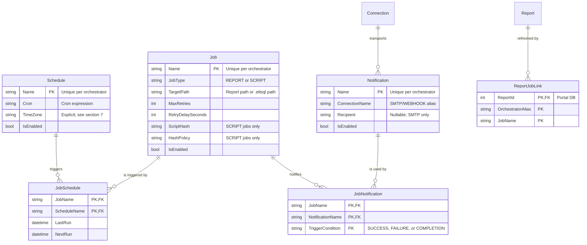

# Design Spec: Job, Schedule, and Alerting Refactor

This document outlines the architectural changes for establishing a unified, many-to-many scheduling
and notification model in ETL-SQL. It details how the engine, portal, and orchestrator align to
replace fragmented scheduler mechanisms with a robust, enterprise-grade scheduler similar to SQL
Agent.

**Status:** design agreed 2026-07-27; open questions are collected in §11 and must be answered before
the persistence slice starts.

---

## 1. Problem Statement & Goals

### The Current State

1. **1:1 Schedule Coupling:** Schedules are coupled directly to report refresh entities
   (`DatasetJob`). Registering a second schedule on the same report silently overwrites the existing
   one, because `SubscriptionsController` keys the job as `portal-refresh:{alias}:{report.Id}` and
   `DatasetRegistryService.RegisterRefreshJobAsync` looks the job up by that key.
2. **Report refreshes are never actually scheduled.** `RegisterRefreshJobAsync` writes a
   `DatasetJobs` row and nothing else — it never calls `SaveJobAsync`, so no Orchestrator
   `JobDefinition` is created. `OrchestratorPollerService` then waits for a completion named
   `portal-refresh:{alias}:{reportId}` that nothing ever produces. The only Portal path that really
   registers an Orchestrator job is the *subscription* path. **This refactor is therefore building
   the scheduling that was only ever recorded as intent, not repairing a working feature** — which
   also means there is no live behaviour to preserve.
3. **Naming and vocabulary fragmentation.** Four schedule vocabularies exist today:
   * engine `CREATE JOB … ON SCHEDULE EVERY 5 MINUTES [AT '02:00']` → `JobDefinition{Interval, Unit, AtTime}`;
   * portal refresh jobs → a **cron** string in `DatasetJob.RefreshInterval` that nothing consumes;
   * subscriptions → `Daily`/`Weekly`/`Monthly`/`Hourly`, mapped to an interval by
     `SubscriptionOrchestration.ParseSchedule`;
   * report datasets → `REFRESH EVERY '30m'` duration strings.
4. **Implicit Alerting:** Email/webhook configurations are inline properties of the job/report rather
   than reusable destinations, leading to configuration duplication across hundreds of jobs.
5. **Timezone Gaps:** `SchedulerService.CalculateNextRun` computes from `DateTime.Now` with no
   timezone concept at all.

### Architectural Goals

* **Modular Peer Entities:** Establish `JOB`, `SCHEDULE`, and `NOTIFICATION` as three independent,
  first-class peer entities.
* **Many-to-Many Mappings:** Enable a single `SCHEDULE` to trigger multiple `JOB`s, and a single
  `JOB` to trigger multiple `NOTIFICATION`s.
* **One Grammar:** A single `CREATE/ALTER/DROP/ENABLE/DISABLE` lifecycle for these objects,
  targeted with `EXECUTE <server> BEGIN … END`. The engine's existing `CREATE JOB` form is
  **replaced**, not supplemented.
* **Cron everywhere.** Cron plus an explicit timezone is the one schedule representation. The
  Orchestrator's interval model predates this decision and is corrected here.
* **Operational Resilience:** Mutations survive an unreachable node without leaving the two sides
  permanently disagreeing.

---

## 2. Ownership: the Orchestrator is the System of Record

**Decision (2026-07-27).** The Orchestrator owns `JOB`, `SCHEDULE`, `NOTIFICATION` and the links
between them. It runs the jobs, so it holds the schedule and computes the next run. Names are
**unique per orchestrator** — `Nightly` may exist once on `orch_a` and once on `orch_b`.

The Portal is a **client**, not a second catalog. It keeps exactly one thing the Orchestrator cannot
know: which of its reports a job refreshes. Everything else it displays is read through
`OrchestratorProxyService` (`api/scheduled-jobs`), not mirrored.

Consequences, which are the substance of this decision:

* The three new tables land in the **Orchestrator store**
  (`SQLiteJobHistoryStore` + `NpgsqlOrchestratorDialect`), not in Portal EF migrations.
* There is no Portal→Orchestrator catalog reconciler. §8 covers the much smaller problem that
  remains: an orphaned report link.
* `DatasetJobs` is replaced by a link table, not by a job catalog.



`TriggerCondition` lives on `JobNotification` only. A `NOTIFICATION` is a destination; *when* it
fires is a property of the link, which is what lets one channel serve both `ON SUCCESS` for one job
and `ON FAILURE` for another.

---

## 3. SQL Grammar & Statement Lifecycle

Targeting uses `EXECUTE <connection> BEGIN … END`, consistent with the managed-connection decision
recorded in `TODO.md`. There is no `AT <server>` clause on these statements. A statement outside a
block targets the locally configured orchestrator store — the same target the engine's `CREATE JOB`
uses today.

### 3.1 Object Creation

```sql
EXECUTE orch_admin BEGIN
    -- 1. A shared trigger
    CREATE SCHEDULE NightlyTrigger
    ON '0 2 * * *'
    AT TIME ZONE 'America/New_York';

    -- 2. A reusable destination
    CREATE NOTIFICATION OpsAlert
    USING local_mail TO 'ops-alerts@example.com';

    -- 3. The executable job
    CREATE JOB FinanceNightly
    FOR REPORT 'folders/Finance Dashboard'
    WITH (MAX_RETRIES = 3, RETRY_DELAY = 60);
END;
```

* **`FOR REPORT` vs `FOR SCRIPT`** are mutually exclusive and enforced by the parser:
  * `CREATE JOB JobA FOR REPORT 'folders/ReportName';`
  * `CREATE JOB JobB FOR SCRIPT 'pipelines/SyncData.etlsql';`
* **`WITH (MAX_RETRIES, RETRY_DELAY)`** is carried over verbatim from the retired
  `CREATE JOB … WITH (…)` form. Retry is a property of the *attempt*, not of the trigger, so it
  belongs on the job and not on the schedule. `JobDefinition` already has `MaxRetries` and
  `RetryDelaySeconds`, so no storage change is needed for it.
* **Script integrity is preserved.** `JobDefinition.ScriptHash` / `HashPolicy` (driven by
  `SET SCRIPT_HASH_POLICY`) continue to apply to `FOR SCRIPT` jobs. `FOR REPORT` jobs have no
  external script and carry neither.

### 3.2 Linking (`ALTER JOB … ADD / REMOVE`)

```sql
EXECUTE orch_admin BEGIN
    ALTER JOB FinanceNightly ADD SCHEDULE NightlyTrigger;

    ALTER JOB FinanceNightly ADD NOTIFICATION SlackChannel ON SUCCESS;
    ALTER JOB FinanceNightly ADD NOTIFICATION OpsAlert    ON FAILURE;
END;
```

```sql
ALTER JOB FinanceNightly REMOVE SCHEDULE NightlyTrigger;
ALTER JOB FinanceNightly REMOVE NOTIFICATION OpsAlert ON FAILURE;
```

Attaching both `ON COMPLETION` and `ON SUCCESS`/`ON FAILURE` for the same job and notification is
**rejected at link time**, not silently double-fired: `COMPLETION` is defined as the union of the
other two, so the pair is always a mistake.

### 3.3 Administrative Lifecycle

Existence modifiers precede the object name for every kind, matching the canonicalization already
applied to all sixteen `DROP` kinds:

```sql
DROP JOB IF EXISTS FinanceNightly;
DROP SCHEDULE IF EXISTS NightlyTrigger;
DROP NOTIFICATION IF EXISTS OpsAlert;

DISABLE JOB FinanceNightly;       -- pauses this job
DISABLE SCHEDULE NightlyTrigger;  -- pauses every job on this trigger
DISABLE NOTIFICATION OpsAlert;    -- suppresses this destination everywhere
ENABLE JOB FinanceNightly;

ALTER JOB FinanceNightly SET TARGET = 'folders/Finance Dashboard v2';
ALTER JOB FinanceNightly SET (MAX_RETRIES = 5);
ALTER SCHEDULE NightlyTrigger SET CRON = '0 3 * * *';
ALTER SCHEDULE NightlyTrigger SET TIME ZONE 'UTC';
ALTER NOTIFICATION OpsAlert SET TO 'infra-alerts@example.com';
```

`CREATE OR ALTER` and `CREATE OR REPLACE` are **not** supported for these three kinds in this pass;
the parser must reject them by name rather than silently discarding the mode. This is the capability
matrix required by the P1 lifecycle item in `TODO.md`.

**Referential rules, enforced and tested:**

| Action | Behaviour |
| :--- | :--- |
| `DROP SCHEDULE` still linked to a job | **Restrict.** Fails, naming the jobs that use it. |
| `DROP NOTIFICATION` still linked to a job | **Restrict.** Fails, naming the jobs that use it. |
| `DROP JOB` with links | **Cascade** the links; schedules and notifications survive. |
| Portal report deleted | **Restrict** the report delete while refresh jobs are attached. |

Restrict is the default because these objects are shared: cascading a `DROP SCHEDULE` would silently
unschedule unrelated jobs.

### 3.4 Retired forms

Each is rejected by the parser with a diagnostic naming its replacement — the retired forms parse
cleanly today, so a generic syntax error would leave the reader guessing:

| Retired | Replacement |
| :--- | :--- |
| `CREATE JOB n ON SCHEDULE EVERY 5 MINUTES AS <stmt>` | `CREATE SCHEDULE` + `CREATE JOB … FOR SCRIPT` + `ALTER JOB … ADD SCHEDULE` |
| `ALTER JOB n ON SCHEDULE EVERY …` | `ALTER SCHEDULE s SET CRON = …` |
| `CREATE REFRESH JOB FOR REPORT '…' SCHEDULE '…'` | `CREATE JOB n FOR REPORT '…'` + link |
| `DROP REFRESH JOB FOR REPORT '…'` | `DROP JOB IF EXISTS n` |

The inline `AS <statement>` job body disappears with the first row: a job now names a script path, so
its body is versioned, hashable, and lintable like any other script. **Every sample, doc snippet, and
test using the inline form must be migrated in the same change.**

---

## 4. Orchestrator Store Changes

The Orchestrator store is raw DDL with a dialect abstraction (`SqliteOrchestratorDialect`,
`NpgsqlOrchestratorDialect`) and idempotent `ALTER TABLE … ADD COLUMN` upgrades — **not** EF
migrations. Additive changes are easy; removals are not, because the columns are `NOT NULL`.

### `Jobs` (existing table, altered)

* Add `JobType` (`TEXT NOT NULL DEFAULT 'SCRIPT'`), `TargetPath` (`TEXT`).
* Retire `Interval`, `Unit`, `AtTime` — schedules move to the `Schedules` table.
* Keep `Script`, `LastRun`, `NextRun`, `IsEnabled`, `MaxRetries`, `RetryDelaySeconds`, `ScriptHash`,
  `HashPolicy`, `Version`, `LeaseOwner`, `LeaseExpiresAt`, `LeaseFenceToken`.
* `Name` remains the primary key. See §11 Q3 on how the flat namespace interacts with generated
  subscription jobs.

### `Schedules` (new)

`Name` (PK), `Cron` (`TEXT NOT NULL`), `TimeZone` (`TEXT NOT NULL`), `IsEnabled`.

### `Notifications` (new)

`Name` (PK), `ConnectionName` (`TEXT NOT NULL`), `Recipient` (`TEXT NULL`), `IsEnabled`.
A credential is **never** stored here; the connection alias resolves through the governed connection
catalog at dispatch time, keeping the `SECRET:`-reference zero-trust rule intact.

### `JobSchedules` (new)

`JobName` + `ScheduleName` (composite PK, FK), `LastRun`, `NextRun`.
Per-link run state is what makes two schedules on one job distinguishable in operations.

### `JobNotifications` (new)

`JobName` + `NotificationName` + `TriggerCondition` (composite PK, FK).

### Portal side

`DatasetJobs` is replaced by `ReportJobLinks` (`ReportId` FK, `OrchestratorAlias`, `JobName`).
`ReportId` stays a **real foreign key** so report deletion is enforced by the database; the job's
`TargetPath` is a mutable property that `ALTER JOB … SET TARGET` changes, and the two are kept
consistent by the Portal when a report is renamed or moved.

Dropping `DatasetJobs` and adding `ReportJobLinks` are Portal EF migrations, and a `DropTable` in
`Up` violates `MigrationConvergenceTests.PortalMigrations_UpOperationsFollowRollingExpandContract`.
The mechanism for that is the `PreDeploymentBreakingMigrations` allow-list in that test, with a
written justification — precedent: `_DropSmtpConnections`. Name the migration explicitly there
rather than rediscovering the failure during the gate.

---

## 5. Scheduler Changes: Cron and Timezone

`SchedulerService.CalculateNextRun` currently does `DateTime.Now.AddMinutes(interval)` and cannot
express `'*/15 8-18 * * 1-5'`. Cron was the intended representation from the start, so the
interval model is corrected rather than bridged:

```csharp
var tz   = TimeZoneInfo.FindSystemTimeZoneById(schedule.TimeZone);
var next = CronExpression.Parse(schedule.Cron).GetNextOccurrence(DateTimeOffset.UtcNow, tz);
```

* `Cronos` is currently referenced only by `ETL-SQL.Portal`; the Orchestrator project needs the
  reference. It is an existing, already-inventoried dependency.
* A job with several schedules computes `NextRun` per link; the scheduler fires the earliest due
  link and records `LastRun` on that link.
* Two links of the same job falling due simultaneously must coalesce into **one** run, not two.
* `DateTime.Now` must not survive anywhere in the path: all comparisons move to `DateTimeOffset`
  in UTC, with the timezone applied only inside the cron calculation.

---

## 6. Portal Integration

The Portal no longer generates a composite key encoding the schedule. A job has one name; the link
table carries the rest.

**Refresh flow:**

1. `CREATE JOB … FOR REPORT` inside `EXECUTE <portal> BEGIN … END` resolves the report, writes a
   `ReportJobLinks` row, and forwards the job to the orchestrator named by the block.
2. On completion, `OrchestratorPollerService` matches the completion's `JobName` against
   `ReportJobLinks`, resolves the `Report`, and calls `jobs.EnqueueRefreshAsync` as it does today.
3. `JobType == 'SCRIPT'` completions are not the Portal's business and are ignored.

`ReportDependencyService` displays the job name and its schedules; `ConfigurationExportService` emits
the new statements in dependency order — `SCHEDULE` and `NOTIFICATION` before the `JOB` that links
them.

---

## 7. Timezone Resolution

```sql
CREATE SCHEDULE NightlyTrigger ON '0 2 * * *' AT TIME ZONE 'America/New_York';
```

* **The identifier is validated at `CREATE`/`ALTER` time**, not at first fire. An unknown zone is a
  statement error, not a schedule that silently never runs correctly.
* **IANA identifiers are canonical.** `'Eastern Standard Time'` is a Windows-only ID and the
  enterprise certification lane runs on Linux as well as Windows. .NET converts between the two on
  ICU-enabled platforms, but only one form can be the documented, portable spelling.
* **The default is resolved and stored at creation time**, from `Scheduler:DefaultTimeZone`
  (falling back to `UTC`). Resolving it lazily at each fire would mean editing `appsettings.json`
  silently moves every existing schedule.
* `AT TIME ZONE` at statement level does not collide with any `AT <connection>` clause:
  `ExpressionParser` already disambiguates the same way, with a two-token lookahead
  (`Peek == TIME && Peek2 == ZONE`).

---

## 8. Operational Resilience

With the Orchestrator as the system of record there is no catalog to reconcile — a mutation either
commits on the Orchestrator or fails and is reported. Two narrower problems remain:

1. **Orphaned report links.** A `ReportJobLinks` row whose job no longer exists on the Orchestrator.
   A periodic sweep marks these as broken and surfaces them in the Portal; it **must not** delete
   Orchestrator jobs it does not recognise. A shared Orchestrator can legitimately carry jobs from
   another Portal, and a prefix-scoped delete would silently destroy them.
2. **HA.** Any such background sweep runs on every Portal node, so it must be gated by
   `IClusterLockStore`, matching `OperationalMetricsDigestService` and `AdminDigestServiceBase`.
   The existing `OrchestratorPollerService` should be audited for the same property in this change.

---

## 9. Audit Logging and Security

All mutations (`CREATE`, `ALTER`, `DROP`, `ENABLE`, `DISABLE`, `ADD`, `REMOVE`) on `JOB`, `SCHEDULE`,
and `NOTIFICATION` log to the persistent audit outbox:

* `Action = CREATE_JOB | DROP_SCHEDULE | ATTACH_SCHEDULE | ATTACH_NOTIFICATION | …`
* `Target = JobName | ScheduleName | NotificationName`
* `Payload = cron / timezone / connection alias / trigger condition`

Notification connections never store a credential. Delivery resolves the connection through the
governed catalog, so an SMTP password or webhook token exists only as a `SECRET:` reference — the
same rule the SMTP catalog unification established. §11 Q4 covers *which process* performs that
resolution, which is the open half of this.

---

## 10. Consumers to Migrate

* `SubscriptionsController` — `api/subscriptions/refresh-jobs`, subscription create/update/enable.
* `DatasetRegistryService` / `IDatasetRegistry` — remove the default interface method bodies. A
  default body means removing an override still compiles and silently binds to a no-op; the compiler
  will not find the call sites for you.
* `OrchestratorPollerService` — match on `ReportJobLinks`, not the composite key.
* `ReportDependencyService`, `ConfigurationExportService`, `LineageImpactService`,
  `ReferenceImpactService`, `SubscriptionScriptMaintenance`.
* Parser/AST/formatter/linter, LSP completion, `eng.*` virtual tables (`eng.jobs`, `eng.schedules`,
  `eng.notifications`, `eng.job_schedules` — reconcile with the `SHOW`-retirement inventory in
  `TODO.md`, which currently lists `eng.refresh_jobs`).
* Samples, snippets, hover help, `docs/syntax-index.md`, and every doc snippet using the retired
  inline-`AS` job form.

---

## 11. Open Questions

**Q1 — Is `ALERT` a notification?** Not quite, and the difference decides the work.
`CREATE ALERT 'x' FOR REPORT 'r' WHEN VISUAL 'v' > 100 DELIVER TO 'a@b.com' AT smtp_alias` is
**condition + destination**. A `NOTIFICATION` is only a destination; its condition is a job outcome
(`SUCCESS`/`FAILURE`/`COMPLETION`), not a data predicate. So an alert decomposes into a JOB that
evaluates the predicate plus a NOTIFICATION that delivers — which means jobs need a
`WHEN <predicate>` concept this design does not yet have. Options:
  * (a) keep `ALERT` as a distinct object whose *delivery* is a `NOTIFICATION` reference — small
    change, keeps four nouns;
  * (b) add a data condition to `JOB` and express alerts as `JOB + NOTIFICATION` — fewer nouns,
    materially more work.
  Related: v0.17.0's `ASSERT JOB … ON FAILURE ALERT <connection>` already uses a bare connection as a
  delivery target. Should it become `ON FAILURE NOTIFY <notification>` in the same pass?

**Q2 — How are sugar-generated names assigned?** If `SUBSCRIPTION` becomes sugar over
`JOB + SCHEDULE + NOTIFICATION`, those objects need names in a namespace shared with hand-written
ones. Options: deterministic derived names (`sub:{id}` — collision-proof, ugly in `eng.jobs`);
user-supplied names on the subscription; or a reserved prefix that `CREATE JOB` refuses. This also
decides whether a user may `DROP JOB` a subscription's generated job out from under it.

**Q3 — Does `Jobs.Name` stay a flat primary key?** It is a single namespace today, already shared
with generated subscription jobs. Named user jobs, generated subscription jobs, and generated report
refreshes now coexist in it. Is a `JobType`/owner discriminator enough, or does the PK need scoping?

**Q4 — Which process dispatches a notification?** The Orchestrator knows the outcome but the
governed connection catalog and `SECRET:` resolution live in the Portal. Either the Orchestrator
gains catalog access (widening its trust boundary), or the Portal dispatches on poll (delaying
alerts to the poll interval, and failing entirely when the Portal is down — the exact moment a
failure alert matters most).

**Q5 — What happens to `REFRESH EVERY '30m'` on `CREATE DATASET`?** It is a fifth schedule
vocabulary, engine-local rather than orchestrator-backed. In scope for this unification, or
deliberately left as a dataset-cache TTL that is not a scheduled job?

**Q6 — Timezone identifier form.** IANA is assumed above as the canonical spelling. Confirm, and
decide whether Windows IDs are accepted-and-normalised or rejected outright.
