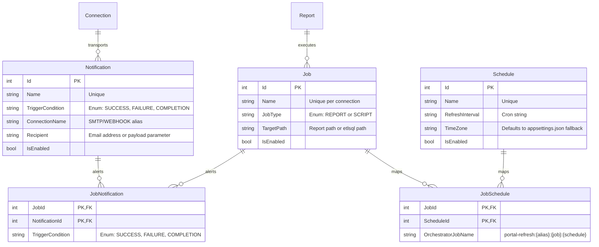

# Design Spec: Job, Schedule, and Alerting Refactor

This document outlines the architectural changes for establishing a unified, many-to-many scheduling and notification model in ETL-SQL. It details how the engine, portal, and orchestrator align to replace fragmented scheduler mechanisms with a robust, enterprise-grade scheduler similar to SQL Agent.

---

## 1. Problem Statement & Goals

### The Current State
1. **1:1 Schedule Coupling:** Currently, schedules are coupled directly to report refresh entities (`DatasetJob`). Registering a second schedule on the same report silently overwrites the existing one.
2. **Naming Fragmentation:** General script jobs use `CREATE JOB` (with custom scheduler expressions), while report refreshes use `CREATE REFRESH JOB FOR REPORT` (with cron strings).
3. **Implicit Alerting:** Email/webhook configurations are inline properties of the job/report rather than reusable destinations, leading to configuration duplication across hundreds of jobs.
4. **Timezone Gaps:** Triggers fire relative to local system clocks without explicit timezone awareness or global default configurations.

### Architectural Goals
* **Modular Peer Entities:** Establish `JOB`, `SCHEDULE`, and `NOTIFICATION` as three independent, first-class peer entities in the database.
* **Many-to-Many Mappings:** Enable a single `SCHEDULE` to trigger multiple `JOB`s, and a single `JOB` to trigger multiple `NOTIFICATION`s.
* **Unified SQL Grammar:** Consolidate all scheduler verbs under the standard `CREATE/ALTER/DROP/ENABLE/DISABLE` lifecycle commands inside `EXECUTE` blocks.
* **Operational Resilience:** Build periodic background reconciliation to heal trigger states if the Orchestrator connection drops during a mutation.

---

## 2. Conceptual Architecture

The diagram below illustrates how transport layers (Connections), alert endpoints (Notifications), triggers (Schedules), and actions (Jobs) relate to one another:



---

## 3. SQL Grammar & Statement Lifecycle

Targeting uses the existing `EXECUTE <connection> BEGIN ... END` block. Individual statements within the block do not require `AT <connection>` clauses.

### 3.1 Object Creation (Symmetrical Peer Entities)

```sql
EXECUTE portal_admin BEGIN
    -- 1. Create a shared schedule
    CREATE SCHEDULE NightlyTrigger 
    ON '0 2 * * *' 
    AT TIME ZONE 'Eastern Standard Time';

    -- 2. Create the destination notification channel
    CREATE NOTIFICATION OpsAlert
    USING local_mail TO 'ops-alerts@example.com';

    -- 3. Create the executable Job
    CREATE JOB FinanceNightly 
    FOR REPORT 'folders/Finance Dashboard';
END;
```

* **`FOR REPORT` vs `FOR SCRIPT`:** The parser enforces mutual exclusivity. A job must define either what report to refresh or what plain script file to run:
  * `CREATE JOB JobA FOR REPORT 'folders/ReportName';`
  * `CREATE JOB JobB FOR SCRIPT 'pipelines/SyncData.etlsql';`

### 3.2 Job Alteration (Linking Mappings)

Schedules and notifications are linked to jobs via `ALTER JOB ... ADD / REMOVE`:

```sql
EXECUTE portal_admin BEGIN
    -- Add schedule to job
    ALTER JOB FinanceNightly ADD SCHEDULE NightlyTrigger;

    -- Attach notifications to outcomes
    ALTER JOB FinanceNightly ADD NOTIFICATION SlackChannel ON SUCCESS;
    ALTER JOB FinanceNightly ADD NOTIFICATION SlackChannel ON FAILURE;
    ALTER JOB FinanceNightly ADD NOTIFICATION OpsAlert ON FAILURE;
END;
```

To remove links, use `REMOVE`:
```sql
ALTER JOB FinanceNightly REMOVE SCHEDULE NightlyTrigger;
ALTER JOB FinanceNightly REMOVE NOTIFICATION OpsAlert ON FAILURE;
```

### 3.3 Administrative Lifecycles

All peer entities support direct lifecycle modifications:
```sql
-- Disabling/Enabling (Globally pauses execution or alert dispatch)
DISABLE JOB FinanceNightly;
DISABLE SCHEDULE NightlyTrigger;
DISABLE NOTIFICATION OpsAlert;

ENABLE JOB FinanceNightly;

-- Updates
ALTER NOTIFICATION OpsAlert SET TO 'infra-alerts@example.com';
ALTER SCHEDULE NightlyTrigger SET ON '0 3 * * *';

-- Cleanup
DROP JOB FinanceNightly;
DROP SCHEDULE NightlyTrigger;
DROP NOTIFICATION OpsAlert;
```

---

## 4. Database Schema Refactor

Both the SQLite (`ETL-SQL.Portal.Data`) and Postgres (`ETL-SQL.Portal.Migrations.Postgres`) providers must be updated with the following table schema changes:

### `RefreshJobs` Table
* Rename `DatasetJobs` to `RefreshJobs`.
* Drop `RefreshInterval`, `LastRefreshedAt`, and `OrchestratorJobName`.
* Add `Name` (`string`, unique index on `(OrchestratorAlias, Name)`).
* Add `JobType` (`string` or `enum` representing `REPORT` or `SCRIPT`).
* Add `TargetPath` (`string` representing report path or script path).
* Add `IsEnabled` (`bool`).

### `Schedules` Table (New)
* `Id` (`int`, PK).
* `Name` (`string`, unique index on `(OrchestratorAlias, Name)`).
* `RefreshInterval` (`string`, cron expression).
* `TimeZone` (`string`, timezone identifier).
* `IsEnabled` (`bool`).

### `Notifications` Table (New)
* `Id` (`int`, PK).
* `Name` (`string`, unique index on `(OrchestratorAlias, Name)`).
* `ConnectionName` (`string` referencing catalog connection).
* `Recipient` (`string`, nullable).
* `IsEnabled` (`bool`).

### `RefreshJobSchedules` Table (New Mapping Table)
* `JobId` (`int`, PK, FK referencing `RefreshJobs.Id`).
* `ScheduleId` (`int`, PK, FK referencing `Schedules.Id`).
* `OrchestratorJobName` (`string` unique name used on the Orchestrator node).
* `LastRefreshedAt` (`DateTime`, nullable).

### `RefreshJobNotifications` Table (New Mapping Table)
* `JobId` (`int`, PK, FK referencing `RefreshJobs.Id`).
* `NotificationId` (`int`, PK, FK referencing `Notifications.Id`).
* `TriggerCondition` (`string`, PK, `SUCCESS`, `FAILURE`, or `COMPLETION`).

---

## 5. Orchestrator Integration

Because the Orchestrator has a flat execution model where each `JobDefinition` represents a single schedule trigger, the Portal manages multiple trigger mappings:

### Suffix Naming Strategy
When `ALTER JOB J ADD SCHEDULE S` runs, the Portal generates a deterministic identifier for the Orchestrator:
`portal-refresh:{OrchestratorAlias}:{JobName}:{ScheduleName}`
*(e.g., `portal-refresh:orch_admin:FinanceNightly:NightlyTrigger`)*

This string is saved in `RefreshJobSchedules.OrchestratorJobName`. 

### The Poller Loop
When the Orchestrator completes a task, the Portal's `OrchestratorPollerService` picks up the event:
1. It queries the `RefreshJobSchedules` mapping table where `OrchestratorJobName` matches the event.
2. It resolves the associated `RefreshJob` record.
3. If `RefreshJob.JobType == 'REPORT'`, it calls the Portal execution queue (`jobs.EnqueueRefreshAsync`) to rebuild the Parquet cache files and visual snapshots.
4. If `RefreshJob.JobType == 'SCRIPT'`, it executes the target script.

---

## 6. Timezone Resolution & Configuration

Schedules can specify an explicit timezone via the `AT TIME ZONE` clause:
```sql
CREATE SCHEDULE NightlyTrigger ON '0 2 * * *' AT TIME ZONE 'Eastern Standard Time';
```

### Global Fallback
If no timezone is defined in the script, the portal falls back to the local application configuration:
```json
{
  "Scheduler": {
    "DefaultTimeZone": "UTC"
  }
}
```
If this value is absent, `UTC` is hardcoded as the ultimate system default.

### Run-Time Calculation
Next execution times are calculated by parsing the Cron string relative to the resolved timezone:
```csharp
var tz = TimeZoneInfo.FindSystemTimeZoneById(schedule.TimeZone ?? config.Scheduler.DefaultTimeZone ?? "UTC");
var nextRun = CronExpression.Parse(schedule.RefreshInterval).GetNextOccurrence(DateTimeOffset.UtcNow, tz);
```

---

## 7. Operational Resilience (Reconciliation background task)

If a user detaches a schedule, updates a timezone, or deletes a job while the Orchestrator node is unreachable:
1. The Portal applies the DB transaction successfully.
2. The Orchestrator's flat `JobDefinition` remains stale.

### Startup & Periodic Sync
A background sync worker runs on portal startup and periodically (every hour):
* It queries all Orchestrator schedules matching the prefix `portal-refresh:*`.
* It compares them to the active mappings in `RefreshJobSchedules`.
* **Heal Operations:**
  * If a job exists on Orchestrator but not in `RefreshJobSchedules`, the reconciler sends a `DELETE` API call to Orchestrator.
  * If a mapping exists in `RefreshJobSchedules` but is missing or mismatched (different cron/timezone/enablement state) in Orchestrator, the reconciler triggers a `PUT` or `POST` API call to align Orchestrator's database.

---

## 8. Migration and Legacy Syntax Deprecation

### Greenfield Execution
Since there is no live production database data to preserve, migrations will drop the old `DatasetJobs` structure and provision the new normalized tables directly.

### Legacy Code Deprecation
If a developer executes the old report-scoped syntax:
```sql
CREATE REFRESH JOB FOR REPORT 'folders/Report' ...
```
The parser will explicitly throw a `SyntaxException`:
> *"Deprecated report-scoped refresh job syntax. Schedulers must now define a named JOB, SCHEDULE, and link them using ALTER JOB. Example: CREATE SCHEDULE S ON 'cron'; CREATE JOB J FOR REPORT 'path'; ALTER JOB J ADD SCHEDULE S;"*

---

## 9. Audit Logging and Security

All mutations (`CREATE`, `ALTER`, `DROP`, `ENABLE`, `DISABLE`, `ADD`, `REMOVE`) on `JOB`, `SCHEDULE`, and `NOTIFICATION` must log audit events to the persistent outbox:
* Audit format: `Action = CREATE_JOB | DROP_SCHEDULE | ATTACH_SCHEDULE`, `Target = JobName | ScheduleName`, `Payload = Connection details / cron strings / condition links`.
* Connections used for notifications (e.g. SMTP password fields or webhook authorization tokens) are never saved in the `Notification` record. They are resolved via connection string settings during dispatch, maintaining the zero-trust isolation.
