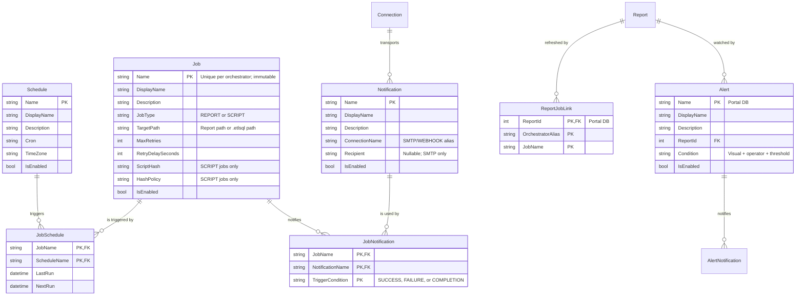

# Design Spec: Job, Schedule, and Alerting Refactor

This document outlines the architectural changes for establishing a unified, many-to-many scheduling
and notification model in ETL-SQL. It details how the engine, portal, and orchestrator align to
replace fragmented scheduler mechanisms with a robust, enterprise-grade scheduler similar to SQL
Agent.

**Status:** design agreed 2026-07-27. Remaining open points are in §12.

---

## 1. Problem Statement & Goals

### The Current State

1. **1:1 Schedule Coupling:** Schedules are coupled directly to report refresh entities
   (`DatasetJob`). Registering a second schedule on the same report silently overwrites the existing
   one, because `SubscriptionsController` keys the job as `portal-refresh:{alias}:{report.Id}` and
   `DatasetRegistryService.RegisterRefreshJobAsync` looks the job up by that key.
2. **Two report-refresh paths, one of which never schedules anything.**
   * `POST api/subscriptions/refresh-jobs` → `RegisterRefreshJobAsync` writes a `DatasetJobs` row and
     **nothing else**. It never calls `SaveJobAsync`, so no Orchestrator job exists, and
     `OrchestratorPollerService` waits forever on a completion nothing produces. This path has never
     worked.
   * `CREATE DATASET … REFRESH EVERY '30m'` **does** schedule: `CreateDatasetStatementHandler`
     synthesises a `CreateJobStatement` whose body is a `PRINT` statement — a no-op whose only
     purpose is to produce a completion for the poller to see — and then registers the link. It is
     the only working end-to-end refresh today, and it is built out of the two things this refactor
     removes: the inline `AS <statement>` job body and a 1:1 dataset↔schedule coupling.
3. **Naming and vocabulary fragmentation.** Five schedule vocabularies exist today:
   * engine `CREATE JOB … ON SCHEDULE EVERY 5 MINUTES [AT '02:00']` → `JobDefinition{Interval, Unit, AtTime}`;
   * portal refresh jobs → a **cron** string in `DatasetJob.RefreshInterval` that nothing consumes;
   * subscriptions → `Daily`/`Weekly`/`Monthly`/`Hourly`, mapped to an interval by
     `SubscriptionOrchestration.ParseSchedule`;
   * report datasets → `REFRESH EVERY '30m'` duration strings;
   * alerts → no schedule at all; evaluation timing is implicit.
4. **Implicit Alerting:** Email/webhook configurations are inline properties of the job/report rather
   than reusable destinations, leading to configuration duplication across hundreds of jobs.
5. **Timezone Gaps:** `SchedulerService.CalculateNextRun` computes from `DateTime.Now` with no
   timezone concept at all.
6. **No human-facing label.** A job has exactly one string, and it is both the script identifier and
   what an operator reads in a list. A generated name such as `portal-refresh:orch_a:17` is therefore
   unreadable in the UI, and there is nowhere to record what a job is *for*.

### Architectural Goals

* **Modular Peer Entities:** `JOB`, `SCHEDULE`, and `NOTIFICATION` as three independent, first-class
  peer entities, with `ALERT` composing them on the Portal side.
* **Many-to-Many Mappings:** One `SCHEDULE` triggers many `JOB`s; one `JOB` drives many
  `NOTIFICATION`s.
* **One Grammar:** A single `CREATE/ALTER/DROP/ENABLE/DISABLE` lifecycle, targeted with
  `EXECUTE <server> BEGIN … END`. The engine's existing `CREATE JOB` form is **replaced**.
* **Cron everywhere.** Cron plus an explicit timezone is the one schedule representation.
* **The script is the source of truth.** Identity is the name, and the name does not drift.

---

## 2. Identity: the name is the key

**Decision (2026-07-27).** `Name` remains the primary key. It is **not** renameable. Presentation
moves to separate, freely mutable attributes:

| Attribute | Purpose |
| :--- | :--- |
| `Name` | Primary key. Script-facing identity. Immutable. |
| `DisplayName` | Human label shown in the Portal and CLI. Defaults to `Name`. Freely editable. |
| `Description` | What the object is for. Freely editable. |
| `Options` | Property bag for classification and presentation metadata only. |

### Why not a surrogate key with a renameable name

The SQL Agent model — surrogate id, renameable label — is the wrong fit here, for a reason specific
to this product: **ETL-SQL's configuration is code.** `ConfigurationExportService` emits the catalog
as a replayable script, and scripts reference objects by name:

```sql
ALTER JOB FinanceNightly ADD SCHEDULE NightlyTrigger;
```

If a name can change out from under that script, the script silently stops matching what exists. A
re-import then creates a duplicate instead of reconciling, and the config-as-code round trip — the
property the export exists to provide — is broken by a UI action nobody thought was destructive.

It is also the identity model every other object in the language already uses. `CONNECTION`,
`PROCEDURE`, `FUNCTION`, `VIEW`, `INDEX`, `TABLE` are all named, none has a surrogate key, and none
can be renamed. Giving three new objects a different identity model would make them the exception.

**What this buys us**, beyond consistency: the plan no longer re-keys `JobHistory`,
`JobState (JobName, StateKey)` or `HostMetricsDaily (Day, JobName)`. Those all key on the name string
today, and the surrogate-key version required rebuilding four tables — which would have been the
first non-additive change ever made to the orchestrator store, and SQLite cannot alter a primary key
in place. That entire migration disappears. The name stays stable, so history stays correct without a
`JobNameAtRunTime` column to preserve it.

**What it costs:** correcting a badly chosen name means `DROP` + `CREATE`, which loses that job's
history — the same trade every other object in the language makes. `DisplayName` removes most of the
motive for renaming, since what an operator reads is editable. If a true in-place rename is ever
needed it can be added later as a cascading key update; do not build a surrogate-key model
speculatively for it.

`Options` is deliberately narrow: **anything the scheduler reads gets a real column.** A property bag
that influences behaviour becomes an unvalidated, unqueryable second schema.

---

## 3. Ownership

| Entity | Owner | Why |
| :--- | :--- | :--- |
| `JOB`, `SCHEDULE`, `NOTIFICATION` | **Orchestrator** | It runs the jobs, so it holds the trigger, computes the next run, and dispatches the outcome. |
| `ALERT` | **Portal** | An alert says *a visualization changed*. Evaluating `WHEN VISUAL …` means querying a report — Report-SQL work the Orchestrator knows nothing about. |
| Connection catalog | **Portal** | ACLs, ownership, usage ledger, per-user audit need an identity model the Orchestrator does not have. |

Names are unique per orchestrator — each Orchestrator has its own store, so `Nightly` may exist once
on `orch_a` and once on `orch_b` with no extra scoping needed.

For jobs, the Portal is a **client**, not a second catalog. It keeps exactly one thing the
Orchestrator cannot know: which of its reports a job refreshes. Everything else it displays is read
through `OrchestratorProxyService` (`api/scheduled-jobs`), not mirrored. There is therefore no
Portal→Orchestrator catalog reconciler; §9 covers the smaller problem that remains.

`NOTIFICATION` is defined **where it is used**, targeted by the `EXECUTE` block — the same grammar
against two catalogs, exactly as `CREATE CONNECTION` already works in both. A notification is a thin
object (connection alias + recipient), so this is not duplication of substance, and it keeps alert
delivery inside the Portal where the alert is evaluated. See §12 Q1.



`TriggerCondition` lives on `JobNotification` only. A `NOTIFICATION` is a destination; *when* it
fires is a property of the link, which is what lets one channel serve `ON SUCCESS` for one job and
`ON FAILURE` for another.

---

## 4. SQL Grammar & Statement Lifecycle

Targeting uses `EXECUTE <connection> BEGIN … END`, consistent with the managed-connection decision
in `TODO.md`. There is no `AT <server>` clause. A statement outside a block targets the locally
configured orchestrator store — the same target the engine's `CREATE JOB` uses today.

### 4.1 Object Creation

```sql
EXECUTE orch_admin BEGIN
    -- 1. A shared trigger
    CREATE SCHEDULE NightlyTrigger
    ON '0 2 * * *'
    AT TIME ZONE 'America/New_York'
    WITH (DISPLAY_NAME = 'Overnight (2am ET)', DESCRIPTION = 'Standard batch window');

    -- 2. A reusable destination
    CREATE NOTIFICATION OpsAlert
    USING local_mail TO 'ops-alerts@example.com';

    -- 3. The executable job
    CREATE JOB FinanceNightly
    FOR REPORT 'folders/Finance Dashboard'
    WITH (MAX_RETRIES = 3, RETRY_DELAY = 60, DISPLAY_NAME = 'Finance — nightly refresh');
END;
```

* **`FOR REPORT` vs `FOR SCRIPT`** are mutually exclusive and enforced by the parser.
* **`WITH (MAX_RETRIES, RETRY_DELAY)`** carries over verbatim from the retired `CREATE JOB … WITH (…)`
  form. Retry is a property of the *attempt*, not the trigger, so it belongs on the job.
  `JobDefinition` already stores both, so this costs no storage change.
* **`DISPLAY_NAME` and `DESCRIPTION`** are optional in `WITH (…)` on every kind. `DISPLAY_NAME`
  defaults to `Name`.
* **Script integrity is preserved.** `JobDefinition.ScriptHash` / `HashPolicy` (driven by
  `SET SCRIPT_HASH_POLICY`) continue to apply to `FOR SCRIPT` jobs. `FOR REPORT` jobs have no
  external script and carry neither.

### 4.2 Linking (`ALTER … ADD / REMOVE`)

```sql
EXECUTE orch_admin BEGIN
    ALTER JOB FinanceNightly ADD SCHEDULE NightlyTrigger;

    ALTER JOB FinanceNightly ADD NOTIFICATION SlackChannel ON SUCCESS;
    ALTER JOB FinanceNightly ADD NOTIFICATION OpsAlert    ON FAILURE;

    ALTER JOB FinanceNightly REMOVE SCHEDULE NightlyTrigger;
    ALTER JOB FinanceNightly REMOVE NOTIFICATION OpsAlert ON FAILURE;
END;
```

Attaching `ON COMPLETION` alongside `ON SUCCESS`/`ON FAILURE` for the same job and notification is
**rejected at link time**, not silently double-fired: `COMPLETION` is the union of the other two, so
the pair is always a mistake.

### 4.3 Alerts (Portal)

An `ALERT` is a **condition** plus destinations. That is what distinguishes it from a
`NOTIFICATION`, which is only a destination whose trigger is a job outcome. It tells a user that a
visualization has changed, so it lives with the Portal, which is the only component that can
evaluate the condition:

```sql
EXECUTE portal_admin BEGIN
    CREATE NOTIFICATION FinanceOps
    USING local_mail TO 'finance-ops@example.com';

    CREATE ALERT RevenueDrop
    FOR REPORT 'folders/Finance Dashboard'
    WHEN VISUAL RevenueChart < 100000
    WITH (DESCRIPTION = 'Revenue below the quarterly floor');

    ALTER ALERT RevenueDrop ADD NOTIFICATION FinanceOps;
END;
```

* **The visual is an identifier, not a string literal** (`RevenueChart`, not `'RevenueChart'`),
  matching how visuals are named everywhere else in Report-SQL. Today's
  `CREATE ALERT 'x' FOR REPORT 'r' WHEN VISUAL 'v' > 100` quotes all three; name and visual become
  identifiers, and the report path stays a literal because it is a path.
* **`ADD NOTIFICATION` takes no `ON <condition>`** — the alert *is* the condition. Only jobs need a
  trigger qualifier.
* **`FOR SCRIPT` is not offered in this pass.** `WHEN VISUAL` has no meaning for a script, and the
  scalar-query predicate that would replace it is a larger grammar. See §12 Q2.
* **Evaluation is on report refresh completion.** The Portal already learns of every refresh through
  `OrchestratorPollerService`, so an alert needs no schedule of its own and cannot go stale relative
  to the data it watches. See §12 Q2 for the alternative.
* `ASSERT JOB … ON FAILURE ALERT <connection>` (v0.17.0) sends to a bare connection. It becomes
  `ON FAILURE NOTIFY <notification>` so there is one destination concept, not two.

### 4.4 Administrative Lifecycle

Existence modifiers precede the object name for every kind, matching the canonicalization already
applied to all sixteen `DROP` kinds:

```sql
DROP JOB IF EXISTS FinanceNightly;
DROP SCHEDULE IF EXISTS NightlyTrigger;
DROP NOTIFICATION IF EXISTS OpsAlert;
DROP ALERT IF EXISTS RevenueDrop;

DISABLE JOB FinanceNightly;       -- pauses this job
DISABLE SCHEDULE NightlyTrigger;  -- pauses every job on this trigger
DISABLE NOTIFICATION OpsAlert;    -- suppresses this destination everywhere
ENABLE JOB FinanceNightly;

ALTER JOB FinanceNightly SET (DISPLAY_NAME = 'Finance — overnight', DESCRIPTION = '…');
ALTER JOB FinanceNightly SET TARGET = 'folders/Finance Dashboard v2';
ALTER JOB FinanceNightly SET (MAX_RETRIES = 5);
ALTER SCHEDULE NightlyTrigger SET CRON = '0 3 * * *';
ALTER SCHEDULE NightlyTrigger SET TIME ZONE 'UTC';
ALTER NOTIFICATION OpsAlert SET TO 'infra-alerts@example.com';
```

There is no `RENAME TO`. Changing a name is `DROP` + `CREATE`, and the parser says so when a name is
not found: the diagnostic names the closest existing object rather than only reporting absence, since
a typo'd name is otherwise indistinguishable from a missing object.

`CREATE OR ALTER` and `CREATE OR REPLACE` are **not** supported for these kinds in this pass; the
parser must reject them by name rather than silently discarding the mode.

**Referential rules, enforced and tested:**

| Action | Behaviour |
| :--- | :--- |
| `DROP SCHEDULE` still linked | **Restrict.** Fails, naming the jobs that use it. |
| `DROP NOTIFICATION` still linked | **Restrict.** Fails, naming the jobs or alerts that use it. |
| `DROP JOB` / `DROP ALERT` with links | **Cascade** the links; schedules and notifications survive. |
| Portal report deleted | **Restrict** while refresh jobs or alerts are attached. |

Restrict is the default because these objects are shared: cascading a `DROP SCHEDULE` would silently
unschedule unrelated jobs.

### 4.5 Retired forms

Each is rejected by the parser with a diagnostic naming its replacement — they all parse cleanly
today, so a generic syntax error would leave the reader guessing:

| Retired | Replacement |
| :--- | :--- |
| `CREATE JOB n ON SCHEDULE EVERY 5 MINUTES AS <stmt>` | `CREATE SCHEDULE` + `CREATE JOB … FOR SCRIPT` + `ALTER JOB … ADD SCHEDULE` |
| `ALTER JOB n ON SCHEDULE EVERY …` | `ALTER SCHEDULE s SET CRON = …` |
| `CREATE REFRESH JOB FOR REPORT '…' SCHEDULE '…'` | `CREATE JOB n FOR REPORT '…'` + link |
| `DROP REFRESH JOB FOR REPORT '…'` | `DROP JOB IF EXISTS n` |
| `CREATE DATASET &d … REFRESH EVERY '30m'` | `CREATE JOB n FOR REPORT '…'` + link (see §5) |
| `CREATE ALERT 'n' FOR REPORT 'r' WHEN VISUAL 'v' > 100 DELIVER TO '…' AT smtp` | `CREATE ALERT n …` + `ALTER ALERT n ADD NOTIFICATION …` |
| `ASSERT JOB … ON FAILURE ALERT <connection>` | `ASSERT JOB … ON FAILURE NOTIFY <notification>` |

The inline `AS <statement>` job body disappears with the first row: a job names a script path, so its
body is versioned, hashable, and lintable like any other script. **Every sample, doc snippet, and
test using the inline form must be migrated in the same change.**

---

## 5. Retiring `CREATE DATASET … REFRESH EVERY`

**Decision (2026-07-27): remove it.** A dataset with its own private schedule is a 1:1 coupling of
exactly the kind this refactor exists to eliminate, and it cannot express two refresh cadences, a
timezone, retries, or notifications. Separating it now, before the product is in use, is far cheaper
than adding a second scheduler surface and migrating later.

It is also the only engine-side consumer of the two mechanisms being retired: it builds a
`CreateJobStatement` with an inline `PRINT` body and calls `RegisterRefreshJobAsync`. Removing it
deletes `CreateDatasetStatementHandler.CreateRefreshJob`, `ParseRefreshInterval`, the
`__dataset_refresh_*__` synthetic job names, and the `DatasetRefreshIntervalRule` lint rule.

Replacement is an ordinary named job against the owning report:

```sql
EXECUTE orch_admin BEGIN
    CREATE SCHEDULE HalfHourly ON '*/30 * * * *' AT TIME ZONE 'UTC';
    CREATE JOB SalesRefresh FOR REPORT 'folders/Sales';
    ALTER JOB SalesRefresh ADD SCHEDULE HalfHourly;
END;
```

`TTL` stays on `CREATE DATASET` — it is cache expiry, not a schedule, and has no trigger.
Consumers to update: `docs/reference/visuals-reporting/report/dataset.md`, `report-cli.md`,
`docs/guides/report-sql.md`, `docs/cookbooks/report-recipes.md`, `docs/syntax-index.md`,
`snippets/dataset.md`, and the sample reports under `samples/08_Reporting`,
`samples/10_Kitchen_Sinks`, `samples/integration`, and `Reports/`.

---

## 6. Orchestrator Store Changes

The Orchestrator store is raw DDL with a dialect abstraction (`SqliteOrchestratorDialect`,
`NpgsqlOrchestratorDialect`) and idempotent `ALTER TABLE … ADD COLUMN` upgrades — **not** EF
migrations. Because `Name` stays the primary key, **every change here is additive**, in keeping with
how this store has always been modified. `JobHistory`, `JobState` and `HostMetricsDaily` are not
touched at all.

### `Jobs` (altered, additively)

* Add `DisplayName`, `Description`, `Options`, `JobType` (`TEXT NOT NULL DEFAULT 'SCRIPT'`),
  `TargetPath` (`TEXT`).
* `Interval`, `Unit` and `AtTime` become unused once schedules move to `Schedules`. They are
  `NOT NULL`, so they are left in place with defaults rather than dropped, and the code stops reading
  them. Removing them is a later contract step, not part of this change.

### `Schedules`, `Notifications` (new, Orchestrator)

`Name` (PK), `DisplayName`, `Description`, `Options`, `IsEnabled`, plus:
`Schedules` → `Cron`, `TimeZone`. `Notifications` → `ConnectionName`, `Recipient` (nullable).

A credential is **never** stored on a `Notification`; the connection alias resolves through normal
connection/secret resolution at dispatch time, keeping the `SECRET:`-reference rule intact.

### `JobSchedules`, `JobNotifications` (new, Orchestrator)

Composite PKs on the names. `JobSchedules` carries per-link `LastRun`/`NextRun` — that is what makes
two schedules on one job distinguishable in operations. `JobNotifications` carries `TriggerCondition`
in the PK.

### Portal side

* `Alerts` and `AlertNotifications` (new, EF migrations on both providers). `Alerts.ReportId` is a
  real FK; the condition is stored as visual name + operator + threshold, replacing the columns on
  the existing alert entity.
* `Notifications` — the Portal's own destination catalog, for alert delivery (§3, §12 Q1).
* `DatasetJobs` is replaced by `ReportJobLinks` (`ReportId` FK, `OrchestratorAlias`, `JobName`).
  `ReportId` stays a **real foreign key** so report deletion is enforced by the database; the job's
  `TargetPath` is a mutable property that `ALTER JOB … SET TARGET` changes, and the Portal keeps the
  two consistent when a report is renamed or moved.

Dropping `DatasetJobs` is a Portal EF migration, and a `DropTable` in `Up` violates
`MigrationConvergenceTests.PortalMigrations_UpOperationsFollowRollingExpandContract`. The mechanism
is that test's `PreDeploymentBreakingMigrations` allow-list with a written justification —
precedent: `_DropSmtpConnections`. Name the migration there rather than rediscovering the failure
during the release gate.

---

## 7. Scheduler Changes: Cron and Timezone

`SchedulerService.CalculateNextRun` currently does `DateTime.Now.AddMinutes(interval)` and cannot
express `'*/15 8-18 * * 1-5'`. Cron was the intended representation from the start, so the interval
model is corrected rather than bridged:

```csharp
var tz   = RelDateResolver.FindTimeZone(schedule.TimeZone);
var next = CronExpression.Parse(schedule.Cron).GetNextOccurrence(DateTimeOffset.UtcNow, tz);
```

* `Cronos` is currently referenced only by `ETL-SQL.Portal`; the Orchestrator project needs the
  reference. It is an existing, already-inventoried dependency.
* A job with several schedules computes `NextRun` per link; the scheduler fires the earliest due link
  and records `LastRun` on that link.
* Two links of the same job falling due simultaneously must coalesce into **one** run, not two.
* `DateTime.Now` must not survive anywhere in the path: comparisons move to `DateTimeOffset` in UTC,
  with the timezone applied only inside the cron calculation.

### Timezone resolution

**Reuse `RelDateResolver.FindTimeZone`.** It already implements the product's documented rule
(`docs/reference/dates-times/dates-times.md` §3) and is what the `AT TIME ZONE` *expression* already
calls. It accepts IANA IDs (`America/New_York`), Windows IDs (`Eastern Standard Time`), and the
abbreviation aliases in its `TzMapping` (`EST`, `CST`, `PST`, `UTC`, `GMT`, `JST`, `AEST`, …), and
falls back across the IANA↔Windows boundary when the platform lacks one form. A scheduler that
accepted a different set of spellings than `AT TIME ZONE` and `RELDATE` would be a defect, so there
is nothing to decide beyond calling the existing function. `ETL-SQL.Orchestrator` already references
`ETL-SQL.Engine`, so no code moves.

Two rules the scheduler adds on top:

* **Validate at `CREATE`/`ALTER` time**, not at first fire. `FindTimeZone` already throws
  `TimeZoneNotFoundException`; the statement handler surfaces it.
* **Resolve the default once, at creation.** With no `AT TIME ZONE`, store the resolved
  `Scheduler:DefaultTimeZone` (falling back to `UTC`). Resolving lazily at each fire would mean
  editing `appsettings.json` silently moves every existing schedule.

`AT TIME ZONE` at statement level does not collide with any `AT <connection>` clause:
`ExpressionParser` already disambiguates with a two-token lookahead (`Peek == TIME && Peek2 == ZONE`).

---

## 8. Portal Integration

1. `CREATE JOB … FOR REPORT` inside `EXECUTE <portal> BEGIN … END` resolves the report, writes a
   `ReportJobLinks` row, and forwards the job to the orchestrator named by the block.
2. On completion, `OrchestratorPollerService` matches the completion's `JobName` against
   `ReportJobLinks`, resolves the `Report`, calls `jobs.EnqueueRefreshAsync`, and then evaluates any
   `Alerts` attached to that report.
3. `JobType == 'SCRIPT'` completions are not the Portal's business and are ignored.

**Generated names** for subscription- and sugar-created objects derive from `NEWID()` (UUID v7,
`StandardFunctions.System`), e.g. `sub_0198f3a1c4d27e5b`. UUID v7 is time-ordered, so generated names
sort by creation. Because the name is now only the machine identity, readability is handled by
`DisplayName` — a generated job shows as *"Weekly Sales Digest"* in the UI while keeping a stable,
export-safe name. The prefix is reserved: `CREATE JOB` rejects a user-supplied name matching it, and
`DROP JOB` refuses a generated job whose owning subscription still exists.

---

## 9. Operational Resilience

With the Orchestrator as the system of record there is no catalog to reconcile — a mutation either
commits on the Orchestrator or fails and is reported. Two narrower problems remain:

1. **Orphaned report links.** A `ReportJobLinks` row whose job no longer exists on the Orchestrator.
   A periodic sweep marks these broken and surfaces them in the Portal; it **must not** delete
   Orchestrator jobs it does not recognise. A shared Orchestrator can legitimately carry another
   Portal's jobs, and a prefix-scoped delete would silently destroy them.
2. **HA.** Any such sweep runs on every Portal node, so it must be gated by `IClusterLockStore`,
   matching `OperationalMetricsDigestService` and `AdminDigestServiceBase`. `OrchestratorPollerService`
   should be audited for the same property in this change.

---

## 10. Notification Dispatch and Security

**Job notifications are dispatched by the Orchestrator.** It owns the job, knows the outcome first,
and does not depend on the Portal being up — which matters most for a failure alert, since a Portal
outage is exactly when one is needed. Dispatch resolves the connection alias through the engine's
normal connection and `SECRET:` resolution **on the orchestrator host**, the same path any script
already uses to send mail. No new trust boundary, and no credential crosses a process boundary.

**Alert notifications are dispatched by the Portal**, which is where the condition is evaluated and
where the governed connection catalog already lives.

The consequence to accept: a job notification's connection alias must exist where the job runs. The
governed `PortalSharedConnection` catalog stays in the Portal because it is a *governance* artifact —
ACLs, ownership, usage ledger, per-user audit — and the Orchestrator has no user or group model at
all (its API authenticates with a single `X-Orchestrator-Key`). Moving the catalog there would mean
inventing an identity model in the Orchestrator, a far larger change than this one. The alias is
therefore a **contract between the two**, not a shared row; see §12 Q3.

All mutations (`CREATE`, `ALTER`, `DROP`, `ENABLE`, `DISABLE`, `ADD`, `REMOVE`) log to the persistent
audit outbox: `Action = CREATE_JOB | DROP_SCHEDULE | ATTACH_SCHEDULE | …`, `Target = <name>`,
`Payload = cron / timezone / connection alias / trigger condition`.

---

## 11. Consumers to Migrate

* `SubscriptionsController` — `api/subscriptions/refresh-jobs`, subscription create/update/enable.
* `DatasetRegistryService` / `IDatasetRegistry` — remove the default interface method bodies. A
  default body means deleting an override still compiles and silently binds to a no-op; the compiler
  will not find the call sites for you.
* `CreateDatasetStatementHandler` — delete `CreateRefreshJob` and `ParseRefreshInterval` (§5).
* `DatasetRefreshIntervalRule` — delete.
* `OrchestratorPollerService` — match on `ReportJobLinks`; evaluate attached alerts on completion.
* `SchedulerService`, `SQLiteJobHistoryStore`, `NpgsqlOrchestratorDialect`, `IJobHistoryStore`,
  `JobDefinition`.
* `ReportDependencyService`, `ConfigurationExportService`, `LineageImpactService`,
  `ReferenceImpactService`, `SubscriptionScriptMaintenance`, `OrchestratorProxyService`.
* Parser/AST/formatter/linter, LSP completion, `eng.*` virtual tables (`eng.jobs`, `eng.schedules`,
  `eng.notifications`, `eng.alerts`, `eng.job_schedules` — reconcile with the `SHOW`-retirement
  inventory in `TODO.md`, which currently lists `eng.refresh_jobs`).
* Samples, snippets, hover help, `docs/syntax-index.md`, and every doc snippet using the retired
  inline-`AS` job form or `REFRESH EVERY`.

---

## 12. Open Questions

**Q1 — Is a Portal-side `NOTIFICATION` catalog right?** §3 defines notifications where they are used:
the Orchestrator's for job outcomes, the Portal's for alerts, same grammar targeted by the `EXECUTE`
block. The alternative is a single Portal-owned catalog that the Orchestrator reads, which removes
the two-catalog surface but makes job notifications depend on the Portal being reachable — losing the
property that makes §10 worth having. Confirm the split.

**Q2 — Alert scope in this pass.** Two sub-parts, both currently answered conservatively:
  * `FOR SCRIPT` alerts are excluded because `WHEN VISUAL` has no meaning there and a scalar-query
    predicate is a larger grammar. Add later, or in scope now?
  * Alerts evaluate on report refresh completion rather than carrying their own `SCHEDULE`. That
    needs no new mechanism and cannot go stale relative to the data, but it means a report that never
    refreshes never alerts, and an alert cannot be checked more often than its report refreshes.
    Acceptable, or should `ALTER ALERT … ADD SCHEDULE` exist?

**Q3 — Should the Portal provision connection aliases onto an orchestrator?** §10 makes the alias a
contract an operator satisfies on each orchestrator host. That is honest but manual, and it means
configuring SMTP twice for an operator who thinks of it as one thing. A provisioning path would
remove the duplication but must carry the `SECRET:` reference without ever carrying the value, and
must define what happens when the reference does not resolve on the target host.

**Q4 — Subscription sugar: how much is user-visible?** Generated jobs appear in `eng.jobs` and the
Portal job list, now with a readable `DisplayName`. Should they still be hidden by default behind an
`IsSystemGenerated` flag, or is seeing them the point — one place where every scheduled thing is
visible?
