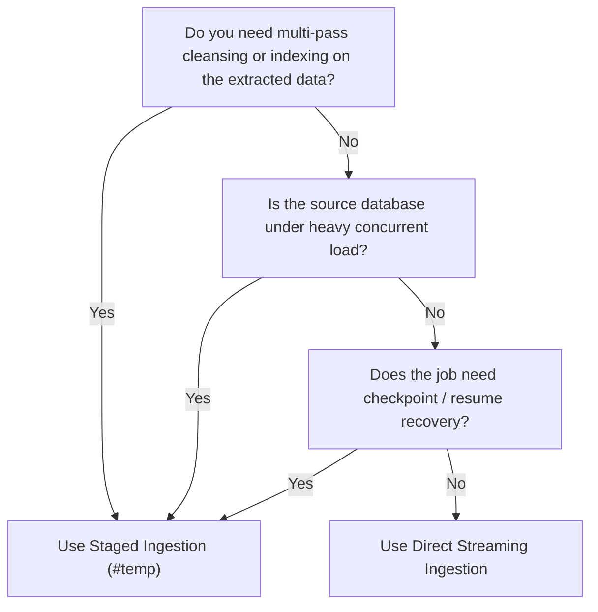

# Staged vs. Direct Streaming Ingestion

ETL-SQL supports two primary patterns for moving data between sources and destinations: **Staged Ingestion** (extracting into an engine `#temp` workspace first) and **Direct Streaming** (piping directly from source to destination in a single statement).

Selecting the appropriate pattern depends on dataset volume, connection concurrency limits, and recovery requirements.

---

> **Applies to:** every deployment profile (Solo, Team, Enterprise, SaaS).

## Ingestion Pattern Comparison

```
Staged Ingestion:
[Source DB] ──▶ [#temp Table in Engine Memory] ──▶ [Target DB]
             (Connection closed)

Direct Streaming:
[Source DB] ────────────────────────────────────▶ [Target DB]
             (Both connections open concurrently)
```

| Factor | Staged Ingestion (`#temp`) | Direct Streaming (`INSERT ... SELECT`) |
| :--- | :--- | :--- |
| **Source Hold Time** | **Minimal** — connection closes immediately after extract | **High** — remains open for the entire load duration |
| **I/O Overhead** | Writes locally to engine memory/spill before destination write | **Zero local I/O** — rows stream straight through |
| **Checkpoint & Resume** | **Fully supported** across top-level labels | Not supported — failure requires restarting from the beginning |
| **Multi-Pass Updates** | Supported (can index, update, or join `#temp` repeatedly) | Single-pass only |
| **Transformations & Rules**| Full support (`REGEX`, `HASHBYTES`, `EXPECT`, etc.) | Full support (`REGEX`, `HASHBYTES`, `EXPECT`, etc.) |
| **Best Used When...** | Source database is busy, or multi-step cleansing is required | Moving large datasets where local disk write overhead is prohibitive |

---

## Example 1: Staged Ingestion Pattern

Extract rows quickly to isolate a busy production database, perform multi-step validation and cleanup in engine memory, and then merge into the data warehouse.

```sql
CREATE CONNECTION src  AS POSTGRES(HOST='pg.prod.local', DATABASE='sales', USER='etl', PASSWORD='SECRET:pg_pass');
CREATE CONNECTION dest AS MSSQL(SERVER='sql.prod.local', DATABASE='edw', TRUSTED_CONNECTION=TRUE);

BEGIN TRY
    -- 1. Extract and immediately release remote connection
    SELECT order_id, customer_id, order_date, total_amount
    INTO #staged_orders
    FROM src.orders
    WHERE order_date >= DATEADD(DAY, -1, GETDATE());

    -- 2. Transform and cleanse in engine memory
    UPDATE #staged_orders
    SET total_amount = 0.00
    WHERE total_amount IS NULL;

    -- 3. Load into target warehouse
    MERGE INTO dest.dbo.FactOrders AS Target
    USING #staged_orders AS Source
    ON Target.OrderId = Source.order_id
    WHEN MATCHED THEN
        UPDATE SET Target.TotalAmount = Source.total_amount
    WHEN NOT MATCHED THEN
        INSERT (OrderId, CustomerId, OrderDate, TotalAmount)
        VALUES (Source.order_id, Source.customer_id, Source.order_date, Source.total_amount);

    PRINT 'Staged load completed successfully.';
END TRY
BEGIN CATCH
    PRINT 'Error during staged load: ' + ERROR_MESSAGE();
    THROW;
END CATCH
```

---

## Example 2: Direct Streaming Ingestion Pattern

Stream millions of rows directly from source to destination with in-flight transformation (such as cryptographic hashing) without incurring local disk I/O.

```sql
CREATE CONNECTION src  AS MSSQL(SERVER='oltp.prod.local', DATABASE='AppDb', TRUSTED_CONNECTION=TRUE);
CREATE CONNECTION dest AS SNOWFLAKE(ACCOUNT='xy12345', DATABASE='ANALYTICS', USERNAME='etl', PASSWORD='SECRET:sf_pass');

-- Direct stream: rows are processed in 10,000-row chunks in-flight
INSERT INTO dest.PUBLIC.CUSTOMER_ARCHIVE (CustomerId, EmailHash, CreatedDate)
SELECT 
    Id, 
    HASHBYTES('SHA2_256', Email) AS EmailHash, 
    CreatedAt
FROM src.dbo.Users;
```

---

## Decision Guide: Which Ingestion Pattern Should I Choose?



---

## Related Topics

- [Modular Scripts and Parameters](modular-scripts-and-parameters.md) — Breaking pipelines into manageable steps.
- [Script Resilience & Checkpoints](script-resilience-and-checkpoints.md) — Checkpoint-resume workflows.
- [Data Quality Column Rules](../data-quality/column-quality-rules.md) — Inline validation rules.
